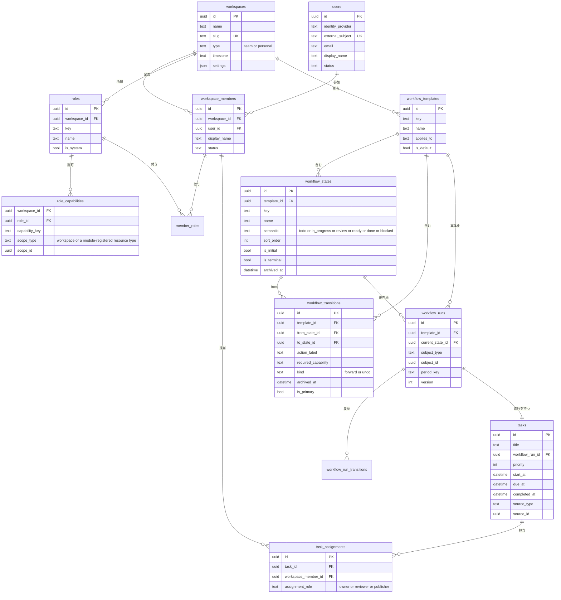
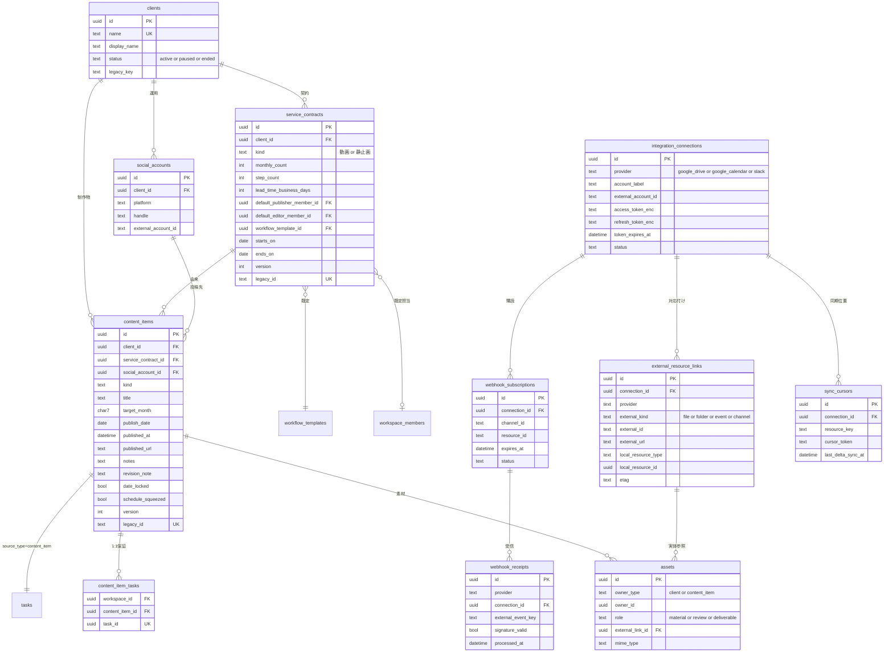

# SOCIAL BASE — System Design

システム設計の唯一の正典。このファイルだけを読めば現行のシステム設計が分かる状態を保つ。

| | |
|---|---|
| 版 | **v5**（第4回 Senior Review 反映済み・判定 A） |
| 作成 | 2026-08-29 |
| 対象 | `ml-editing-board.html`（SOCIAL BASE 編集進行ボード） |
| 前提 | UIフェーズFIX済み（`f264170`） |
| 関連 | `SOCIAL_BASE_UI_IMPLEMENTATION_SPEC.md` / `SOCIAL_BASE_TODAY_RESPONSIVE_SPEC.md` / `SOCIAL_BASE_CLIENT_MANAGEMENT_RESPONSIVE_SPEC.md` |
| レビュー | `SOCIAL_BASE_SENIOR_REVIEW.md` / `SOCIAL_BASE_SENIOR_REVIEW_2.md` / `SOCIAL_BASE_SENIOR_REVIEW_3.md` / `SOCIAL_BASE_SENIOR_REVIEW_4.md` / `SOCIAL_BASE_REVIEW_RESOLUTION.md` |

**優先順位** — UI に関する記述は既存 UI SPEC 3本が正典。本書はその裏側（データ・権限・処理）の正典。両者が矛盾した場合、UIの見た目と操作は UI SPEC を優先し、本書を直す。

**読み方** — 各章末の「■ オーナー向け説明」は非エンジニア向けの要約。技術的な判断の根拠は本文にある。

---

## 目次

1. [Design Principles / Goals / Non-Goals](#1-design-principles--goals--non-goals)
2. [Current Architecture](#2-current-architecture)
3. [Target Architecture](#3-target-architecture)
4. [Module Boundaries](#4-module-boundaries)
5. [Domain Model](#5-domain-model)
6. [Database Schema](#6-database-schema)
7. [ER Diagram](#7-er-diagram)
8. [Workspace / Membership / Permission](#8-workspace--membership--permission)
9. [Permission Matrix](#9-permission-matrix)
10. [Task / Assignment](#10-task--assignment)
11. [Workflow / State / Transition](#11-workflow--state--transition)
12. [Schedule / Recurrence](#12-schedule--recurrence)
13. [Automation](#13-automation)
14. [Notification](#14-notification)
15. [External Data Integration（Google Drive / Notion）](#15-external-data-integrationgoogle-drive--notion)
16. [Google Calendar Integration](#16-google-calendar-integration)
17. [Slack Integration](#17-slack-integration)
18. [Recommendation / Capacity](#18-recommendation--capacity)
19. [Audit / Observability](#19-audit--observability)
20. [Security](#20-security)
21. [API / Application Layer](#21-api--application-layer)
22. [Concurrency / Idempotency](#22-concurrency--idempotency)
23. [Background Jobs](#23-background-jobs)
24. [Migration from Artifact / STATE](#24-migration-from-artifact--state)
25. [Testing Strategy](#25-testing-strategy)
26. [Deployment / Operations](#26-deployment--operations)
27. [Implementation Phases](#27-implementation-phases)
28. [Risks / Open Questions](#28-risks--open-questions)
29. [Architecture Decision Log](#29-architecture-decision-log)

---

## 1. Design Principles / Goals / Non-Goals

### 1.1 Principles

**P1. 汎用 Core + 固有 Module。**
SOCIAL BASE は最初の Workspace にすぎない。他部署・個人タスク・別の Workflow へ展開できるよう、Core は「動画」「クライアント」「Instagram」を知らない。固有概念は SOCIAL BASE Module に閉じる。これが本書で最も強い制約であり、他のすべての判断に優先する。

**P2. Fail Closed。**
本人・Workspace・Permission のいずれかが確認できない場合は拒否する。現行実装の `myRole()` 既定 `null`（`ml-editing-board.html:2167`）と同じ思想をサーバー側へ持ち上げる。

**P3. Authorization はサーバーが持つ。**
UI の非表示は利便性のためであり、安全性の根拠にしない。同じことが二度押し防止にも当てはまる（`ADVANCING` は UX、整合性は `version` で守る）。

**P4. 設定をコードに埋めない。**
ステータス、権限、アラート日数、負荷しきい値は運用中に変わる。変わるものはデータに置く。

**P5. 過剰設計をしない。**
Microservices・Event Sourcing・No-code Workflow Builder は作らない。Modular Monolith から始め、必要になった Module だけ切り出せる形にする。 **優先順位（P0）に反する複雑さは、将来の汎用性を理由にしても入れない。**

**P6. AI と自動計算は提案まで。**
投稿日の最適化も担当変更も Recommendation を出すだけ。人が Accept して初めて確定データになる。

**P7. 段階移行。**
現行 artifact を止めずに移す。Read → Write → Parity確認 → Legacy撤去。二重実装はしない。

**P0. 優先順位（2026-09-03 追加・オーナー確定）。**
判断に迷ったときはこの順序で決める。**上位のために下位を犠牲にすることは許すが、逆はしない。**

1. **SNS運用チームで本当に便利に使えること**
2. **今の手入力・管理工数を減らすこと**
3. **進捗漏れ・遅れを防止すること**
4. **保守・運用が簡単であること**
5. そのうえで他用途へ流用しやすいこと

**5 は最優先ではない。** P1（汎用 Core + 固有 Module）は Core を汚さないための構造上の制約であり、**将来の汎用化のために v1 の機能や運用を複雑にする根拠にはしない。**

**判定に使える基準** — ある機能について「人が新しく入力する場所が増えるか」を問う。増えるなら 2 に反しており、設計が間違っている。

### 1.2 Goals（v1 の到達点）

- 実ユーザー認証と Workspace 分離
- サーバー側 Permission（Capability ベース）
- マスターデータ（契約・メンバー・シフト・ワークフロー定義）を画面から編集できる
- Task の永続化と Workflow transition、Audit Log
- Schedule と Recurring Workflow、Client 準備 Alert、毎月12日の分析サイクル
- Google Drive / Google Calendar / Slack Integration
- 投稿予定日と担当変更の Recommendation
- 現行UIの主要操作が DB を Source of Truth として動作し、Desktop / Tablet / Mobile に Regression がない

### 1.3 Non-Goals（v1 でやらない）

Microservices 化 / Kubernetes / Event Sourcing / AI による完全自動の担当変更・投稿日変更 / ML forecasting / 汎用 No-code Workflow Builder / UI 全面 Rewrite / 全外部サービス連携 / Redis 導入 / **Automation の汎用条件式言語**（§13.3） / **Realtime（SSE / WebSocket）**（ADR-014）。

そして明示的に：

**artifact 上へ新しい Workspace / Permission / Workflow 基盤を先行実装してから新環境で作り直す、という二重実装をしない。** 新しい Domain 機能は新環境（Worker + D1）にのみ載せる。

---

## 2. Current Architecture

### 2.1 構成

単一 HTML ファイル（5,226行）。Claude Artifact として公開され、`claude.ai/code/artifact/9ef7dd31-0f03-4e34-983c-83298a759d8c` が運用URL。

| Layer | 位置 | 責務 |
|---|---|---|
| Layer A | `:1529-1874` | 純粋ロジック。外部呼び出しなし。ステータス定義、営業日・祝日計算、`generate()`、`applyOp()` |
| Layer B | `:1876-1984` | 保存アダプタ。`localStorage` の op journal と `ARTIFACT.publish()` |
| Layer C | `:1986-5226` | 描画。6画面と全モーダル |

### 2.2 保存の仕組み

```
操作 -> newOp()      : 操作を1件の op にする
     -> OPS.add()    : localStorage へ退避（未同期キュー）
     -> applyOp()    : メモリ上の STATE へ適用
     -> render()     : 画面を描き直す
     -> persist()    : ARTIFACT.publish(buildDoc(STATE))
                       成功なら OPS.drop(opId)
```

`buildDoc()`（`:1939`）は起動時に控えた `PRISTINE`（DOM ではなく元の HTML 文字列）の `<script id="state">` 1行だけを差し替えて全文を作る。つまり **1回の操作ごとに約350KBのHTML全体を再公開する**。

競合は2種類で処理する。状態遷移は `op.payload.from` と現在値が一致しなければ `"conflict"`（`:1828`）。それ以外のフィールドは `updatedAt[field]` 比較の last-write-wins（`:1839`）。

### 2.3 データの置き場所

**`STATE`（artifact に保存され、画面から編集できる）**

| キー | 内容 |
|---|---|
| `rows[]` | `id / contractId / client / kind / month / title / editor / status / planned / due / postedAt / trans / actor / dateLocked / squeezed / url / note / revisionNote / updatedAt` |
| `clients{}` | クライアント名 -> `material / review / nextShootDate / planningDeadline / planningStatus / nextRegularMeeting / materialStatus / updatedAt` |
| `notes{}` | 日付 -> `{text, updatedAt}` |
| `version / seeded / maintenance / lastUpdated` | メタ情報 |

**ソース直書き（HTML を編集しないと変えられない）**

| 定数 | 行 | 内容 |
|---|---|---|
| `SEED_CONTRACTS` | `:1846` | 10社13契約。`client / display / kind / count / steps / poster` |
| `STAFF_MAP` | `:1861` | 表示名 -> シフト表のローマ字名 |
| `MEMBERS` | `:1864` | 6名。`name / role（社員・スタッフ）/ title` |
| `SEED_SHIFTS` | `:1868` | 2026-08 のみ |
| `SHIFT_UNMATCHED` | `:1873` | 編集スタッフ以外として除外した7名 |
| `SNAP` | `:1874` | Notion からの取得日 |
| `STATUSES` ほか | `:1539-1554` | 6ステータスと遷移表 |
| `MATERIAL_STEPS` / `PLAN_STATUSES` | `:4363-4364` | 資料準備フロー4段階 / 企画4段階 |
| `LOAD_CFG` | `:1999` | 負荷スコアの重み `{today:8, week:2, overdue:15, review:4, full:120}` |
| `EQUINOX` / `HOLIDAY_VALID_THROUGH` | `:1568-1569` | 祝日テーブル（2028年まで） |

**`localStorage`（端末ローカル）** — `mlboard.me`（本人）/ `mlboard.ops.v1`（未同期op）/ `mlboard.draft.*`（入力途中）

### 2.4 現行の4つの不変条件

`f264170` で入れたもの。移行後も等価の保証が要る。

| # | 名前 | 現在の実装 | 移行後の担保 |
|---|---|---|---|
| 1 | `ADVANCING` | 行ID単位で工程進行の多重実行を防ぐ（`:3583`） | UX として残す。整合性は §22 の `expectedVersion` が担保 |
| 2 | `READY` | artifact 初期化前は `writable()=false`（`:2195`） | セッション確立前は書き込みAPIを呼ばない（§21） |
| 3 | `BOTTOM_NAV_VIEWS` | ナビは主要5枠＋その他（`:2183`） | UI のまま維持。画面追加時はこの表だけ触る |
| 4 | fail closed | `myRole()` 既定 `null`、本人未確定中は `data-blocking`（`:2167`, `:4964`） | §8 の Server-side Permission が本体になる |

### 2.5 現行UIが読んでいるデータ（UI → Data Mapping）

| 画面 | 主な関数 | 読むデータ |
|---|---|---|
| ホーム | `summary()` `myTasks()` `stalledRows()` `priorityRows()` | `rows` + `SEED_CONTRACTS` |
| 今日 | `todayBuckets()` `todayReview()` `scopeRows()` | `rows` + `SEED_CONTRACTS` + `clients` + `notes` + 本人role |
| 動画一覧 | `filteredRows()` `trackBlock()` `clientAggByName()` | `rows` + `SEED_CONTRACTS` |
| チーム負荷 | `loadOf()` `capacityOf()` `loadSuggestions()` | `rows` + `SEED_SHIFTS` + `STAFF_MAP` + `LOAD_CFG` |
| 投稿カレンダー | `calRows()` `axisDays()` `bizDays()` | `rows` + 祝日 + `SEED_SHIFTS` |
| クライアント管理 | `clientAgg()` `clientAlerts()` `materialLate()` | `rows` + `SEED_CONTRACTS` + `clients` + `MATERIAL_STEPS` + `PLAN_STATUSES` |

### 2.6 現行構成の限界

1. **新規クライアント1社の追加に5,226行のHTML編集が要る。** 契約本数の変更も同じ。
2. **翌月のシフトを入れる経路がない。** `SEED_SHIFTS` は2026-08のみで、`generate()` は将来月で稼働日情報を失う。
3. **本人が自己申告。** `ME` は `localStorage` にあるだけで、誰でも社員を選べる（`:4942`）。
4. **外部サービスと自力では繋がらない。** artifact のページから外部ホストへの fetch / XHR / WebSocket は遮断される（設定で外せる制約ではない）。**［2026-09-03 訂正］** 閲覧者本人の Claude コネクタを借りる経路（`mcp` 能力）は存在するため「一切繋がらない」は不正確である。ただし**閲覧者本人を識別する能力が使えず、定期実行の仕組みも無い**ため、本番の基盤にはできない（§24.1）。
5. **毎回350KBの全文再公開。** 同時操作が増えるほど競合が出る。
6. **監査記録がない。** `trans` に遷移時刻は残るが、誰がいつ何を変えたかは追えない。

> **■ オーナー向け説明**
>
> **何を決めたか** — 今の仕組みを正確に書き出しました。データの一部（案件の進み具合、DriveのURL、撮影日など）は画面から直せますが、クライアント一覧・メンバー・シフト・工程の名前はプログラムの中に直接書いてあり、画面からは直せません。
>
> **なぜそうするか** — どこから手を付けるかを決めるには、まず何がどこにあるかを正確に把握する必要があります。
>
> **何が良くなるか** — 「新しいクライアントを1社増やす」ができない理由がはっきりしました。5,226行のプログラムを編集しないと増やせない状態です。翌月のシフトを入れる場所がないことも、同じ原因です。
>
> **デメリット / 将来の制約** — なし（現状の記録なので）。
>
> **あとから変更できるか** — 簡単。
>
> **判断が必要なこと** — なし。

---

## 3. Target Architecture

### 3.1 全体像

```
                 ブラウザ（API と同一オリジン）
  +--------------------------------------------------+
  |  ml-editing-board.html                           |
  |    Layer C 描画（Visual / Interaction Contract    |
  |               を維持。内部実装の変更は許容）       |
  |    Layer A' 表示専用ロジックのみ                  |
  |    API クライアント（旧 Layer B の置き換え）       |
  +--------------------------------------------------+
                        |  HTTPS / same-origin
                        v
  +--------------------------------------------------+
  |  Cloudflare Access（認証のみ。エッジで評価）       |
  |    未認証はここで止まりコードに到達しない          |
  +--------------------------------------------------+
                        |  ctx.access
                        v
  +--------------------------------------------------+
  |  Application Layer（Worker / Serverless HTTP）    |
  |    Command Service  /  Query Service              |
  |    認可は必ずここで判定（fail closed）             |
  +--------------------------------------------------+
                        |
                        v
  +--------------------------------------------------+
  |  Domain（Modular Monolith）                       |
  |    Core Modules      |  SOCIAL BASE Module        |
  +--------------------------------------------------+
                        |
        +---------------+---------------+
        v                               v
  +-----------+                   +--------------+
  |    D1     |  Outbox -> Queue  |  Job Runner  |
  | (業務SoT) |                   | (cron 起動)   |
  +-----------+                   +--------------+
                                         |
                                         v
                              Integration Adapters
                （Notion 読取 / Drive / Slack / Calendar）
                                         |
                    +--------------------+--------------------+
                    v                                         v
        +------------------------+                +------------------------+
        | Notion（マスタ SoT）    |                | Google Drive           |
        | 顧客 / 案件 / 社員Task  |                | （ファイル本体の SoT）  |
        | / ネタストック          |                |                        |
        +------------------------+                +------------------------+
```

**Source of Truth は1つではない。** 業務のトランザクションデータは D1、人が保守するマスタは Notion、ファイル本体は Google Drive が正典である。**どのデータがどこの正典かは §5.6 の表を唯一の正とする。**

### 3.2 決定事項

| 項目 | 決定 | 理由 |
|---|---|---|
| Source of Truth | **役割で分ける。** 業務トランザクション（進捗・工程・担当・業務予定・権限・Audit）＝ **D1** / 人が保守するマスタ（顧客・案件・運用ルール・一般社員Task・ネタストック）＝ **Notion** / ファイル本体 ＝ **Google Drive**（§5.6） | 同時更新・監査・冪等性を要するデータだけが専用の置き場を必要とする。人が保守するマスタは、人が既に使っている場所を正典にしたほうが二重入力が生まれない |
| 業務データベース | **Cloudflare D1（SQLite）** | トランザクション・版番号による競合検出・一意制約・SQL migration・時点復元（30日）を満たす。RLS は使わない（ADR-019 改訂） |
| 認証 | **Cloudflare Access を Worker に適用し、`ctx.access` / `ctx.access.getIdentity()` を使う** | Access JWT の検証を自前実装しない。認証はエッジで完了する（§8.2） |
| 認可 | **Worker 側で D1 の Membership / Capability を判定する。Access は認証のみ** | Access は「社内の誰か」しか保証しない。何をしてよいかは SOCIAL BASE の責任（§8.4） |
| 実行形態 | **Modular Monolith（Worker 1つ）** | 6人・10社の規模で Microservices は運用負荷だけ増える。加えて **Access のコンテキストは Service Binding / RPC を越えて伝播しない**ため、Worker を分けると本人情報が失われる |
| 稼働形態 | **Worker（リクエスト起動）＋ D1 ＋ cron トリガーの Job Runner** | 常時稼働サーバーを持たず運用負荷を最小化する |
| 言語 | **TypeScript** | 現行 Layer A が JavaScript で、Domain ロジックを読み替えずに移植できる |
| Schema/Migration | **SQL migration を正とする**。ORM は型付きクエリビルダとして使う | migration をライブラリ都合に握らせない |
| Validation | **Schema Validation（Zod 相当）を API 境界に必須** | 外部入力（UI・webhook・Notion 応答）を型で止める |
| 非同期 | **Domain Event -> Outbox -> Job Runner** | UI の応答時間に外部APIを巻き込まない |
| Notion 連携 | **片方向（Notion -> SOCIAL BASE）の読み取りのみ** | 双方向にすると正典が二重になる（§5.6 / §15.6） |
| Event Sourcing | **不採用** | 通常のRDB + Audit Log + Domain Event で足りる |
| Realtime | **v1 は不採用。ポーリングで足りる** | §24 参照。必要になったら SSE |
| 特定クラウドへの依存 | **SQL とドメイン層を分離し、SQLite 固有の書き方を避ける** | 将来 PostgreSQL へ移す余地を残す。移す動機は「Workspace が増える」「データ量が数GBを超える」のいずれかが起きたとき |

### 3.3 Layer A の分割

Layer A を丸ごとサーバーへ移すのではなく、**壊れるとデータ整合性が崩れるものだけ**を移す。

| 移す先 | 対象 | 判定基準 |
|---|---|---|
| **サーバー（Domain）** | `applyOp()` の状態遷移判定、`generate()`、`assignEditors()`、`distribute()`、`interleave()`、`phaseOf()`、`bizDays()` / `holidays()` / `isBiz()` / `subBiz()` / `addBiz()` / `closedDays()` / `nearestWorking()`、`capacityOf()` / `shiftHours()`、`judge()` のしきい値、`loadOf()` のスコア計算 | 結果が保存される・権限がかかる・人によって違ってはいけない |
| **Frontend（表示専用）** | `jpDate()` `jpFull()` `fmtStamp()` `p2()` `prioLabel()` `statusPill()` `sBadge()` `tileBg()` `hashStr()` `shortName()` `pct()` | 表示の整形のみ。間違えても保存データに影響しない |

**原則：同じ業務計算をサーバーとクライアントの両方に持たない。** Frontend が業務判断を再計算する構造にしない。優先度（`prioOf`）や負荷スコアのような「データから導出される業務値」は、サーバーが計算して Read Model に載せて返す。Frontend はラベルを付けるだけにする。

**同格の規約：Domain から `new Date()` / `now()` を直接呼ばない。** 「今日」は必ず `businessToday(workspace)` を通す（§6.1 の業務日付）。Serverless と cron は UTC で動くため、これを守らないと日付が絡む全判定が1日ずれ得る。lint ルールで機械的に禁止する。

### 3.4 Layer C の扱い

**「そのまま変更なし」ではなく「Visual / Interaction Contract を維持する」。**

維持するもの：画面構成、レイアウト、余白、色、ステータス表記、ボタン文言と押下時の見え方、レスポンシブの挙動（Desktop 1200- / Tablet 768-1199 / Mobile 0-767）、`BOTTOM_NAV_VIEWS` のナビ構成。

変えてよいもの：データ取得が `STATE` 直読みから API 呼び出しになること、非同期化に伴うローディング表現の追加、`commit()` の内部実装、`render()` の呼び出しタイミング。

判定は Visual Regression（§25）で行う。**同一幅でのスクリーンショット画素差0** を Regression の基準にする。

> **■ オーナー向け説明**
>
> **何を決めたか** — データを専用のデータベースに置き、画面はそのデータベースに問い合わせる形にします。プログラムは1つのまとまりとして作り、中を機能ごとにきれいに区切ります。
>
> **なぜそうするか** — 6人・10社の規模で、システムを何個にも分割すると管理の手間だけが増えます。1つにまとめつつ中身を整理しておけば、将来大きくなったときに必要な部分だけ切り出せます。
>
> **何が良くなるか** — 常時動かしっぱなしのサーバーを持たずに済み、費用と管理の手間が小さくなります。画面の見た目と操作は今のままです。
>
> **デメリット / 将来の制約** — 画面を開いたときのデータ取得が一瞬発生するため、読み込み中の表示が増える箇所があります。
>
> **あとから変更できるか** — 多少大変（土台の作り方なので、後から変えると影響範囲が広い）。ただし今回はいちばん無難な選択をしています。
>
> **判断が必要なこと** — なし（技術的な選択のため、こちらで決めました）。

---

## 4. Module Boundaries

### 4.1 Core と SOCIAL BASE Module

**Core は「動画」「クライアント」「Instagram」「Drive」「Slack」を知らない。**

| Core Module | 責務 |
|---|---|
| **Identity** | User、認証、セッション |
| **Workspace** | すべてのデータの境界。設定・タイムゾーン |
| **Membership** | User が特定 Workspace に参加している状態 |
| **Permission** | Capability、Role、Scope、認可判定 |
| **Task** | 期限・状態・担当を持つ作業単位 |
| **Workflow** | 設定可能な State Machine |
| **Assignment** | Task と Member の割当 |
| **Schedule** | 日時を持つ予定と繰り返しルール |
| **Availability** | メンバーが働ける日時（`WorkingSchedule` / `TimeOff`） |
| **Capacity** | Availability と Task 量から導く余力 |
| **Automation** | Trigger / Condition / Action のルールエンジン |
| **Notification** | 通知の生成と配信 |
| **Audit** | 重要操作の記録 |
| **Integration**（framework） | 接続・外部ID対応・webhook受信・同期カーソルの共通機構 |

| SOCIAL BASE Module | 責務 |
|---|---|
| **Client** | 運用クライアント |
| **ServiceContract** | クライアントとの契約。月あたり本数・種別・工程数・投稿担当 |
| **SocialAccount** | Instagram / TikTok / YouTube 等の運用対象アカウント |
| **ContentItem** | 制作物そのもの（動画・静止画） |
| **Asset** | Drive 上のファイルへの参照 |
| **Analytics** | 投稿実績と分析 |

### 4.2 依存の向き

```
  SOCIAL BASE Module  ------>  Core Module
        （知ってよい）           （逆は禁止）

  Integration Adapter ------>  Core / Module の公開インターフェース
   (Drive/Calendar/Slack)      （Adapter 固有型を Core へ持ち込まない）
```

**禁止事項**

- Core のテーブル・型・関数名に `client` / `video` / `instagram` / `drive` / `slack` が出てはいけない。
- Core が SOCIAL BASE Module を import してはいけない。
- Core が Google / Slack の型を直接参照してはいけない。Integration framework の抽象を経由する。

### 4.3 シフトを Core に置く理由

`SEED_SHIFTS` は「動画編集のシフト」ではなく「メンバーがいつ働けるか」である。営業部でも個人 Workspace でも同じ概念が要る。したがって **Core の `WorkingSchedule` / `TimeOff` / `Availability`** として定義し、そこから `Capacity` を導出する。

Slack からのシフト変更は Core を直接書かない。

```
Slack Adapter -> ShiftChangeRequest（Core: 未確定の変更要求）
              -> Validation
              -> 人の確認（§17.3）
              -> WorkingSchedule 更新
              -> Audit
              -> Capacity 再計算
              -> Assignment Recommendation（§18）
```

**Slack を切っても Core は成立する。** `ShiftChangeRequest` は画面からも作れる。

この時 Core は「Slack」という語を持たない。`working_schedules.source` と `shift_change_requests.origin` は `manual` / `import` / `integration` の3値で、どの連携経由かは `integration_connections` への参照で表す。Slack 固有の値を Core の enum に埋めない（§4.2 の禁止事項）。

### 4.4 資料準備フローと月次分析を専用 Domain にしない理由

現行の `MATERIAL_STEPS`（未依頼 / 分析・ハイライト作成中 / 社員対応待ち / 資料完成）と「毎月12日までに分析・ハイライト」は、**どちらも Core の Recurring Workflow + Automation Rule で表現する**。専用の Domain Module は作らない。

- 4段階の進行 = `WorkflowTemplate`（クライアント単位・月次で `WorkflowRun` を生成）
- 毎月12日の期限 = `RecurrenceRule` + `ScheduleEntry`
- 遅延アラート = `AutomationRule`（Trigger: `date.reached`、Condition: Run が未完了）

固有データが必要な箇所だけ、SOCIAL BASE Module の**成果物 Entity**として定義する。v1 では完成資料への `Asset` 参照を `ContentItem`（種別 `資料`）として持てば足りる。専用テーブルは作らない。

この方式なら、他部署の月次業務にもそのまま転用できる。

> **■ オーナー向け説明**
>
> **何を決めたか** — システムを2つの層に分けます。「どんな部署でも使う共通の仕組み」と「SOCIAL BASE だけの仕組み」です。シフト管理は共通側に置きます。
>
> **なぜそうするか** — 将来、営業部や管理部でも使いたいとのことなので、動画制作専用の作りにしてしまうと作り直しになります。シフトは「人がいつ働けるか」であって動画制作固有ではないため、共通側が正しい置き場所です。
>
> **何が良くなるか** — 別部署で使い始めるときに、共通部分はそのまま使えます。Slack連携をやめても、シフト管理そのものは壊れません。
>
> **デメリット / 将来の制約** — 「動画制作だけ考えれば速いのに」という場面で、少し遠回りな作りになります。
>
> **あとから変更できるか** — 非常に大変（この線引きが後からずれると全体に波及します）。だからこそ最初に決めています。
>
> **判断が必要なこと** — なし。

---

## 5. Domain Model

### 5.1 Core

**Workspace** — すべてのデータの境界。個人 Workspace も Workspace として表現する。
`id / name / slug / type(team|personal) / timezone / settings(json) / archived_at / created_at / updated_at`

**User** — システム上の人物。Workspace をまたいで1つ。
`id / identity_provider / external_subject / email / display_name / avatar_url / status(active|suspended) / last_login_at`

**WorkspaceMember** — 特定 Workspace 内での参加状態。同じ人物が Workspace ごとに異なる Role を持てる。
`id / workspace_id / user_id / display_name / status(active|invited|removed) / joined_at`

**Role** — Workspace 内で定義される。Capability の集合。
`id / workspace_id / key / name / is_system / description`

**Capability** — システム定義の固定リスト（§9.1）。
**RoleCapability** — `workspace_id / role_id / capability_key / scope_type / scope_id`
**MemberRole** — `workspace_id / workspace_member_id / role_id`（複数可）

**Task** — 「誰かが、ある目的のために、期限・状態・担当を持って行う作業単位」。
`id / workspace_id / title / description / workflow_run_id / priority / start_at / due_at / completed_at / source_type / source_id / created_by / created_at / updated_at`

現在の状態と適用中の Template は **`workflow_runs` が唯一の正**。Task は `workflow_run_id` だけを持ち、Template は `task -> run -> template` で解決する。状態を2箇所に持つと、一覧画面と詳細画面で同じ案件のステータスが違って見える。

`source_type` / `source_id` は「この Task が何の作業か」への参照。SOCIAL BASE では `content_item`。Core は `source_type` の中身を解釈しない（文字列として持つだけ）。

**TaskAssignment** — 複数担当に対応。
`id / task_id / workspace_member_id / assignment_role(owner|reviewer|publisher) / assigned_at / assigned_by`

**WorkflowTemplate / WorkflowState / WorkflowTransition / WorkflowRun** — §11。

`WorkflowRun` は `period_key` を持つ。Core は書式を解釈しない不透明な文字列で、月次なら `2026-09`、期間概念が無ければ NULL。`unique(workspace_id, template_id, subject_type, subject_id, period_key)` で「同じ対象・同じ期間の Run は1つ」を DB で保証する（§11.6）。


**ScheduleEntry** — 日時を持つ予定。
`id / workspace_id / kind / title / starts_at / ends_at / all_day / recurrence_rule_id / subject_type / subject_id / created_by`

`kind` は Module が登録する不透明な文字列で、Core は具体値を知らない（値は §12.1）。


**RecurrenceRule** — `id / workspace_id / rule(RFC5545 相当) / anchor / timezone / until`

**WorkingSchedule** — メンバーが働ける時間。現行 `SEED_SHIFTS` の移行先。
`id / workspace_id / workspace_member_id / date / starts_at / ends_at / source(manual|import|integration) / source_connection_id / created_by`

**TimeOff** — 休暇・臨時休業。`id / workspace_id / workspace_member_id(null可=全体休業) / from_date / to_date / reason`

**BusinessCalendar** — 営業日判定の元。祝日テーブルをコードから外す。
`id / workspace_id / date / kind(holiday|company_closed|business_day) / label / valid_source`

**ShiftChangeRequest** — 未確定の勤務変更要求。
`id / workspace_id / workspace_member_id / requested_changes(json) / origin(ui|integration) / origin_connection_id / origin_ref / status(pending|approved|rejected) / reviewed_by / reviewed_at`

**AutomationRule / AutomationRun** — §13。
**Notification / NotificationDelivery** — §14。
**AuditLog** — §19。
**IntegrationConnection / ExternalResourceLink / WebhookSubscription / WebhookReceipt / SyncCursor** — §15-17。
**Recommendation** — §18。

### 5.2 SOCIAL BASE Module

**Client** — 運用クライアント。**Source of Truth は Notion `DB_顧客マスター`（§5.6）。D1 側は読み取り専用の写しであり、画面から編集させない。**
`id / workspace_id / notion_page_id UK / name / display_name / status(active|paused|ended) / synced_at / archived_at / created_at`

現行 `STATE.clients` と `SEED_CONTRACTS.client` の移行先だが、移行後の更新経路は Notion だけになる。

**ServiceContract** — 契約。**Source of Truth は Notion `DB_案件`（§5.6）。D1 側は読み取り専用の写し。**
`id / workspace_id / notion_page_id UK / client_id / kind(動画|静止画) / monthly_count / step_count / lead_time_business_days / default_publisher_member_id / default_editor_member_id / workflow_template_id / starts_on / ends_on / status / synced_at / archived_at / version`

`monthly_count` は Notion の `動画投稿本数` / `静止画投稿本数` から取り込む。**`契約金額` と `先方担当者` は取得対象に入れない**（§15.6）。`SEED_CONTRACTS` はここへ移行するが、移行後の更新経路は Notion だけになる。

現行の `steps`（4 または 2）は `step_count` に、そこから決まるリードタイム（7営業日 / 3営業日、`:1725`）は **`lead_time_business_days` として明示的に持つ**。コード内の三項演算子をデータにする。

**SocialAccount** — `id / workspace_id / client_id / platform / handle / external_account_id / status`

**ContentItem** — 制作物そのもの。**Task とは分離する。**
`id / workspace_id / client_id / service_contract_id / social_account_id / kind / title / body / target_month / publish_date / published_at / published_url / notes / revision_note / date_locked / schedule_squeezed / version / created_at / updated_at`

**Asset** — Drive 上のファイル・フォルダへの参照。本体は複製しない。
`id / workspace_id / owner_type / owner_id / role(material|review|deliverable) / external_link_id / mime_type / metadata(json)`

### 5.3 ContentItem と Task を分ける理由

現行の `rows` 1行は「動画1本」と「その作業」を兼ねている。分離すると、1つの制作物に対して企画・撮影・編集・確認・投稿という複数の Task をぶら下げられる。

**v1 では ContentItem : Main Task = 1 : 1 で運用する**（UIを変えないため）。DB 設計としては最初から分離しておく。後から分けるのは非常に大変だが、最初から分けておけば運用だけ後で広げられる。

### 5.4 現行 `rows` の分解

| 現行フィールド | 移行先 |
|---|---|
| `id` | `ContentItem.id`（旧IDは `legacy_id` に保持） |
| `contractId` | `ContentItem.service_contract_id` |
| `client` | `ContentItem.client_id`（名前 -> ID 解決） |
| `kind` | `ContentItem.kind` |
| `month` | `ContentItem.target_month` |
| `title` | `ContentItem.title` |
| `editor` | `TaskAssignment`（role=`owner`） |
| （契約の `poster`） | `TaskAssignment`（role=`publisher`）/ `ServiceContract.default_publisher_member_id` |
| `status` | `WorkflowRun.current_state_id`（Task は状態を持たない。§11.1） |
| `planned` | `ScheduleEntry`（kind=`publish_planned`）＋ `ContentItem.publish_date` |
| `due` | `Task.due_at` |
| `postedAt` | `ContentItem.published_at` |
| `trans{}` | **移行しない**。履歴として成立しないため展開せず、raw JSON を `audit_logs` 1件へ保存する（§24.4） |
| `actor` | `AuditLog.actor` |
| `dateLocked` | `ContentItem.date_locked` |
| `squeezed` | `ContentItem.schedule_squeezed` |
| `url` | `ContentItem.published_url` |
| `note` | `ContentItem.notes` |
| `revisionNote` | `ContentItem.revision_note` |
| `updatedAt{}` | 廃止。`version` + `AuditLog` に置換（§22） |

### 5.5 Read Model（現行6画面との対応）

Write Model は正規化する。Read Model は画面が使いやすい形にする。完全な CQRS や別DBは作らない（**CQRS-lite**）。Read Model は Query Service が SQL で組み立てるだけで、専用テーブルもマテリアライズドビューも v1 では作らない。

| Query Service | 対応画面 | 置き換える現行関数 | 返すもの |
|---|---|---|---|
| `HomeDashboardQuery` | ホーム | `summary()` `stalledRows()` `priorityRows()` | 月次サマリ、停滞、優先対応、KPI |
| `MyTasksQuery` | ホーム / 今日 | `myTasks()` | 本人の担当 Task（tab: all/today/urgent） |
| `TodayTasksQuery` | 今日 | `todayBuckets()` `todayReview()` | over / now / nodate / done の4バケット、要確認3カテゴリ、当日メモ |
| `ContentListQuery` | 動画一覧 | `filteredRows()` `trackBlock()` `clientAggByName()` | 絞り込み済み一覧、工程トラック、クライアント別集計 |
| `TeamLoadQuery` | チーム負荷 | `loadOf()` `capacityOf()` `loadSuggestions()` | メンバー別負荷スコアと帯、Capacity、担当変更 Recommendation |
| `PublishCalendarQuery` | 投稿カレンダー | `calRows()` `axisDays()` | 月内営業日、日別の投稿予定、祝日・休業日 |
| `ClientOverviewQuery` | クライアント管理 | `clientAgg()` `clientAlerts()` | クライアント別の進捗・遅延・アラート |
| `ClientDetailQuery` | クライアント管理（詳細） | `clientDetail()` の参照分 | Drive リンク、次回撮影日、企画・資料の Workflow Run、担当編集者 |

**重要** — 負荷スコア（`loadOf()` の `score` / `band`）、優先度（`prioOf()`）、遅延判定（`judge()`）、**および緊急度（§8.6 の導出値）** は **サーバーが計算して Read Model に載せる**。Frontend では再計算しない（§3.3）。**緊急度は列として保存しない**（ADR-029）。

> **■ オーナー向け説明**
>
> **何を決めたか** — データの持ち方を整理しました。いちばん大きな変更は、いま「動画1本＝1行」で扱っているものを「制作物」と「その作業」の2つに分けることです。ただし画面上は今までどおり1対1で表示します。
>
> **なぜそうするか** — 1本の動画に企画・撮影・編集・確認・投稿と複数の作業がぶら下がる形にしたい、という将来の要望があります。データの持ち方を後から分けるのは非常に大変なので、最初から分けておきます。
>
> **何が良くなるか** — 将来「企画」フェーズを足すときに、作り直しではなく追加で済みます。契約内容（月何本・工程数・投稿担当）も画面から変えられるようになります。
>
> **デメリット / 将来の制約** — 内部の作りが今より少し複雑になります。ただし画面には出てきません。
>
> **あとから変更できるか** — 非常に大変。だから最初に分けます。
>
> **判断が必要なこと** — なし。

---

### 5.6 Source of Truth（正典）

**この表を Source of Truth の唯一の正とする。** 他の章の記述がこの表と矛盾する場合、この表を優先する。

原則は2つ。**人が保守するものは、人が既に使っている場所を正典にする。機械が保守するものだけを D1 に持つ。**

| データ | Source of Truth | 人が更新する場所 | D1 での扱い |
|---|---|---|---|
| Client（顧客） | **Notion `DB_顧客マスター`** | Notion のみ | 読み取り専用の写し。画面から編集させない |
| ServiceContract / 運用ルール（月本数・種類・事業ライン） | **Notion `DB_案件`** | Notion のみ | 読み取り専用の写し。翌月生成と本数管理の入力になる |
| 企画の素（USP・ターゲット・訴求・不安） | **Notion `DB_顧客マスター` の本文** | Notion のみ | 保存しない。必要時に読む |
| 一般社員 Task（企画・台本・指示出し） | **Notion `DB_タスク`** | Notion のみ | **読み取り専用の写しを持つ**（`staff_task_mirror`）。表示はこの写しから返す。**SOCIAL BASE から Notion へ書かない**（§21.5） |
| ネタストック | **Notion** | Notion のみ | v1 では参照しない。UI に画面を追加しない |
| Asset 本体（素材・完成物のファイル） | **Google Drive** | Drive のみ | ファイルを複製しない。`external_link_id` だけを持つ（機械が書く） |
| ContentItem（動画・投稿1本） | **D1** | SOCIAL BASE のみ | 正典 |
| 制作進捗（WorkflowRun の現在地） | **D1** | SOCIAL BASE のみ | 正典 |
| Task（制作工程上の Task） | **D1** | SOCIAL BASE のみ | 正典。ContentItem と 1:1（§5.3） |
| TaskAssignment（編集担当） | **D1** | SOCIAL BASE のみ | 正典 |
| 業務 Schedule（投稿予定日・編集完了希望日・締切） | **D1** | SOCIAL BASE のみ | 正典 |
| Google Calendar | **正典にしない** | Calendar（人の予定として） | **v1 では連携しない**（§16）。将来連携する場合も D1 を正典とし、Calendar は書き出し先として扱う |
| Membership（誰がいるか） | **Cloudflare Access の認証情報**（＋D1 の表示名・Role） | Google Workspace / Access | `users.id` / `workspace_members.id` を不変の内部IDとして持つ。**email を主キーにしない**（§8.2） |
| Permission / Capability | **D1** | SOCIAL BASE | 正典。**判定はサーバー側**（§8.4） |
| WorkingSchedule（勤務予定・シフト） | **D1** | SOCIAL BASE（本人申請＋承認） | 正典。Slack から受ける（§17） |
| Workflow（State / Transition の定義） | **D1（v1 は固定値）** | 更新しない | 正典。画面から編集できるようにしない（§11.5） |
| AutomationRule（自動処理設定） | **D1** | SOCIAL BASE | 正典 |
| AuditLog | **D1** | 更新しない（機械が追記） | 正典。あとから書き換えない（§19） |
| idempotency_keys / jobs / 同期状態 | **D1** | 人は触らない | 正典。システム内部データ |
| business_calendar（営業日・祝日） | **D1** | SOCIAL BASE（年1回） | 正典 |
| 緊急度 | **持たない（導出値）** | **入力欄を作らない** | 締切・現在工程・遅延状態から算出する（§5.5 / §18） |
| 依頼者 | **D1（自動記録）** | **入力欄を作らない** | 作成者・操作ユーザーから自動記録（§8.6 / §19） |

#### 写しは削除しない

**Notion 由来の写し（`clients` / `service_contracts` / `staff_task_mirror`）は削除しない。** Notion 側で消えても `archived_at` を立てるだけにする。`content_items` がこれらを参照しているため、**削除すると外部キー違反になるか、連鎖削除で実データを失う**（§15.6）。

#### 二重更新の禁止

**同じ情報を Notion と D1 の両方で人間が更新する構造を作らない。** 次の3つは名前が似ているだけで別の対象であり、混同すると二重更新になる。

| 紛らわしい対 | 区別 |
|---|---|
| Notion `DB_案件.担当` と D1 `task_assignments` | 前者は**案件担当**（その案件を持つ社員）。後者は**編集担当**（この動画を編集するスタッフ）。**文書・画面・コードで呼び分ける** |
| Notion `DB_案件.ステータス` と D1 の WorkflowRun | 前者は案件単位（運用中／契約中）。後者は動画1本単位の5状態 |
| Notion `DB_タスク.期日` と D1 `tasks.due_at` | 前者は社員タスクの期日。後者は動画1本の締切 |

## 6. Database Schema

**Cloudflare D1（SQLite）。** すべてのテーブルは `workspace_id` を持ち、Workspace をまたぐ参照を作らない。

### 6.1 共通規約

#### 論理型と D1 の物理型の対応

**本書の §6 と §7 では意味のわかる論理型で書く。** D1（SQLite）の物理型への対応は次の1表で定義し、他の章で個別に断らない。

| 論理型 | D1（SQLite）の物理型 | 規約 |
|---|---|---|
| `uuid` | `text` | アプリ側で UUID v4 を生成して入れる。DB 側の生成関数に依存しない |
| `text` | `text` | — |
| `integer` | `integer` | — |
| `boolean` | `integer` | 0 / 1 のみ。`check (col in (0,1))` を付ける |
| `date` | `text` | `YYYY-MM-DD`。**Workspace timezone の暦日**（下の業務日付の定義） |
| `datetime` | `text` | RFC 3339 の UTC（`YYYY-MM-DDTHH:MM:SSZ`）。文字列比較で時系列順になる形式に固定する |
| `json` | `text` | JSON 文字列。`settings` / `metadata` / `payload` / `params` / `actions` / `rule_snapshot` のみ。**検索キーになる値は列にする** |

#### 規約

- 主キーは `uuid`。**生成はアプリ側で行う**（`gen_random_uuid()` のような DB 関数を使わない）。
- `created_at` / `updated_at` は `datetime not null`。**既定値を DB 関数に依存させず、アプリが業務時刻の規約に従って入れる**（下の業務日付の定義）。
- 更新競合を扱うテーブルは `version integer not null default 1`（§22）。
- 論理削除は `archived_at datetime`。物理削除は原則しない。
- **外部キー制約を有効にする。** SQLite は既定で外部キーを強制しないため、接続ごとに `pragma foreign_keys = on` を発行する。**これを忘れると参照整合性が黙って効かなくなる。** Repository の基底で1箇所だけ発行し、そこ以外から接続を取らせない。
- **大文字小文字を区別しない一意性は式インデックスで作る。** email のような列は `unique index on (lower(email))` とする（`citext` のような型は無い）。
- **`text` 列の比較は既定で大文字小文字を区別する。** 区別したくない箇所は明示的に `lower()` を通す。
- **Notion 由来の写しのテーブルは `notion_page_id` に UNIQUE を張り、`synced_at` を持つ。** 人が編集する経路を作らない（§5.6）。

#### 業務日付（business date）の定義

**日付のみの列（`date`）と、`date.reached` / 締切判定 / 営業日計算における「今日」は、すべて Workspace の `timezone` における暦日とする。UTC 暦日を業務日付として使わない。**

現行実装は `TODAY = fromUTC(Date.now() + 9*3600*1000)`（`ml-editing-board.html:5180`）で明示的に JST の暦日を「今日」としており、`prioOf()` / `judge()` / `todayBuckets()` / `loadOf()` / `materialLate()` / `daysSince()` / `isPast()` / `generate()` の `genDate` がすべてこれを基準にしている。Serverless の実行環境と cron トリガーは通常 UTC で動くため、規約なしに移植すると全判定が1日ずれ得る。

- Domain 層に `businessToday(workspace): LocalDate` を1本だけ用意する。
- **Domain から `new Date()` / `now()` を直接呼ぶことを禁止する**（lint ルール化）。§3.3 の「同じ業務計算を両方に持たない」と同格の規約とする。
- この種のずれは JST 00:00〜09:00 にしか症状が出ないため、固定時刻の Unit テストを必須にする（§25.1）。

#### Workspace 境界の強制

**すべてのテーブルは `workspace_id` を持つ。例外は次の2つだけで、それ以外に例外を作らない。**

| テーブル | 例外の理由 |
|---|---|
| `users` | Workspace をまたぐ人物。所属は `workspace_members` が表す |
| `webhook_receipts` | 署名検証前の生受信記録。どの Workspace 宛かは検証後に確定するため、受信時点では決められない |

そのうえで、**`id` 列を持つ全テーブルに `unique(id, workspace_id)` を張り、すべての親子参照を複合外部キーにする**。UNIQUE の無い親は複合外部キーで参照できないため、これは「例」ではなく機械的に適用する規約である。

`users` と `webhook_receipts` は `workspace_id` を持たないためこの規約の対象外。`users` は `workspace_members` 経由で境界を得、`webhook_receipts` は `connection_id` の解決時点で境界が確定する（§6.3）。

```sql
-- 規約：親に (id, workspace_id) の UNIQUE、子から複合外部キー
alter table clients
  add constraint clients_id_ws_uq unique (id, workspace_id);
alter table content_items
  add constraint content_items_client_fk
  foreign key (client_id, workspace_id) references clients (id, workspace_id);

-- 権限テーブルも同じ扱いにする（ここが抜けると権限昇格になる）
alter table roles add constraint roles_id_ws_uq unique (id, workspace_id);
alter table member_roles
  add constraint member_roles_role_fk
  foreign key (role_id, workspace_id) references roles (id, workspace_id);
alter table member_roles
  add constraint member_roles_member_fk
  foreign key (workspace_member_id, workspace_id)
  references workspace_members (id, workspace_id);
```

これにより「Workspace A の Role を Workspace B の Member に付与する」行を DB が受理しなくなる。アプリ層の検証を1行落としても権限昇格にならない。

**`id` を持たない結合テーブルは対象外。** `role_capabilities` / `member_roles` / `content_item_tasks` / `idempotency_keys` は複合主キーを持ち `id` 列が無いため、`unique(id, workspace_id)` は張れない。これらは**主キーに `workspace_id` を含めるか、親への複合外部キーで境界を担保する**。規約の目的は「別 Workspace の行を参照できないこと」であって `id` 列を持つことではない。

### 6.2 Core テーブル

**`id` 列を持つ全テーブルに `unique(id, workspace_id)` を張る（§6.1 の規約）。表では省略し、それ以外の制約・索引だけを書く。**

| テーブル | 主な列 | 主な制約・索引 |
|---|---|---|
| `workspaces` | `id, name, slug, type, timezone, settings json, archived_at` | `unique(slug)` |
| `users` | `id, identity_provider, external_subject, email, display_name, avatar_url, status, last_login_at` | **`unique(lower(email))`（無効化済みを含む全 User。§8.2 規約2）。**`external_subject` は **NULL 許容**（Cloudflare Access の `getIdentity()` から不変IDが取得できる場合のみ入れる。取得できる場合は `unique(identity_provider, external_subject)` を張る）。**同定は `users.id`。email は表示と招待照合のみ**（§8.2）。`workspace_id` を持たない例外テーブル |
| `workspace_members` | `id, workspace_id, user_id, display_name, status, joined_at` | `unique(workspace_id, user_id)` |
| `roles` | `id, workspace_id, key, name, is_system, description` | `unique(workspace_id, key)` |
| `role_capabilities` | `workspace_id, role_id, capability_key, scope_type, scope_id` | `pk(role_id, capability_key, scope_type, scope_id)`、`fk(role_id, workspace_id)` |
| `member_roles` | `workspace_id, workspace_member_id, role_id` | `pk(workspace_member_id, role_id)`、`fk(role_id, workspace_id)`、`fk(workspace_member_id, workspace_id)` |
| `workflow_templates` | `id, workspace_id, key, name, applies_to, is_default, archived_at` | `unique(workspace_id, key)` |
| `workflow_states` | `id, workspace_id, template_id, key, name, semantic, sort_order, is_initial, is_terminal, archived_at` | `unique(template_id, key)`、`semantic in (todo,in_progress,review,ready,done,blocked)` |
| `workflow_transitions` | `id, workspace_id, template_id, from_state_id, to_state_id, action_label, required_capability, kind, is_primary, sort_order, archived_at` | `unique(template_id, from_state_id, to_state_id, kind)`。**物理削除しない**（履歴が参照する。§11.5 規則2）。`kind` は `forward` / `undo`（§11.3） |
| `workflow_runs` | `id, workspace_id, template_id, current_state_id, subject_type, subject_id, period_key, started_at, completed_at, version` | `unique(workspace_id, template_id, subject_type, subject_id, period_key) where period_key is not null` と `unique(workspace_id, template_id, subject_type, subject_id) where period_key is null` の**部分ユニーク2本**（UNIQUE は NULL を互いに異なる値として扱うため、1本だけでは `period_key` NULL の重複を防げない。SQLite も同じ挙動であり、部分インデックス（`where` 付き）に対応している）、`index(workspace_id, subject_type, subject_id)`、`index(workspace_id, current_state_id)`。`period_key` は Core が書式を解釈しない不透明な文字列（月次なら `2026-09`、期間概念が無ければ NULL） |
| `workflow_run_transitions` | `id, workspace_id, run_id, from_state_id, to_state_id, transition_id, actor_member_id, occurred_at, note` | `index(run_id, occurred_at)`、`fk(run_id, workspace_id)` |
| `tasks` | `id, workspace_id, title, description, workflow_run_id, priority, start_at, due_at, completed_at, source_type, source_id, created_by, archived_at` | `index(workspace_id, due_at)`、`index(workspace_id, source_type, source_id)`。**現在の状態と Template は `workflow_runs` が唯一の正**。Task は `workflow_run_id` だけを持つ（§11.1）。**`version` を持たない**：工程は `workflow_runs.version`、内容・日付は `content_items.version` が守る（§22.1） |
| `task_assignments` | `id, workspace_id, task_id, workspace_member_id, assignment_role, assigned_at, assigned_by` | `unique(task_id, workspace_member_id, assignment_role)`、`index(workspace_id, workspace_member_id, assignment_role)` |
| `schedule_entries` | `id, workspace_id, kind, title, starts_at, ends_at, all_day, recurrence_rule_id, subject_type, subject_id, created_by` | `index(workspace_id, starts_at)`、`index(workspace_id, subject_type, subject_id)`。`kind` は Module が登録する不透明な文字列。**Core は具体値を知らない**（値は §12.1） |
| `recurrence_rules` | `id, workspace_id, rule, anchor, timezone, until` | |
| `working_schedules` | `id, workspace_id, workspace_member_id, date, starts_at, ends_at, source, source_connection_id, created_by` | `unique(workspace_member_id, date, starts_at)`、`index(workspace_id, date)` |
| `time_offs` | `id, workspace_id, workspace_member_id, from_date, to_date, reason` | `index(workspace_id, from_date, to_date)` |
| `business_calendar` | `id, workspace_id, date, kind, label, valid_source` | `unique(workspace_id, date)` |
| `shift_change_requests` | `id, workspace_id, workspace_member_id, requested_changes json, origin, origin_connection_id, origin_ref, status, reviewed_by, reviewed_at` | `index(workspace_id, status)` |
| `daily_notes` | `id, workspace_id, date, body, updated_by, version` | `unique(workspace_id, date)`。Workspace 共有の日次メモ（§24.5） |
| `automation_rules` | `id, workspace_id, name, trigger_type, predicates json, actions json, schema_version, enabled, last_evaluated_on, created_by` | `index(workspace_id, trigger_type, enabled)`。`predicates` は**登録済み述語 + パラメータの配列**で AND 結合。式 DSL は作らない（§13.3） |
| `automation_runs` | `id, workspace_id, rule_id, trigger_event_id, rule_snapshot json, status, started_at, finished_at, error, idempotency_key` | `unique(rule_id, idempotency_key)`。`rule_snapshot` は実行時点の Rule 内容（§13.6） |
| `notifications` | `id, workspace_id, recipient_member_id, kind, dedupe_key, title, body, resource_type, resource_id, read_at, created_at` | `index(workspace_id, recipient_member_id, read_at)`、`unique(workspace_id, dedupe_key) where read_at is null`（§14.4 の抑制） |
| `notification_deliveries` | `id, workspace_id, notification_id, channel, status, attempts, last_error, delivered_at` | `fk(notification_id, workspace_id)` |
| `audit_logs` | `id, workspace_id, actor_type, actor_member_id, action, resource_type, resource_id, before json, after json, source, request_id, occurred_at` | `index(workspace_id, resource_type, resource_id, occurred_at)`、`index(workspace_id, request_id)`（§19.5 の障害調査） |
| `recommendations` | `id, workspace_id, kind, subject_type, subject_id, payload json, score, reason, status, decided_by, decided_at, expires_at` | `index(workspace_id, kind, status)` |
| `outbox_events` | `id, workspace_id, event_type, payload json, occurred_at, processed_at, attempts` | `index(processed_at) where processed_at is null` |
| `jobs` | `id, workspace_id, queue, payload json, run_after, attempts, max_attempts, locked_until, locked_by, status, last_error, idempotency_key` | `unique(queue, idempotency_key)`、`index(status, run_after)` |
| `idempotency_keys` | `workspace_id, key, endpoint, request_hash, response_status, response_body json, created_at, expires_at` | `pk(workspace_id, key)` |

### 6.3 Integration テーブル

| テーブル | 主な列 |
|---|---|
| `integration_connections` | `id, workspace_id, provider, account_label, external_account_id, scopes json, access_token_enc, refresh_token_enc, token_expires_at, status, connected_by, revoked_at` |
| `external_resource_links` | `id, workspace_id, connection_id, provider, external_kind, external_id, external_url, local_resource_type, local_resource_id, etag, last_synced_at` |
| `webhook_subscriptions` | `id, workspace_id, connection_id, provider, channel_id, resource_id, verification_token_enc, expires_at, status` |
| `webhook_receipts` | `id, provider, connection_id, external_event_key, received_at, signature_valid, payload json, processed_at` |
| `sync_cursors` | `id, workspace_id, connection_id, resource_key, cursor_token, last_full_sync_at, last_delta_sync_at` |
| `integration_sync_issues` | `id, workspace_id, provider, source_kind, source_ref, reason, detail json, first_seen_at, last_seen_at, resolved_at` |

`external_resource_links` は `unique(provider, external_id, local_resource_type, local_resource_id)` を張り、**SOCIAL BASE 独自IDと Google ID を同一視しない**。

`webhook_receipts` は `unique(provider, connection_id, external_event_key)` で再配送を弾く（§22.4）。

**`external_event_key` は provider ごとに Adapter が決める。** Core も共通スキーマも provider 固有の識別子の形を知らない。

| provider | `external_event_key` |
|---|---|
| Google Drive / Calendar | `channel_id + ":" + message_number`（`X-Goog-Channel-ID` と `X-Goog-Message-Number`） |
| Slack Events API | `event_id`（`Ev0XXXXX`） |
| Slack スラッシュコマンド / インタラクティブ | `trigger_id`（イベントごとに一意で、再送でも同一） |

`X-Slack-Retry-Num` は**再送回数であってイベント識別子ではない**ため、重複排除キーに使わない（§17.4）。

`connection_id` を UNIQUE に含めることで、Workspace 分離も同時に効く。`webhook_receipts` は署名検証前の生受信記録であり `workspace_id` を持たない（§6.1 の例外2）。検証と `connection_id` の解決が済んだ時点で Workspace が確定する。

### 6.4 SOCIAL BASE テーブル

| テーブル | 主な列 | 制約 |
|---|---|---|
| `clients` | `id, workspace_id, notion_page_id, name, display_name, status, synced_at, legacy_key, archived_at` | `unique(workspace_id, notion_page_id)`、`unique(workspace_id, name)`。**Notion 由来の読み取り専用の写し**（§5.6）。同期の同定キーは `notion_page_id`。`name` の UNIQUE は移行時の名前解決のために残す |
| `service_contracts` | `id, workspace_id, notion_page_id, client_id, kind, monthly_count, step_count, lead_time_business_days, default_publisher_member_id, default_editor_member_id, workflow_template_id, starts_on, ends_on, status, synced_at, version, legacy_id` | `unique(workspace_id, notion_page_id)`、`unique(workspace_id, legacy_id)`、`check(monthly_count >= 0)`、`check(lead_time_business_days >= 0)`。**Notion 由来の読み取り専用の写し。** `version` は同期の世代管理用で、人の編集による競合検出には使わない（§22.1） |
| `social_accounts` | `id, workspace_id, client_id, platform, handle, external_account_id, status` | `unique(workspace_id, platform, handle)` |
| `content_items` | `id, workspace_id, client_id, service_contract_id, social_account_id, kind, title, body, target_month, publish_date, published_at, published_url, notes, revision_note, date_locked, schedule_squeezed, **created_by**, version, legacy_id, archived_at` | `unique(workspace_id, legacy_id)`、`fk(created_by, workspace_id) references workspace_members(id, workspace_id)`、`index(workspace_id, target_month)`、`index(workspace_id, publish_date)`、`index(workspace_id, client_id, target_month)`、`index(workspace_id, service_contract_id, target_month)` |
| `content_item_tasks` | `workspace_id, content_item_id, task_id` | `pk(workspace_id, content_item_id, task_id)`、**`unique(task_id)`**、`fk(content_item_id, workspace_id)`、`fk(task_id, workspace_id)` |
| `assets` | `id, workspace_id, owner_type, owner_id, role, external_link_id, mime_type, metadata json` | `index(workspace_id, owner_type, owner_id)` |
| `staff_task_mirror` | `id, workspace_id, notion_page_id, title, status, due_on, assignee_member_id, related_contract_id, synced_at, archived_at` | `unique(workspace_id, notion_page_id)`、`index(workspace_id, due_on)`。**`assignee_member_id` と `related_contract_id` は NULL 許容**（§15.6 の解決規則）。**Notion `DB_タスク` の読み取り専用の写し**（§15.6 / §21.5）。**SOCIAL BASE から更新する経路を作らない。行は削除せず archive する** |

`content_item_tasks` は **Core を汚さずに ContentItem : Task の整合性を保証する**ための Module 側の結合テーブル。Core の `tasks.source_type` / `source_id` は外部キーを張れない多態参照なので、v1 の 1:1 は `unique(task_id)` でここに担保する。将来 1:N へ広げるときはこの UNIQUE を外すだけでよい。

`legacy_id` / `legacy_key` は移行専用（§24）。Parity 確認が終わったら参照をやめるが、列は残す。

### 6.5 Multi-Workspace Isolation

**二重で守る。** PostgreSQL の RLS は使わない（ADR-019 改訂）。

1. **アプリ層** — Repository は必ず `workspace_id` を引数に取る。取らないメソッドを作らない。
2. **スキーマ層** — §6.1 の `unique(id, workspace_id)` と複合外部キーにより、別 Workspace の行を参照できない。**権限テーブル（`roles` / `member_roles` / `role_capabilities`）にも同じ防御を張る。** ここが抜けるとアプリ層の1行のバグが即座に権限昇格になる。

#### RLS を採用しない理由

| 論点 | 判断 |
|---|---|
| 得られたはずの防御 | DB 自身が行単位で遮断する第3の層 |
| 付随して必須になるもの | 読み取りを含む全アクセスの明示トランザクション化、`set local` のみの使用、所有者ロールとアプリロールの分離、`force row level security`、**本番と同じ接続プーラ構成を通した専用テスト** |
| 本件の条件 | Workspace は1つ、利用者25人程度、**書き手はアプリ1つだけ**、D1 に RLS 相当の機構が無い |
| 結論 | **付随コストが得られる防御に見合わない。** 同じ目的をスキーマ層（上の2）と Permission Matrix Test（§25.3）で達成する |

#### **RLS の削除は権限チェックを弱めるという意味ではない**

**次の4つは維持する。RLS の有無と独立している。**

| 維持するもの | 内容 | 章 |
|---|---|---|
| **server-side permission check** | 認可はすべてサーバー（Worker）側で判定する。**UI の非表示・二度押し防止を安全性の根拠にしない** | §8.5 §21 |
| **fail closed** | 判定できないものは拒否する。判定順序を変えない | §8.4 |
| **Capability ベースの権限** | Role 名をコードに書かない。判定は `hasCapability(member, key, scope)` | §8.3 §9 |
| **Audit** | 誰がいつ何をどう変えたかを必ず残す | §19 |

削除するのは **PostgreSQL 固有の機構である RLS だけ**であり、権限の設計思想は一切変えない。

#### 代わりに強めること

RLS が担っていた「アプリ層のバグを DB 側で受け止める」役割を、次で埋める。

- **追記専用のテーブルは DB 側で書き換えを拒否する。** `audit_logs` と `workflow_run_transitions` に `before update` / `before delete` のトリガーを張り、`raise(abort, ...)` で止める。**RLS が無くても「履歴は書き換えない」は DB で守れる**（§19）。トリガーが効いていることをテストで確認する（§25.2）

- **D1 への接続を Repository の基底1箇所に集約し、そこ以外から接続を取らせない。** `workspace_id` を伴わないクエリを書けない構造にする（lint とコードレビューで機械的に禁止する）
- **`pragma foreign_keys = on` を接続ごとに発行する**（§6.1）。これを忘れると複合外部キーによるスキーマ層の防御が黙って無効になる。**この pragma が効いていることをテストで確認する**（§25.2）
- **Permission Matrix Test を全 Capability × 全 Role で網羅する**（§25.3）。RLS の代替として、ここを省略しない

### 6.6 Migration 方式

**expand / contract** を基本にする。

```
1. expand   : 後方互換のある変更だけ流す（列追加、NULL許容、新テーブル）
2. deploy   : 新旧どちらのコードでも動く状態でアプリを入れ替える
3. backfill : データを埋める（Job で分割実行）
4. contract : 不要になった列・制約を落とす
```

Production DB を手で編集しない。すべて migration ファイル経由。**適用は `wrangler d1 migrations` を正とし、production への適用は自動にせず承認を挟む**（§26.3）。

#### D1（SQLite）固有の制約

**SQLite の `alter table` は PostgreSQL より制限が強い。** expand / contract の 4 の段（不要になった列・制約を落とす）が、そのまま書けない場合がある。

| やりたいこと | D1 での扱い |
|---|---|
| 列を足す | `alter table add column` で可。**ただし既定値つき非NULL列の追加は制約があるため、①NULL許容で追加 → ②backfill → ③制約を付けた形へ作り替え の順にする** |
| 列の名前を変える | `alter table rename column` で可 |
| 列を落とす | 条件付きで可。索引や制約から参照されている列は落とせない |
| 列の型・制約（NOT NULL / CHECK / FK）を変える | **直接は変えられない。** 新しい表を作り、データを写し、旧表を落とし、名前を変える（表の作り替え） |

**規約** — contract の段で表の作り替えが必要になる変更は、**1つの migration で「新表作成 → 写し → 索引再作成 → 旧表 drop → rename」を一続きに行う。** 途中で失敗しても中間状態が残らないようにし、作り替えの前後で件数を照合する検証を migration に含める。

**外部キーの扱いに注意する。** 表の作り替え中は `pragma foreign_keys` の状態によって挙動が変わる。作り替えを行う migration では、順序（親→子）と pragma の扱いを migration ファイル内に明記する。**この手順は staging で実際に流してから production へ出す**（§26.3）。

> **■ オーナー向け説明**
>
> **何を決めたか** — データベースの表の設計を決めました。すべてのデータに「どの Workspace のものか」を必ず持たせ、別の Workspace のデータが混ざらないよう2重に防ぎます（プログラム側とデータベースの構造側）。データベースは Cloudflare D1 を使います。
>
> **なぜそうするか** — 将来、営業部や個人用の Workspace を作ったときに、SOCIAL BASE のクライアント情報が見えてしまうことは絶対に避ける必要があります。
>
> **何が良くなるか** — 「見えてはいけないものが見える」事故が、プログラムにミスがあっても起きにくくなります。データベースの構造変更も、動かしたまま安全にできる手順にしてあります。
>
> **デメリット / 将来の制約** — 開発時にひと手間増えます。以前の案にあった「データベース自身が行単位で遮断する仕組み（RLS）」は使いません。**これは権限チェックを弱めるという意味ではありません。** 誰が何をできるかの判定は、これまでどおりサーバー側で必ず行い、判定できないものは拒否し、操作履歴も必ず残します。
>
> **あとから変更できるか** — 非常に大変（後から入れると全部のデータ取得を検証し直すことになります）。最初から入れます。
>
> **判断が必要なこと** — なし。

---

## 7. ER Diagram

読みやすさのため3枚に分ける。すべての実体は `workspace_id` を持つ（図では省略）。

**図中の型は論理型である。** D1（SQLite）の物理型への対応は §6.1 の対応表を正とする。

### 7.1 Core — Identity / Workspace / Permission / Task / Workflow



### 7.2 Core — Schedule / Availability / Automation / Audit

```mermaid
erDiagram
    workspaces ||--o{ schedule_entries : "所有"
    recurrence_rules ||--o{ schedule_entries : "繰り返し"
    workspace_members ||--o{ working_schedules : "勤務"
    workspace_members ||--o{ time_offs : "休暇"
    workspaces ||--o{ business_calendar : "営業日"
    workspace_members ||--o{ shift_change_requests : "変更要求"

    workspaces ||--o{ automation_rules : "定義"
    automation_rules ||--o{ automation_runs : "実行"
    workspaces ||--o{ outbox_events : "発行"
    outbox_events ||--o{ jobs : "投入"

    workspaces ||--o{ notifications : "生成"
    notifications ||--o{ notification_deliveries : "配信"
    workspace_members ||--o{ notifications : "宛先"

    workspaces ||--o{ audit_logs : "記録"
    workspaces ||--o{ recommendations : "提案"

    schedule_entries {
        uuid id PK
        text kind "module-registered (see 12.1)"
        text title
        datetime starts_at
        datetime ends_at
        bool all_day
        uuid recurrence_rule_id FK
        text subject_type
        uuid subject_id
    }
    recurrence_rules {
        uuid id PK
        text rule "RFC5545"
        date anchor
        text timezone
        date until
    }
    working_schedules {
        uuid id PK
        uuid workspace_member_id FK
        date date
        time starts_at
        time ends_at
        text source "manual or import or integration"
    }
    time_offs {
        uuid id PK
        uuid workspace_member_id FK "null=全体休業"
        date from_date
        date to_date
        text reason
    }
    business_calendar {
        uuid id PK
        date date UK
        text kind "holiday or company_closed or business_day"
        text label
        text valid_source
    }
    shift_change_requests {
        uuid id PK
        uuid workspace_member_id FK
        json requested_changes
        text origin "ui or integration"
        text status "pending or approved or rejected"
        uuid reviewed_by FK
    }
    automation_rules {
        uuid id PK
        text name
        text trigger_type
        json predicates
        json actions
        int schema_version
        bool enabled
    }
    automation_runs {
        uuid id PK
        uuid rule_id FK
        uuid trigger_event_id
        text status
        text idempotency_key UK
    }
    outbox_events {
        uuid id PK
        text event_type
        json payload
        datetime occurred_at
        datetime processed_at
    }
    jobs {
        uuid id PK
        text queue
        json payload
        datetime run_after
        int attempts
        int max_attempts
        datetime locked_until
        text status
        text idempotency_key
    }
    notifications {
        uuid id PK
        uuid recipient_member_id FK
        text kind
        text title
        text resource_type
        uuid resource_id
        datetime read_at
    }
    audit_logs {
        uuid id PK
        text actor_type
        uuid actor_member_id FK
        text action
        text resource_type
        uuid resource_id
        json before
        json after
        text source
        text request_id
    }
    recommendations {
        uuid id PK
        text kind "module-registered"
        text subject_type
        uuid subject_id
        json payload
        numeric score
        text reason
        text status "pending or accepted or rejected or expired"
    }
```



### 7.3 SOCIAL BASE Module と Integration



`content_items ||--|| tasks` は v1 の運用（Main Task と 1:1）を示す。DB 上の関連は `tasks.source_type = content_item` / `tasks.source_id = content_items.id` の緩い参照で、Core は `content_item` という文字列の意味を知らない。

> **■ オーナー向け説明**
>
> **何を決めたか** — データの関係を図にしました。3枚あり、1枚目が「人と権限と作業」、2枚目が「予定・シフト・自動処理・記録」、3枚目が「クライアントと制作物と外部サービス連携」です。
>
> **なぜそうするか** — 全体を1枚に詰めると読めないため、役割ごとに分けています。
>
> **何が良くなるか** — 「どのデータがどれとつながっているか」をあとから確認できます。
>
> **デメリット / 将来の制約** — なし。
>
> **あとから変更できるか** — 簡単。
>
> **判断が必要なこと** — なし。

---

## 8. Workspace / Membership / Permission

### 8.1 User と Membership を分ける

`User` はシステム上の人物、`WorkspaceMember` は特定 Workspace 内での参加状態。同じ人物が Workspace ごとに違う Role を持てる。

現行の `MEMBERS`（`:1864`）は名前と `role`（社員 / スタッフ）と `title`（社長）を1つの配列に混ぜている。移行後は次のように割れる。

| 現行 | 移行先 |
|---|---|
| `name` | `WorkspaceMember.display_name` |
| `role`（社員 / スタッフ） | `Role` + `MemberRole`（Capability 集合として再定義） |
| `title`（社長） | `WorkspaceMember.display_name` の補助表示。**権限判定には一切使わない**（現行と同じ） |
| `STAFF_MAP` のローマ字名 | 廃止。シフトは `workspace_member_id` で直接ひもづく |
| **`STAFF_MAP` のキー集合** | **`editor` Role の保持者**。名前対応表ではなく「編集担当になれる人の一覧」として18箇所で使われているため、破棄せずこの意味を移す（§24.4 / HIGH-2） |

### 8.2 Identity

**決定：Cloudflare Access を Worker に適用し、Cloudflare 標準の `ctx.access` から認証済みユーザー情報を取得する。**

理由は3つ。

1. 全員が既に Google アカウントを持っている（Drive / Calendar を業務で使っている）。
2. **Access JWT の検証ロジックを SOCIAL BASE 側で独自実装しない。** 暗号処理を自前で持たない。
3. 退職時に Access からアカウントを外せば SOCIAL BASE のログインも同時に閉じる。パスワード管理をこちらで持たない。

#### 取得方法

| 項目 | 内容 |
|---|---|
| 適用単位 | **Access のポリシーを Worker 自体に結びつける**（ホスト名ではない）。リクエストがコードへ届く前にエッジで評価される |
| 認証済みの目印 | **`ctx.access` が存在する** |
| 本人情報 | **`ctx.access.getIdentity()`**。取得できるのは **email / name / groups** |
| アプリの識別 | `ctx.access.aud` |
| 未認証 | コードに到達しない。万一 `ctx.access` が無いリクエストが来た場合は **401**（fail closed） |
| ローカル開発 | `wrangler.jsonc` の `dev` ブロックに `aud` と擬似 identity を書く。`wrangler dev` でも `ctx.access` が届く |

**規約：Access JWT を自前で検証しない。** 公開鍵の取得・`kid` の突き合わせ・署名検証・`iss` / `aud` の確認を SOCIAL BASE のコードに書かない。

**制約：Access のコンテキストは Service Binding / RPC を越えて伝播しない。** 呼び出し先の Worker は呼び出し元の本人情報を受け取らない。したがって **Worker は1つに保つ**（§3.2）。将来分割する場合は、本人情報を明示的に渡し、**渡された値を信用せず受け側で再判定する**設計にする。

**Access は認証だけを行う。認可は SOCIAL BASE の責任である。** `ctx.access` があることは「Access のポリシーを通った誰かである」ことしか意味しない。何をしてよいかは §8.4 の順序で D1 の Membership / Capability から判定する。

#### 同定は D1 の不変な内部IDで行う。email は識別子に使わない

`users` は**発行後に変えない内部ID（`users.id`）を主キーに持ち、これを人の同定に使う**。Workspace 内での所属は `workspace_members`（§8.1）が表し、こちらも不変の `workspace_members.id` を持つ。

**email をプライマリな識別子にしない。** email は Google Workspace 側で再割り当て可能な可変の値である。具体的に次の経路で壊れる。

1. 友美（`tomomi@example.co.jp`、Role = `internal`）が退職し、アカウントを停止する。
2. 数か月後、情シスが同じアドレスを新入社員へ再発行する（役割アドレスなら日常的に起こる）。
3. 新入社員が初回ログインする。email で `users` を引くと**友美の User にそのままログインする**。

結果として新入社員は友美の `workspace_members`・`member_roles`・`task_assignments` をすべて引き継ぎ、Audit Log は「友美が操作した」と記録し続ける。**§19 の「誰がいつ何をどう変えたか」という要件そのものが偽になる。** 招待制はこの経路を防がない（`workspace_members` の行は既に存在するため）。

逆に姓名変更によるアドレス変更（`kato@` → `natsumi.kato@`）では、同一人物が別 User として重複作成され、担当と監査履歴が分断される。

**規約**

| # | 規約 |
|---|---|
| 1 | **人を指す全ての列は `workspace_member_id`（Workspace 内の操作者）または `users.id`（人物）を持つ。** `task_assignments` / `audit_logs` / `member_roles` などに email を保存して人を指さない |
| 2 | email は**初回ログイン時に内部IDへ結びつける照合用の属性**。以後は表示と照合のみに使う。**`unique index on (lower(email))` は無効化済みの行も含めた全 User に対して張る。** 有効な行だけに限定すると、退職者の email で2人目の User を作れてしまい、規約6 をアプリのバグ1つで破れるようになる。**制約で構造的に不可能にする** |
| 3 | ログインのたびに、内部IDを鍵にして email と表示名を上書きする（アドレス変更に自動追随する） |
| 4 | 招待は email で出し、**初回ログイン時に内部IDへ束ねる（claim）**。まだ束ねられていない招待レコードにだけ email 一致を許す |
| 5 | **退職・契約終了時は Access からアカウントを外し、`users.status` と `workspace_members.status` を無効にする。行は残す**（履歴を壊さない） |
| 6 | **無効化済み User の email で新規ログインが来たら、自動で既存 User に結びつけない。新しい User も自動作成しない。「要確認」として止める（fail closed）** |
| 7 | `getIdentity()` に IdP 側の不変ユーザーIDが含まれる場合は、それも保存して照合の強度を上げる。**含まれるかは公式ドキュメントで確認できていないため、Phase 3 で実測して確認する** |

**運用ルール（オーナー決定）** — **退職者等のメールアドレスを別人へ安易に再利用しない。** SOCIAL BASE のためだけでなく、他サービスを含めた本人取り違えの防止のため。規約6はこれを技術側で二重に受け止めるものであり、運用ルールの代替ではない。

**共有ログインの禁止（オーナー決定）** — 社員・業務委託とも **1人1アカウント**。共有アカウントを作らない。業務委託の方も本人の個別アカウントを Access で許可する。

> **注意** — 「アカウントを止めれば全部閉じる」は**ログインについてのみ**成り立つ。その人が接続した Drive / Calendar の Integration トークンも同時に失効するため、接続主体は個人にしない（§15.1）。

**招待制** — ログインできても有効な `workspace_members` の行が存在しなければどの Workspace にも入れない（fail closed）。

### 8.3 Permission は Capability で持つ

Role 名をコードに書かない。`if (role === "社員")` に相当する判定を Domain Logic に一切残さない。

```
判定 = hasCapability(member, capability_key, scope)

Role         : Workspace 内で定義される名前付きの Capability 集合
Capability   : システム／Module が登録する固定キー
Scope        : workspace 全体、または client / contract 単位
```

**Capability キーは Module が登録する。** Core の Permission エンジンはキーを不透明な文字列として扱い、`client.read` のような SOCIAL BASE 固有キーの意味を知らない。これにより Core を汚さずに Module 固有の権限を足せる。

### 8.4 判定の順序（fail closed）

```
1. セッションがあるか            -> なければ 401
2. User が active か             -> でなければ 403
3. 対象 Workspace の Member か    -> でなければ 404（存在を漏らさない）
4. Member が active か           -> でなければ 403
5. 必要 Capability を持つか       -> なければ 403
6. Scope が対象リソースを含むか   -> なければ 403
```

いずれかが判定できない場合は拒否する。現行の `myRole()` 既定 `null`（`:2167`）と同じ思想。

### 8.5 UI 側の扱い

現行の `visibleViews()`（`:2173`）と `writable()`（`:2195`）は残すが、**役割を降格させる**。

- サーバーは `/session` で「この人が持つ Capability の一覧」を返す。
- UI はそれを見てメニューやボタンを出し分ける（今と同じ体験）。
- **ただし UI の判定は利便性のみ。** すべての書き込み API がサーバー側で §8.4 を再実行する。UI を改変しても権限は抜けない。

`BOTTOM_NAV_VIEWS`（`:2183`）は変更しない。Capability で画面が増減しても、ナビは「主要5枠＋その他」のまま。

> **■ オーナー向け説明**
>
> **何を決めたか** — ログインを Google アカウント（会社で使っているもの）にします。そして「社員だから何でもできる」ではなく、「この人はこれができる」を一覧で管理する形にします。
>
> **なぜそうするか** — 今は画面で自分の名前を選ぶだけなので、誰でも社員として操作できてしまいます。またスタッフが増えたり、業務委託の方に一部だけ見せたい、といった場合に今の作りでは対応できません。
>
> **何が良くなるか** — 誰が操作したのか確実に記録できます。退職時は Google アカウントを止めるだけで SOCIAL BASE も閉じます。「この人には投稿カレンダーだけ見せる」といった調整が後からできます。
>
> **デメリット / 将来の制約** — ログインの手間が1回増えます（普段は自動ログインになります）。Google アカウントを持たない人は招待できません。
>
> **あとから変更できるか** — 多少大変（ログイン方式の変更は後からでも可能ですが、全員の再設定が必要になります）。
>
> **判断が必要なこと** — **あります。** Google アカウントでのログインでよいか。別の方法（メール＋パスワード）を希望される場合はお知らせください。§28 にまとめています。

---

### 8.6 操作者の扱い（「依頼者」を入力させない）

**操作者を UI から受け取らない。** 画面が送ってきた名前・ID を信用せず、必ず `ctx.access` 由来の本人から解決した `workspace_member_id` を使う。

| 場面 | 操作者 |
|---|---|
| 画面からの書き込み | `ctx.access.getIdentity()` → `users` → `workspace_members` で解決した本人 |
| **cron 起動（定期実行）** | **`ctx.access` が存在しない。** 操作者を `system` として記録し、**人向けの Capability を要する操作を実行させない** |
| webhook 受信 | 送信元の検証後、`system` または連携主体として記録する。人として記録しない |

#### 「依頼者」は入力させず自動記録する

現行の進捗管理スプレッドシートには「依頼者」列があり、人が手で入力している。**SOCIAL BASE では入力欄を新設しない。**

- `content_items` の作成時に、**作成した本人を `created_by`（`workspace_member_id`）として自動で記録する。**
- 画面に「依頼者」の入力欄を追加しない（**UI は変更しない**）。
- 表示が必要になった場合は `created_by` から解決する。**同じ情報を人が二度入力する構造を作らない**（§5.6）。

#### 「緊急度」も入力させない

同スプレッドシートの「緊急度」（高／中／低）も**入力欄を新設しない。導出値として算出する。**

- 入力元は既に持っているデータだけ：**締切までの残営業日・現在の工程・遅延しているか**。
- 算出はサーバー側で行い、Read Model に載せて返す（§3.3 の「導出される業務値はサーバーが計算する」に従う）。
- **列として保存しない。** 保存すると「人が直せる値」に見え、二重更新の入口になる。

## 9. Permission Matrix

### 9.1 Capability 一覧

**Core（Core Module が登録）**

| キー | 意味 |
|---|---|
| `workspace.read` | Workspace を開ける |
| `workspace.manage` | Workspace 設定（タイムゾーン、しきい値、営業日）を変更 |
| `member.read` | メンバー一覧を見る |
| `member.manage` | メンバーの招待・削除・表示名変更 |
| `permission.manage` | Role と Capability の割当変更 |
| `task.read.own` | 自分が担当の Task を見る |
| `task.read.all` | Workspace 内すべての Task を見る |
| `task.create` | Task を作る |
| `task.update` | Task の内容（タイトル・メモ・期限）を変更 |
| `task.assign` | 担当を変更する |
| `workflow.transition` | 工程を進める（Transition ごとに追加の Capability を要求できる） |
| `workflow.manage` | ステータス定義そのものを編集 |
| `schedule.read` | 予定を見る |
| `schedule.manage` | 予定を作成・変更 |
| `availability.read` | 他人の勤務予定を見る |
| `availability.self.manage` | 自分の勤務予定・変更要求を出す |
| `availability.manage` | 他人の勤務予定を確定・却下する |
| `capacity.read` | チーム負荷を見る |
| `automation.read` / `automation.manage` | 自動処理ルールの閲覧 / 編集 |
| `integration.read` / `integration.manage` | 外部連携の状態閲覧 / 接続・解除 |
| `recommendation.read` / `recommendation.decide` | 提案の閲覧 / 採否の決定 |
| `audit.read` | 操作履歴を見る |

**SOCIAL BASE Module（Module が登録）**

| キー | 意味 |
|---|---|
| `client.read` | クライアント一覧・詳細を見る |
| `client.manage` | **SOCIAL BASE 側のクライアント属性**（Drive設定・撮影日・企画ステータス・資料フロー）の変更。**クライアントの追加と名称・契約の変更は Notion で行う**（§5.6 / ADR-027） |
| `contract.read` | 契約内容を見る |
| `contract.manage` | 契約（月本数・工程数・担当）の変更。**v1 では対応する操作が無い**（契約は Notion で変更する。§5.6 / ADR-027）。キーは将来のために残すが、これを要求する API を v1 では作らない |
| `content.read` | 制作物を見る |
| `content.update` | タイトル・URL・メモ・修正指示を書く |
| `content.review.internal` | 社員が対応する要確認項目（Drive未設定・タイトル未入力）を見る。**表示制御用で書き込み権限ではない** |
| `content.generate` | 翌月分を生成する |
| `asset.manage` | Drive フォルダ・ファイルの関連付け |
| `analytics.read` | 分析結果を見る |
| `staff_task.read` | **Notion の一般社員 Task（企画・台本・指示出し）を見る。** 表示制御用で書き込み権限ではない（§21.5） |

### 9.2 v1 の既定 Role

現行の2ロール（社員 / スタッフ）を出発点にし、`owner` を分ける。Role は Workspace 内のデータなので、運用開始後に画面から調整できる。

| Capability | `owner`（社長・管理者） | `internal`（社員） | `editor`（スタッフ） |
|---|:--:|:--:|:--:|
| `workspace.read` | ○ | ○ | ○ |
| `workspace.manage` | ○ | — | — |
| `member.read` | ○ | ○ | ○ |
| `member.manage` | ○ | — | — |
| `permission.manage` | ○ | — | — |
| `task.read.own` | ○ | ○ | ○ |
| `task.read.all` | ○ | ○ | ○ |
| `task.create` | ○ | ○ | ○ |
| `task.update` | ○ | ○ | ○ |
| `task.assign` | ○ | ○ | ○ |
| `workflow.transition` | ○ | ○ | ○ |
| `workflow.manage` | ○ | — | — |
| `schedule.read` | ○ | ○ | ○ |
| `schedule.manage` | ○ | ○ | ○ |
| `availability.read` | ○ | ○ | ○ |
| `availability.self.manage` | ○ | ○ | ○ |
| `availability.manage` | ○ | ○ | — |
| `capacity.read` | ○ | ○ | ○ |
| `automation.read` | ○ | ○ | — |
| `automation.manage` | ○ | — | — |
| `integration.read` | ○ | ○ | — |
| `integration.manage` | ○ | — | — |
| `recommendation.read` | ○ | ○ | ○ |
| `recommendation.decide` | ○ | ○ | — |
| `audit.read` | ○ | ○ | — |
| `client.read` | ○ | ○ | — |
| `client.manage` | ○ | ○ | — |
| `contract.read` | ○ | ○ | — |
| `contract.manage` | ○ | — | — |
| `content.read` | ○ | ○ | ○ |
| `content.update` | ○ | ○ | ○ |
| `content.review.internal` | ○ | ○ | — |
| `content.generate` | ○ | ○ | — |
| `asset.manage` | ○ | ○ | — |
| `analytics.read` | ○ | ○ | — |
| `staff_task.read` | ○ | ○ | — |

### 9.3 現行の判定との対応

移行時に挙動が変わらないことを確認するための表。**現行の分岐は `myRole()==="社員"` の8箇所と `writable()` の2種類しかない**ので全列挙する。これが Permission Matrix Test（§25.3）の入力になる。

#### `myRole()==="社員"` による分岐（8箇所すべて）

| 行 | 現行の挙動 | 対応する Capability |
|---|---|---|
| `:2176` | `visibleViews()` にクライアント管理を足す | `client.read` |
| `:2353` | サイドバー「管理」セクションを出す | `client.read` |
| `:2366` | 「翌月を生成」ボタンを出す | `content.generate` |
| `:3517` | `todayReview()` が Drive未設定・タイトル未入力を数える | `content.review.internal` |
| `:3564` | 「今日」画面 KPI の内訳行に同項目を出す | `content.review.internal` |
| `:4014` | 負荷調整の提案を実行できる | `recommendation.decide` + `task.assign` |
| `:4820` | Drive 未設定時に設定導線を出す | `asset.manage` |
| `:5081` | クライアント画面への直接アクセスをホームへ戻す | `client.read`（サーバー側は 404） |

**`:3517` と `:3564` は同じ項目の「件数」と「内訳」で、必ず同じ Capability にひもづける。** 片方だけ移すと数字と内訳が食い違う。

またこの2箇所は**書き込み権限ではなく表示制御**である。`content.update` にひもづけると、`editor` も `content.update` を持つため**スタッフの「今日」画面に社員向けの督促が出てしまい**、UI 仕様（2026-08-28 指示：Drive未設定・タイトル未入力はスタッフには出さない）に反する。専用の `content.review.internal` を使う。

#### `writable()` だけで守られている操作（＝現行は全員可）

| 操作 | 行 | 対応する Capability |
|---|---|---|
| 工程を進める / 1段戻す | `:3639` `:3039` `:4937` | `workflow.transition` |
| 動画追加 | `:4857`（ボタンは `:2328` / `:2490`） | `task.create` |
| 担当編集者の変更 | `:3012` | `task.assign` |
| 投稿予定日 / 締切の変更 | `:4667` ほかの日付入力 | `schedule.manage` |
| タイトル・URL・メモ・修正指示 | `:4778` ほか | `content.update` |
| クライアントの Drive URL・撮影日・企画ステータス・資料フロー | `:4659` `:4721` `:4745` | `client.manage` / `asset.manage`（画面自体が社員のみのため実質社員限定） |

**`staff_task.read` は現行に対応する分岐が無い新規 Capability である。** Notion の一般社員 Task を画面に出すのは移行後に増える機能であり、現行の挙動を再現する対象ではない（§21.5）。

**§9.2 の既定 Role は、この表をそのまま再現するように組んである。** `editor` が `task.create` / `task.assign` / `schedule.manage` を持つのはそのため。移行時に絞りたい場合はオーナー判断（§28 Q13）であり、設計で黙って変えない。

#### `writable()` 自体の条件

`writable() = READY && identified() && CAN_WRITE && !maintenance && !isPast()`（`:2195`）

| 条件 | 移行後 |
|---|---|
| `READY` | セッション取得完了。取得前は書き込み API を呼ばない |
| `identified()` | 認証済みかつ `WorkspaceMember` が存在する |
| `CAN_WRITE` | 対象操作の Capability を持つ |
| `!maintenance` | `workspaces.settings.maintenance` |
| `!isPast()` | 過去月は読み取り専用（UI 判定のまま維持） |

### 9.4 Transition 単位の権限

`workflow_transitions.required_capability` に Capability キーを持たせ、**特定の遷移だけ強い権限を要求できる**ようにする。

現行では「承認」（確認中 → 投稿待ち）に役割制限がなく、`writable()` だけで実行できる（`:4936`）。つまり**今はスタッフも承認できる**。これを続けるか、社員のみにするかは業務ルールの判断であり、§28 でオーナーに確認する。

設計上はどちらでも対応できる。既定は**現行と同じ（全員可）**にして移行時の挙動変化をゼロにし、変更したくなったら `required_capability` に `workflow.approve` を入れるだけで切り替わる。

### 9.5 Scope

`role_capabilities.scope_type` は Capability キーと同じく**Module が登録する不透明な文字列**。Core は `workspace` だけを知り、それ以外の値の意味を解釈しない。SOCIAL BASE Module は `client` / `contract` を登録する。

**v1 では列だけを先行させ、評価器は作らない。** 全 Role が `workspace` スコープで足りるため、`scope_type = 'workspace'` 以外を評価する必要がない。「このクライアントだけ触れる業務委託」のような要件が出た時点で評価器を足す。テーブル変更は不要（LATER-2）。

> **■ オーナー向け説明**
>
> **何を決めたか** — 「誰が何をできるか」の一覧表を作りました。役割は3つ（社長・社員・スタッフ）から始めます。今できていることは、移行後も同じようにできます。
>
> **なぜそうするか** — 今は「社員かどうか」の1本の線しかありません。これを項目ごとに分けておくと、あとから「この人にはこれだけ許可する」を画面から調整できます。
>
> **何が良くなるか** — 新しく人が増えたとき、業務委託の方に一部だけ見せたいときに、プログラムを直さずに対応できます。
>
> **デメリット / 将来の制約** — 設定項目が増えるので、最初に一度きちんと決める必要があります。
>
> **あとから変更できるか** — 簡単（画面から変えられる設計にします）。
>
> **判断が必要なこと** — **あります。**
> 1. 上の表（誰が何をできるか）でよいか。
> 2. **「承認」をスタッフもできるままにするか、社員だけにするか。** 今はスタッフも承認できます。どちらでも作れます。
>
> §28 にまとめています。

---

## 10. Task / Assignment

### 10.1 Task の定義

**Task = 動画ではない。** Task は「誰かが、ある目的のために、期限・状態・担当を持って行う作業単位」。

| Workspace | Task の例 |
|---|---|
| SOCIAL BASE | 企画作成 / 動画編集 / 投稿準備 / 定例資料作成 / 月次分析 |
| 営業部 | 見積作成 / 契約確認 |
| 個人 | 書類提出 / 買い物 |

Task は `source_type` / `source_id` で「何についての作業か」を指す。SOCIAL BASE では `content_item`。Core はこの文字列の意味を知らない。

### 10.2 v1 の運用

`ContentItem : Task = 1 : 1`。現行UIの「動画1本＝1行」をそのまま維持する。

Task が増える将来像（1つの ContentItem に企画・撮影・編集・確認・投稿の Task がぶら下がる）は DB 上すでに可能。UI を変えるときに運用だけ広げる。

### 10.3 Assignment

担当は Task の列ではなく `task_assignments` に持つ。`assignment_role` で役割を分ける。

| `assignment_role` | 現行の対応 | 意味 |
|---|---|---|
| `owner` | `rows[].editor` | 編集担当。作業を進める人 |
| `publisher` | `SEED_CONTRACTS[].poster` | 投稿担当 |
| `reviewer` | （なし） | 確認担当。v1 では未使用、Transition 権限の将来拡張用 |

`ServiceContract.default_publisher_member_id` は投稿担当の**既定値**で、生成時に `task_assignments`（`publisher`）へコピーされる。

**`default_editor_member_id` は月次生成では使わない。** 編集担当は `assignEditors()` がその月の Capacity から毎回決める（§12.4 手順7）。「動画追加」で1本ずつ作る場合も既定値は使わない：現行 `:4875` の選択肢は先頭が空文字で、**既定は「未割当」**である。移行後もこれを維持し、`default_editor_member_id` は**契約上の参考情報としてだけ持つ**（画面からの初期値にも使わない）。現行に無いタイブレーク規則を追加しない（`assignEditors()` の同点処理は現行どおり `names` の並び順に従う）。

以上の既定値は生成時にコピーされ、以後は Task 側が正。契約の既定を変えても既存 Task の担当は動かない（現行の `merge()` が進行中の行を動かさないのと同じ思想）。

### 10.4 優先度は導出する

現行 `prioOf()`（`:2213`）は投稿予定日と当日の比較から高 / 中 / 低を決めており、**手入力させていない**。この方針を維持する。

```
publish_date < 今日   -> 高
publish_date = 今日   -> 中
publish_date > 今日   -> 低
```

`tasks.priority` 列は持つが、v1 では導出値のキャッシュとして扱い、Read Model がサーバー側で計算して返す（§3.3）。手入力の優先度が必要になったら `priority_source(derived|manual)` を足す。

### 10.5 「自分のタスク」の絞り込み

現行は `STAFF_MAP[ME]` が真のとき、つまり**編集スタッフのときだけ**自分の担当に絞る。社員は全件見る。適用箇所は3つあり、すべて同じ規則で揃える。

| 箇所 | 関数 | 絞り込み条件 |
|---|---|---|
| `:2217` | `myTasks()` | `r.editor===ME || 契約の poster===ME` |
| `:3064` | `scopeRows()`（「今日」画面） | 同上 |
| `:3335` | `filteredRows()`（動画一覧の「自分の担当」） | `r.editor===ME` のみ（poster を含まない） |

`:3335` だけ条件が狭い。この差も含めて現行を再現する。Read Model では `MyTasksQuery`（`:2217`）・`TodayTasksQuery`（`:3064`）・`ContentListQuery`（`:3335`）の3つが対応する（§5.5）。

移行後もこの規則を維持する。ただし**権限として表現しない**。

```
editor Role を持つ Member -> 自分が assignee の Task に絞る
持たない Member           -> Workspace 内すべて
```

**これは絞り込みであって権限ではない。** §9.2 の既定 Role では `editor` にも `task.read.all` を与えているため、りりかが動画一覧で「全員」フィルタを選べば全件見える。絞り込みの既定値と、見てよいかどうかの権限を混同しない。

読み取り権限そのものは別に定義する。

```
task.read.all を持つ  -> Workspace 内すべてを読んでよい
持たない              -> 自分が assignee の Task だけ読んでよい
```

v1 では全 Role が `task.read.all` を持つため、権限による絞り込みは発生しない。将来「特定クライアントの分だけ見せる業務委託」を作るときに §9.5 の Scope と組み合わせて効かせる。

> **■ オーナー向け説明**
>
> **何を決めたか** — 「作業」という考え方を、動画に限らず使えるものにします。担当者は「編集担当」「投稿担当」のように役割つきで持たせます。優先度は今までどおり自動計算で、手入力にはしません。
>
> **なぜそうするか** — 将来、営業部や個人のタスク管理にも使いたいとのことなので、「作業＝動画」という前提にすると転用できません。
>
> **何が良くなるか** — 1本の動画に対して企画・撮影・編集・確認・投稿と複数の担当を付けられるようになります。画面は当面そのままです。
>
> **デメリット / 将来の制約** — なし（見た目と操作は変わりません）。
>
> **あとから変更できるか** — 多少大変。
>
> **判断が必要なこと** — なし。

---

## 11. Workflow / State / Transition

### 11.1 ステータスをコードから外す

現行は `STATUSES`（`:1539`）以下6つの定数が JavaScript に直書きされている。これを4テーブルに移す。

| テーブル | 役割 |
|---|---|
| `workflow_templates` | ワークフローの名前と適用対象 |
| `workflow_states` | 状態。表示名と semantic category |
| `workflow_transitions` | 状態から状態への遷移。ボタン文言と必要権限 |
| `workflow_runs` | 実際の進行。Task 1件につき1つ |

### 11.2 semantic category

State には表示名とは別に、UI が意味を解釈するための固定カテゴリを持たせる。

`todo` / `in_progress` / `review` / `ready` / `done` / `blocked`

**これがないと、別部署が別の名前のステータスを作った瞬間に共通UIが動かなくなる。** 「完了率」「停滞」「要確認」などの計算は表示名ではなく semantic を見る。

### 11.3 SOCIAL BASE の初期 Workflow

現行の6ステータスをそのまま定義する。移行時に見た目も文言も変わらない。

| key | 表示名 | semantic | 初期 | 終端 |
|---|---|---|:--:|:--:|
| `not_started` | 未着手 | `todo` | ○ | |
| `editing` | 編集中 | `in_progress` | | |
| `revising` | 要修正 | `blocked` | | |
| `reviewing` | 確認中 | `review` | | |
| `ready_to_post` | 投稿待ち | `ready` | | |
| `posted` | 投稿済み | `done` | | ○ |

Transition（現行 `STATUS_ACTIONS` / `ACTION_TO` / `PREV_STATUS` の内容）

| from | to | ボタン文言 | 主 | 必要 Capability |
|---|---|---|:--:|---|
| 未着手 | 編集中 | 着手する | ○ | `workflow.transition` |
| 編集中 | 確認中 | 編集完了 | ○ | `workflow.transition` |
| 確認中 | 投稿待ち | 承認 | ○ | `workflow.transition`（§9.4 参照） |
| 確認中 | 要修正 | 要修正 | | `workflow.transition` |
| 要修正 | 確認中 | 修正完了 | ○ | `workflow.transition` |
| 投稿待ち | 投稿済み | 投稿済みにする | ○ | `workflow.transition` |

**「次へ」は使わない。** ボタンには必ず具体的なアクション名を出す（現行の方針を維持）。

**1段戻す（取り消し）用の逆向き Transition**（現行 `PREV_STATUS` `:1553`）

| from | to | ボタン文言 | 主 |
|---|---|---|:--:|
| 編集中 | 未着手 | 着手を取り消す | |
| 確認中 | 編集中 | 編集完了を取り消す | |
| 要修正 | 確認中 | 要修正を取り消す | |
| 投稿待ち | 確認中 | 承認を取り消す | |
| 投稿済み | 投稿待ち | 投稿済みを取り消す | |

`workflow_transitions` に `kind text`（`forward` / `undo`）を持たせ、UI は主アクションに `forward` だけを出す。

**一意制約には `kind` を含める必要がある。** 「要修正 -> 確認中」は前進（「修正完了」）と undo（「要修正を取り消す」）の両方に存在し、`(from, to)` が完全に一致する（現行でも `ACTION_TO["修正完了"] = "確認中"` と `PREV_STATUS["要修正"] = "確認中"` の両方が成立する）。したがって制約は `unique(template_id, from_state_id, to_state_id, kind)` とする。

**`is_terminal` の State からも undo は出る。** 「投稿済み -> 投稿待ち」があるため、`is_terminal` は「そこで前進が終わる」という意味であり「遷移が一切できない」ではない。§11.5 規則3の「滞在中の State は archive できない」判定に `is_terminal` を使わない。

取り消しも1件の遷移として `workflow_run_transitions` に残す（監査上、取り消した事実が消えてはいけない）。


### 11.4 「要修正」の扱い

`revising` は分岐であって主工程ではない。現行の `MAIN_STATUSES`（`:1541`）がステッパーから除外しているのと同じで、**semantic を `blocked` にすることで UI 側が主工程から外せる**。ハードコードした除外リストを持たない。

修正指示（`revisionNote`）は `ContentItem.revision_note` に残し、承認時にクリアする現行動作（`:2727`）を Automation Rule ではなく Transition の副作用として実装する。

### 11.5 Workflow 変更時の既存データ互換

**State も Transition も削除しない。** 使われなくなったものは `archived_at` を立てるだけにする。過去の `workflow_run_transitions` が `from_state_id` / `to_state_id` / `transition_id` で参照し続けるため、物理削除すると履歴が壊れるか、外部キー違反で削除自体が失敗する。

**v1 では Workflow の定義を画面から編集させない**（§5.6 / ADR-030）。5状態と遷移は固定値として投入し、変更が必要になった場合は migration で行う。

したがって次の7規則は、**保存時の検証ではなく migration レビューのチェックリストとして適用する。** 画面から編集できるようにする判断が出た時点で、同じ規則を保存時の検証として実装する。

1. State の追加・**表示名変更**・並び替えは既存 Run に影響しない。
2. **Transition も削除しない。`archived_at` を立てるだけにする。** 履歴が `transition_id` で参照しているため（State と同じ扱い）。
3. **現在どれかの Run が滞在している State は archive できない。**
4. **`semantic` / `is_initial` / `is_terminal` は、その State を参照する `workflow_run_transitions` が1件でもあれば変更できない。** 意味を変えたい場合は新しい State を作り、古い State を archive する。
5. `workflow_transitions.required_capability` の変更は既存 Run に影響しないが、**Audit Log に必ず残す**（§20.2 の強い監査対象に Workflow Template 変更を含める）。
6. Template を大きく変えるときは新しい Template を作り、`ServiceContract.workflow_template_id` を切り替える。既存 Run は古い Template のまま完了させる。
7. 規則6を実行しても**既存 Task の参照は変更しない**。Task は `workflow_run_id` だけを持ち、Template は `task -> run -> template` で解決するため、切り替えの影響を受けない（§11.1）。

規則4がなぜ要るか。`semantic` は表示名ではなく**集計とオートメーションの意味論そのもの**（§11.2）である。たとえば「投稿待ち」の `semantic` を `ready` から `done` へ変えると、その瞬間に過去12か月分の完了率が跳ね上がり、§13.5 の「締切超過」Rule が投稿待ちを対象外にし、「今日」画面の完了バケットに投稿待ちが流れ込む。取り消しても、その間に飛んだ通知と `AutomationRun` の記録は戻らない。

### 11.6 資料準備フローと月次分析

どちらも専用 Domain を作らず、この Workflow 機構で表現する（§4.4）。

**資料準備フロー**（現行 `MATERIAL_STEPS`、クライアント単位）

| key | 表示名 | semantic |
|---|---|---|
| `not_requested` | 未依頼 | `todo` |
| `analyzing` | 分析・ハイライト作成中 | `in_progress` |
| `awaiting_internal` | 社員対応待ち | `review` |
| `completed` | 資料完成 | `done` |

Client ごとに月次で `WorkflowRun` を生成する（`subject_type = client`）。現行 `STATE.clients[name].materialStatus` の1個の値が、月ごとの Run に置き換わる。**過去の月の状態が残るようになる**のが移行による改善点。

**Run は `period_key` で月を持つ**（例：`2026-09`）。`unique(workspace_id, template_id, subject_type, subject_id, period_key)` により、同じクライアントの同じ月の Run が複数作られない。これが無いと「定例7日前」と「月次分析サイクル」の2つの Rule が別の日に同じ月の Run を作り、画面に出る状態が不定になる。遅延判定（現行 `materialLate()` `:4383`）も「その Run の `period_key` の12日」で行う。

**企画ステータス**（現行 `PLAN_STATUSES`：未着手 / 進行中 / 確認待ち / 完了）も同じ形で Template 化する。

> **■ オーナー向け説明**
>
> **何を決めたか** — 工程（未着手→編集中→確認中→投稿待ち→投稿済み、および要修正）を、プログラムに書き込むのをやめて設定として持ちます。中身は今とまったく同じにします。
>
> **なぜそうするか** — 将来「企画」フェーズを足したい、別部署では別の工程を使いたい、という要望があります。今のままだとプログラムを書き換えないと足せません。
>
> **何が良くなるか** — 工程の追加や名前の変更が、プログラムの修正なしでできます。資料準備フロー（未依頼→分析中→社員対応待ち→資料完成）も同じ仕組みに乗せるので、**過去の月の状態が残るようになります**（今は最新の1つしか残りません）。
>
> **デメリット / 将来の制約** — 工程を自由に変えられるぶん、うっかり壊さないための決まりが要ります（使用中の工程は消せない等）。それは仕組みで防ぎます。
>
> **あとから変更できるか** — 簡単（設定になるため）。
>
> **判断が必要なこと** — なし。移行時点では今と完全に同じ工程で始めます。

---

## 12. Schedule / Recurrence

### 12.1 due_at だけでは足りない

Task の期限とは別に `ScheduleEntry` を設ける。1つの制作物に複数の日付が付くため。

| `kind` | 現行の対応 | 意味 |
|---|---|---|
| `publish_planned` | `rows[].planned` | 投稿予定日 |
| `internal_due` | `rows[].due` | 社内締切（投稿日からリードタイム分さかのぼった日） |
| `shoot` | `clients[].nextShootDate` | 撮影日 |
| `client_meeting` | `clients[].nextRegularMeeting` | 定例MTG |
| `planning_due` | `clients[].planningDeadline` | 企画期限 |
| `analysis_due` | （毎月12日・コード上は文言のみ） | 分析・ハイライトの期限 |

この表の `kind` はすべて **SOCIAL BASE Module が登録する値**であり、Core の `schedule_entries.kind` は不透明な文字列として持つだけで意味を解釈しない（§4.2）。別部署は自分たちの `kind` を登録する。

### 12.2 営業日をデータにする

現行の祝日は `EQUINOX` + 算出ロジック（`:1568-1598`）でコードに埋まっており、**2028年で切れる**。移行後は `business_calendar` テーブルに持つ。

- 祝日・会社休業日・臨時営業日を1行ずつ持つ。
- 現行の「シフトが1件もない平日が3日以上連続したら休業とみなす」推定（`closedDays()`, `:1751`）は、**推定をやめて `business_calendar` の `company_closed` を正とする**。推定は残すが、初期投入時の候補提示にだけ使う。
- 有効期限切れの警告（現行 `HOLIDAY_VALID_THROUGH`, `:1569`）は、`business_calendar` の最終日を見て「あと N 日分しかありません」と出す Automation Rule にする。

`isBiz()` / `bizDays()` / `subBiz()` / `addBiz()` / `bizRange()` はサーバー側 Domain へ移し、`business_calendar` を参照する形に変える。ロジック自体は現行と同じ。

### 12.3 リードタイム逆算

現行は `con.steps === 4 ? 7 : 3` 営業日（`:1725`）というコード内の三項演算子。移行後は `ServiceContract.lead_time_business_days` を読む。

```
internal_due = subBiz(営業日リスト, publish_planned, lead_time_business_days)
floor        = addBiz(営業日リスト, 生成日, 1)
if internal_due < floor:
    internal_due = floor
    ContentItem.schedule_squeezed = true
```

`schedule_squeezed`（現行 `squeezed`）は「リードタイムが確保できなかった」印で、今日画面の要確認に出る。この挙動は維持する。

### 12.4 月次生成

現行 `generate()`（`:1697`）+ `merge()`（`:5019`）をサーバー側 Command として移植する。ただし**契約の扱いを1点変える**。

#### ServiceContract 単位にする

現行は Client でグループ化したあと、種別ごとに**先頭の契約1件しか見ない**。

```js
var v = cs.filter(function(c){return c.kind==="動画"})[0];   // :1708
var s = cs.filter(function(c){return c.kind==="静止画"})[0]; // :1709
```

現在のデータでは1クライアントにつき種別ごと1契約なのでたまたま成立しているが、**Phase 5 で契約が画面から編集可能になった瞬間、2本目の契約が無音で消える**。「同じクライアントで別ブランドの動画契約をもう1本」は普通に起こる。

移行後は `ServiceContract` を単位にする。

```
1. business_calendar から対象月の営業日を得る
2. ServiceContract ごとに monthly_count 本を用意する
3. 同一 Client の全契約をまとめて interleave し、営業日へ均等配置する
   （配置は Client 単位。1社の投稿が同じ日に固まらないようにするため）
4. distribute() の位相は phaseOf(client_id) で決める
5. 投稿担当に勤務予定が登録されている場合に限り、非稼働日から nearestWorking() で前後の空き営業日へ寄せる
6. 契約の lead_time_business_days から internal_due を逆算（§12.3）
7. assignEditors(): ここまでで作った「生成案」に対して編集担当を割り当てる。
   editor Role 保持者の Capacity に比例させ、クライアント単位でまとめて同じ担当に寄せる
8. merge: 生成案のうち「未着手かつ未ロックの ContentItem」だけを既存と差し替える。
   進行中・date_locked は動かさない。契約本数が減って削りきれない場合は overflow で返す
```

**手順7は必ず merge の前に置く。** 現行も `generate()`（`:4992`）→ `assignEditors()`（`:4994`）→ `merge()`（`:5005`）の順で、**assignEditors は既存データではなく生成案にだけ作用する**。

順序を逆にすると壊れる。`assignEditors()` は `byClient[c].forEach(function(r){ r.editor = best; })`（`:1777`）でクライアント配下の全行の担当を**無条件に上書き**する。merge 後に走らせると、merge が守ったはずの進行中・`date_locked` の案件まで担当が毎月書き換わる。手順8自身の「進行中・date_locked は動かさない」と §10.3 の「契約の既定を変えても既存 Task の担当は動かさない」の両方を破り、しかもエラーも通知も出ない。


#### 投稿担当の補正は「勤務予定がある人」にだけかかる

手順5は無条件ではない。現行 `:1714` は `cfg.staff[poster] ? workingDays(...) : null` で、**`STAFF_MAP` に無い人（＝社員）が投稿担当の契約には補正がかからない**。

実測すると、poster がなつみ（社員）の契約は9本・月**34本**で、全50本のうち34本が補正なし、りりか担当の16本だけが補正ありという非対称な挙動になっている。

移行後もこの規則を維持する。判定は `editor` Role の有無ではなく、**その月に `working_schedules` が1件でもあるかどうか**とする（現行の `cfg.staff[poster]` は「シフト管理対象か」を意味しており、実質これと同じ）。社員に勤務予定を入れ始めた瞬間に34本の配置が変わるため、**移行時は社員の `working_schedules` を投入しない**。投入する場合は配置が変わることを承知のうえで行う。

§24.6 の `generate()` Parity は、この非対称性を再現できて初めて通る。

#### 位相の鍵を不変にする

現行 `phaseOf(client)`（`:1712`）はクライアント**名**を鍵にしている。名前を変えると配置が変わる。移行後は不変の `client_id` を鍵にする。

ただし移行直後は現行と同じ配置を再現する必要があるため、`clients.legacy_key`（旧クライアント名）を鍵にする互換モードを用意し、Parity 確認（§24.6）ではこちらを使う。以後の生成は `client_id` 基準に切り替える。

#### 冪等性

同じ月に対して2回実行しても結果が同じになるよう、`idempotency_key = workspace_id + target_month + generation_input_hash` を使う（§22）。現行は連打すると `merge()` が2回走る。

**`generation_input_hash` の定義（1）契約** — 生成対象の `ServiceContract` を `id` 順に並べ、各行の `(id, version)` を連結する。`service_contracts.version` は契約内容を変えるたびに上がる（§6.4）。これにより「同じ契約状態での再実行は1回に固定されるが、契約を直してからの再生成は別の操作として通る」という挙動になる。

**（2）営業日と勤務予定も含める。** `generate()` の結果は契約に加えて **営業日（`business_calendar`）と投稿担当の勤務予定（`working_schedules`）** で変わる（手順1・手順5）。契約が同じままシフトだけ変わったときに再生成が冪等キーで弾かれると、**シフト変更が投稿予定に反映されないまま無音で握り潰される**。

したがって鍵は次の3つを連結してハッシュする。

```
generation_input_hash =
    hash( 対象契約の (id, version) 昇順連結
        + 対象月と前月の business_calendar の (date, kind) 昇順連結
        + 対象月の working_schedules の (member_id, date, starts_at, ends_at) 昇順連結 )

前月を含めるのは、リードタイム逆算（§12.3）が最大7営業日さかのぼるためで、現行も `bizRange(monthMinus(ym,1), 3)`（`:1701`）で前後3か月を見ている。前月の祝日を後から登録した場合、内部締切が変わるのに再生成が冪等キーで弾かれる。
```

`idempotency_key = workspace_id + target_month + generation_input_hash` とする。

**生成対象の絞り込み** — 手順2は全契約ではなく、`status = active` かつ `starts_on <= 対象月末` かつ（`ends_on` が NULL または `ends_on >= 対象月初`）の契約に限る。現行は契約の開始・終了を持たないため全件が対象だが、Phase 5 以降は解約済みクライアントの分を生成しないことが必要になる。

### 12.5 Recurrence

`RecurrenceRule` は RFC 5545 相当の文字列で持つ。特殊なコードを書かない。

| 業務ルール | Recurrence |
|---|---|
| 毎月12日までに分析・ハイライト | `FREQ=MONTHLY;BYMONTHDAY=12` |
| 定例MTGの7日前に資料準備 Task | 定例の `ScheduleEntry` から相対 -7日（Automation の `date.reached`） |
| 毎月の制作分生成 | `FREQ=MONTHLY;BYMONTHDAY=25`（前月25日に翌月分を生成）※日付は運用で決める |

Recurrence の展開は Job（§23）で行い、`ScheduleEntry` を実体化する。無限に先まで作らず、**先6か月分**だけ実体化する。

> **■ オーナー向け説明**
>
> **何を決めたか** — 投稿予定日・社内締切・撮影日・定例MTG・企画期限を、まとめて「予定」として扱います。祝日の一覧もプログラムから出してデータにします。
>
> **なぜそうするか** — 今は祝日が2028年までしかプログラムに入っておらず、それ以降は土日しか判定できなくなります。データにしておけば画面から足せます。
>
> **何が良くなるか** — 年末年始やお盆の臨時休業を、推測ではなく正しく登録できます（今は「シフトが3日以上入っていない平日は休業だろう」と推測しています）。翌月分の生成を2回押しても二重にならなくなります。
>
> **デメリット / 将来の制約** — 祝日と休業日を毎年どなたかが登録する必要があります。「あと何日分しか入っていません」という警告は自動で出します。
>
> **あとから変更できるか** — 簡単。
>
> **判断が必要なこと** — **あります。** 翌月分の生成を「毎月何日に自動で行うか」。今は手動でボタンを押す運用です。自動にするか手動のままにするか。§28 にまとめています。

---

## 13. Automation

### 13.1 if 文の集合にしない

アラート条件をコードに書くと、日数を変えるたびにデプロイが要る。`AutomationRule` としてデータに持つ。

```
Rule = { trigger_type, predicates, actions, schema_version, enabled, last_evaluated_on }
```

### 13.2 Trigger

| `trigger_type` | 発火タイミング |
|---|---|
| `task.created` | Task 作成時 |
| `task.state_changed` | Workflow の遷移時 |
| `schedule.changed` | ScheduleEntry の作成・変更時 |
| `date.reached` | 日次のスケジュール起動で、条件に合致した日 |
| `capacity.changed` | 勤務予定の確定・担当変更で負荷が変わった時 |
| `integration.event_received` | Drive / Calendar / Slack の webhook 受信時 |

すべての Trigger は `outbox_events` を経由する（§23.1）。同期処理の中で Automation を実行しない。

### 13.3 Conditions — 登録済み述語 + パラメータ

**汎用の条件式 DSL は作らない。** 既知9ルール（§13.5）のために式評価器・パス解決・演算子テーブルとその検証を自作するのは P5（過剰設計をしない）に反する。§1.3 の Non-Goals に「Automation の汎用条件式言語」を追加する。

`automation_rules.predicates` は**登録済み述語 + パラメータの配列**で、要素は AND で結合する。

```json
{
  "predicates": [
    { "key": "content.publish_date_within_days", "params": { "days": 14 } },
    { "key": "workflow.run_not_in_semantic",     "params": { "template": "planning", "semantic": ["done"] } }
  ]
}
```

- 述語は関数として実装し、レジストリに登録する。1本あたり10行程度。
- **日数・対象・しきい値はすべて `params`（＝データ）**。P4（設定をコードに埋めない）は満たす。
- **OR が必要な場合は Rule を分ける。** 式のネストは作らない。ルール数が増えても Rule 一覧が読める形を保つ。
- 述語のキーは Module が登録できる。Core は `content.*` の意味を知らない。

v1 の述語は §13.5 の9ルールを賄う9個で足りる。増やすときは関数1本の追加で済み、既存 Rule に影響しない。

### 13.4 Actions

| Action | 内容 |
|---|---|
| `create_task` | Task を作る（Template 指定） |
| `create_notification` | 通知を作る（§14） |
| `recommend_schedule` | 投稿日の Recommendation を作る（§18） |
| `request_assignment_change` | 担当変更の Recommendation を作る |
| `create_calendar_event` | Google Calendar へイベントを作る（§16） |
| `prepare_drive_folder` | Drive フォルダを用意する（§15） |

**Action は直接データを書き換えない。** 人の確認が要るもの（担当変更・投稿日変更）は必ず `Recommendation` を作るだけにする（P6）。

### 13.5 SOCIAL BASE の初期 Rule

| 名前 | Trigger | Condition | Action |
|---|---|---|---|
| 企画準備アラート | `date.reached`（日次） | 投稿予定日の14日前 かつ 企画 Workflow が未完了 | 担当者へ通知 |
| 定例資料 7日前 | `date.reached` | 定例MTGの7日前 | 資料準備 Task を作成 |
| 定例資料 3日前 | `date.reached` | 3日前 かつ 未完了 | リマインド通知 |
| 定例資料 前日 | `date.reached` | 1日前 かつ 未完了 | 最終確認の通知 |
| 月次分析サイクル | `date.reached` | 毎月1日 | 分析 Task と ハイライト作成 Task を生成、期限を12日に設定 |
| 月次分析の遅延 | `date.reached` | 毎月13日 かつ 未完了 | 社員へ通知 |
| 締切超過 | `task.state_changed` / 日次 | `internal_due` を過ぎて未完了 | 担当者と社員へ通知 |
| 営業日データ切れ | `date.reached` | `business_calendar` の残りが90日未満 | 社員へ通知 |
| Drive 未設定 | `date.reached` | Client の素材 / 確認用フォルダ URL が未設定 | 社員へ通知 |

日数（14日・7日・3日・12日）は **すべて Rule のデータ**。コードには書かない。

### 13.6 実行保証

- `AutomationRun` を必ず保存する（`rule_id / trigger_event_id / status / started_at / finished_at / error`）。
- **冪等性** — `unique(rule_id, idempotency_key)`。`idempotency_key = rule_id + trigger_event_id`（`date.reached` は `rule_id + 日付 + 対象リソースID`）。同じイベントが再配送されても2回実行されない。
- **Rule versioning** — `schema_version` を持ち、Run には**実行時点の Rule 内容を `automation_runs.rule_snapshot json` へ保存する**。あとから Rule を変えても、過去の Run が何をしたか追える。
- **失敗時** — Job の retry（§23.3）に乗る。max_attempts 超過で dead-letter に落とし、社員へ通知する。**無音で消えない。**
- **無効化** — `enabled = false` で即停止できる。暴走時の止め方を必ず用意する。
- **catch-up** — `automation_rules.last_evaluated_on` を持ち、起動時に未評価の日を順に処理する。Job が落ちた日の Rule が永久に飛ばないようにする。上限7日で、それより古い分は通知して打ち切る（MEDIUM-6）。

> **■ オーナー向け説明**
>
> **何を決めたか** — 「投稿予定日の14日前に企画ができていなければ担当者に知らせる」といった自動処理を、プログラムではなく設定として登録します。日数もすべて設定です。
>
> **なぜそうするか** — 「14日前を10日前に変えたい」というときに、毎回プログラムの修正とリリースが必要になるのは現実的ではありません。
>
> **何が良くなるか** — 通知のタイミングを画面から変えられます。自動処理が動いた記録が全部残るので、「なぜ通知が来たのか」を後から確認できます。
>
> **デメリット / 将来の制約** — 自動処理を増やしすぎると通知が多くなり、読まれなくなります。最初は上の9個だけで始めることを推奨します。
>
> **あとから変更できるか** — 簡単。
>
> **判断が必要なこと** — **あります。** 上の9個の自動通知でよいか、日数（14日前・7日前・3日前・毎月12日）が実際の運用に合っているか。§28 にまとめています。

---

## 14. Notification

### 14.1 生成と配信を分ける

```
Automation / Domain Event -> Notification（何を知らせるか）
                          -> NotificationDelivery（どこへ送るか・送れたか）
```

`Notification` は Workspace 内の事実。`NotificationDelivery` は channel ごとの配信試行。片方が失敗しても事実は残る。

### 14.2 Channel

| channel | v1 | 備考 |
|---|---|---|
| `in_app` | ○ | 画面内の通知。現行の「お知らせ」バー（`notices()`, `:2260`）の置き換え先 |
| `slack_dm` | ○ | Slack Integration がある場合（§17） |
| `email` | — | v1 では作らない。必要になったら Adapter を足す |

### 14.3 現行の「お知らせ」との関係

現行 `blockers()`（`:2251`）と `notices()`（`:2260`）は、システム状態（未同期・競合・メンテナンス・データ鮮度）を画面上部に出している。

移行後の扱い：

| 現行の項目 | 移行後 |
|---|---|
| 編集権限なし | セッションの Capability から UI が判定（通知ではない） |
| 競合により保留 | API の 409 応答をその場で表示（§22） |
| メンテナンス中 | Workspace 設定 `settings.maintenance` |
| 未同期 N件 | **廃止**。サーバー保存が成功してから画面に反映するため、未同期状態が発生しない |
| データ取得日が古い | `Notification`（Automation Rule） |
| サンプル表示中 | **残す**。`workspaces.settings.sample_months` に含まれる月を表示中の間だけ出す（§24.4）。サンプルを移行する場合に警告手段が無くなるのを防ぐ |
| 過去月は読み取り専用 | UI 判定のまま |
| 祝日テーブル期限 | `Notification`（§13.5） |

### 14.4 通知の抑制

同じ内容を毎日送らない。`Notification` に `dedupe_key`（`kind + resource_id + 対象日`）を持たせ、同一キーの未読が存在する間は再作成しない。制約で担保する：`notifications.dedupe_key` 列と `unique(workspace_id, dedupe_key) where read_at is null`（§6.2）。これが無いと §13.5 の9ルールは日次で回るため、毎日同じ通知が届き3日で誰も読まなくなる。

> **■ オーナー向け説明**
>
> **何を決めたか** — 通知を「知らせる内容」と「どこへ送ったか」に分けて記録します。まずは画面内の通知と Slack へのDMの2つに対応します。
>
> **なぜそうするか** — Slack が落ちていても「知らせるべきこと」自体は残しておきたいためです。
>
> **何が良くなるか** — 同じ内容が毎日届く、といった状態を防げます。今の画面上部のお知らせのうち「未同期◯件」は、仕組み上そもそも発生しなくなるので消えます。
>
> **デメリット / 将来の制約** — メール通知は今回作りません。必要になったら追加します。
>
> **あとから変更できるか** — 簡単。
>
> **判断が必要なこと** — なし。

---

## 15. External Data Integration（Google Drive / Notion）

### 15.1 Integration framework（§15-17 共通）

Core は Google 型も Slack 型も知らない。共通インターフェースを1つ置く。

```ts
interface IntegrationProvider {
  key: "google_drive" | "google_calendar" | "slack";
  connect(workspaceId, grant): Promise<Connection>;
  refresh(connection): Promise<Connection>;
  revoke(connection): Promise<void>;
  verifyWebhook(request): WebhookVerification;   // 署名・トークン検証
  dedupeKey(request): string;                    // 重複排除キー（provider 固有）
  sync(connection, cursor): Promise<SyncResult>; // 差分同期
}
```

共通テーブルは §6.3。共通ルールは7つ。

1. **通知だけを信用しない。** webhook は「変わった」という合図としてだけ扱い、必ず API で対象を再取得して突き合わせる。
2. **外部IDと内部IDを同一視しない。** 対応は `external_resource_links` にだけ持つ。
3. **OAuth トークンは暗号化して保存する。** 平文で持たない（§20）。
4. **Scope は最小限。** 必要になった時点で追加同意を取る。
5. **すべての webhook は `webhook_receipts` に記録し、重複配送を弾く。** 重複排除キーは `dedupeKey()` が provider ごとに決める（§6.3）。共通スキーマは provider 固有の識別子の形を知らない。
6. **接続主体は Workspace であり個人ではない**（下記）。
7. **トークンのリフレッシュは直列化する**（下記）。

外部API失敗は Integration の問題であって業務の問題ではない。**Drive が落ちても工程は進められる**ように、Integration Action は必ず非同期（Job）にする。

#### 接続主体は Workspace

§8.2 は「退職時に Google アカウントを止めれば SOCIAL BASE も閉じる」を利点として挙げているが、**これはログインについてのみ成り立つ**。接続主体を個人にすると、その人のアカウント停止で Drive / Calendar のトークンも失効し、**退職のたびに全社の外部連携が止まる**。

- 接続に使うアカウントは**共有の運用アカウント**（または Google の service account + domain-wide delegation）とする。
- `integration_connections.connected_by` は「誰が接続操作をしたか」の**監査用の記録**であり、トークンの帰属を表さない。
- §26.5 に「接続アカウント自体の失効検知」を追加する。トークン期限とは別に、アカウント停止による失効を検知して通知する。

**決定（オーナー承認済み）** — 接続主体は**共有の運用アカウント**とする（§28 Q14 解決）。個人アカウントでは接続しない。

#### リフレッシュの single-flight

同じ接続に対して複数の Job が同時にトークンを更新すると、refresh token が二重使用されて失効する（Google は refresh token のローテーションを行う）。

`integration_connections` の該当行を `select ... for update` でロックしてからリフレッシュし、**同時実行を直列化する**。ロック待ちの側は、待ち終わった時点で更新済みのトークンを読み直す。

### 15.2 何を Drive につなぐか

| 内部リソース | Drive 側 | 現行の対応 |
|---|---|---|
| `Client` | 素材フォルダ（未編集動画置場） | `STATE.clients[name].material`（URL文字列） |
| `Client` | 確認用フォルダ（編集済み動画置場） | `STATE.clients[name].review` |
| `ContentItem` | 制作物フォルダ | （なし。将来） |
| `Asset` | ファイル | （なし） |

現行は URL 文字列を人が貼るだけ（`openDriveSetup()`, `:4827`）。移行後は `external_resource_links` に `folder_id` として持ち、URL は表示用に持つ。

### 15.3 保存する情報

`drive_file_id` / `folder_id` / `external_url` / `mime_type` / `etag` / `metadata` / `last_synced_at`。

**ファイル本体を SOCIAL BASE の DB へ複製しない。** 参照だけ持つ。

### 15.4 同期

- Drive の changes API + `sync_cursors.cursor_token`（`startPageToken`）で差分同期する。
- webhook（`changes.watch`）を受けたら、**通知内容を信じずに changes API を叩き直す**。
- チャンネルには有効期限があるため、期限前に更新する Job を回す。失効時は全同期にフォールバックする。
- フォルダの**自動作成はしない**（現行 §9.1 の方針を維持）。`prepare_drive_folder` Action は「フォルダ候補を提示する」までで、作成は人が承認する。

### 15.5 失敗時のUX

Drive 未接続・トークン失効・API エラーは、**工程操作をブロックしない**。クライアント管理画面に「Drive 未接続」の状態を出し、`integration.manage` を持つ人にだけ再接続の導線を見せる。

> **■ オーナー向け説明**
>
> **何を決めたか** — Google ドライブのフォルダを、URLを手で貼るのではなくシステムが正式に覚える形にします。ファイルの中身はコピーせず、場所だけ覚えます。
>
> **なぜそうするか** — URLを手で貼る方式だと、フォルダを移動・改名したときにリンクが切れても気づけません。
>
> **何が良くなるか** — フォルダが変わったことを検知できます。将来、動画1本ごとのフォルダを自動で用意する、といったこともできるようになります。
>
> **デメリット / 将来の制約** — 最初に一度、Google ドライブへの接続許可（同意画面）が必要です。フォルダの自動作成は今回もしません（勝手にフォルダが増えるのを避けるため、候補の提示までにします）。
>
> **あとから変更できるか** — 簡単。
>
> **判断が必要なこと** — なし。

---

### 15.6 Notion Integration（読み取り同期）

**Notion は §5.6 のとおり、顧客・案件・運用ルール・一般社員 Task・ネタストックの Source of Truth である。** SOCIAL BASE はこれを**片方向で読むだけ**にする。

#### 方向と経路

| 項目 | 決定 |
|---|---|
| 方向 | **Notion → SOCIAL BASE の片方向のみ。** マスタへ書き戻さない |
| 認証 | Notion の内部インテグレーションのトークン。**Worker の Secret に保管する**（§26.1）。閲覧者個人の連携に依存しない |
| 起動 | 1日1回の定期同期（cron）＋ 画面操作で必要になった分の読み取り |
| 保存先 | `clients` / `service_contracts` の**読み取り専用の写し**（`notion_page_id` UK、`synced_at`）。人が編集する経路を作らない |
| 一般社員 Task | **読み取り専用の写し（`staff_task_mirror`）を持つ。** 画面表示はこの写しから返す（レート制限のため。§21.5） |
| ネタストック | **v1 では読まない。** UI に画面を追加しない |

#### 取得するプロパティを列挙する（列挙しないものは取得しない）

| DB | 取得するプロパティ |
|---|---|
| `DB_顧客マスター` | `会社名` / `ステータス` / `セグメント` / `業種` / `案件`(relation) |
| `DB_案件` | `案件名` / `顧客`(relation) / `事業ライン` / `目的` / `ステータス` / `動画投稿本数` / `静止画投稿本数` |
| `DB_タスク` | `タスク名` / `ステータス` / `期日` / `担当` / `関連案件`(relation) |

**`契約金額` と `先方担当者` は取得しない。** SOCIAL BASE が必要としない財務情報・個人情報を最初からシステムへ持ち込まない。**スタッフ向けの応答にも含まれない**ことを API のスキーマ検証で保証する（§21.2）。

#### 同期の規則（実データに存在する不整合への対応）

**次の6規則は、実際の `DB_案件` の内容から導いたものである。** 想定ではない。

| # | 規則 | 根拠 |
|---|---|---|
| 1 | `事業ライン` が SNS運用系のものだけを同期対象にする | `採用_Lステップ構築` が2件あり、動画本数が空 |
| 2 | 記入例・テンプレート行を除外する | 「サンプル案件（記入例）」が `ステータス = 運用中` で存在する |
| 3 | `ステータス` が空の行は同期せず「要確認」として通知する | ステータスも事業ラインも空の行が1件ある。黙って無視すると案件が抜ける |
| 4 | `静止画投稿本数` の空欄は 0 として扱う | 0 と空欄が混在している |
| 5 | 取得するプロパティを列挙し、それ以外は取得しない | 同じ DB に `契約金額` がある |
| 6 | **必須プロパティが欠けたら同期を止めて通知する（fail closed）** | Notion にスキーマ契約が無く、プロパティ名の変更で連携が黙って壊れる |

#### 同期は削除しない（archive のみ）

**［重要］Notion 側で案件やクライアントが消えても、写しの行を削除しない。** `content_items` は `service_contract_id` / `client_id` で写しを参照しているため、**写しを削除すると外部キー違反になるか、連鎖削除で実データを失う。**

| Notion 側の状態 | 写しの扱い |
|---|---|
| 新規に現れた | 行を追加する |
| 内容が変わった | 取得対象のプロパティだけを更新する（`synced_at` を更新） |
| 消えた／`ステータス` が運用中でなくなった／除外規則に該当するようになった | **`status` を終了に変え、`archived_at` を立てるだけ。行は消さない** |
| 再び現れた | `archived_at` を外して復帰させる（`notion_page_id` で同定するため同じ行に戻る） |

**したがって同期は「スナップショット置換」ではなく「スナップショット突き合わせ（追加・更新・archive）」である。** ADR-024 の移行時のスナップショット同期とは扱いが異なる。

**archive された案件に紐づく `content_items` は残る。** 過去の実績が消えないことを Parity 確認（§24.6）と回帰テスト（§25.2）で固定する。

#### Notion 側の人・関連の解決規則

| 項目 | 規則 |
|---|---|
| `DB_タスク.担当`（Notion ユーザー） | **email で `users` を引き、`workspace_members` を解決する。** 解決できない場合は `assignee_member_id` を NULL にし、表示は Notion 上の氏名の文字列にとどめる。**推測で他人に割り当てない**（fail closed） |
| `DB_タスク.関連案件` | 同期対象の `service_contracts` に存在すれば紐づける。**同期対象外（Lステップ等）や archive 済みなら `related_contract_id` は NULL** にし、タスク自体は表示する。外部キー違反で同期を止めない |
| `DB_案件.顧客`（relation） | `clients` の `notion_page_id` で解決する。解決できない場合は §15.6 規則3 と同じ扱い（同期せず「要確認」） |

**規則3・6で止めたものは黙って捨てない。** `integration_sync_issues` として残し、画面と通知に「要確認」として出す。**「同期できたつもりで案件が消えている」状態を作らない。**

#### レート制限と画面表示

**Notion API は接続あたり平均 毎秒3リクエスト**（超過は 429）。したがって次を規約とする。

- **画面表示は必ず D1 の写しから返す。** リクエストのたびに Notion を呼ばない
- 同期は retry + backoff。429 を受けたら待つ
- relation は1プロパティ100件、1リクエストの応答は 500KB が上限。**ページングを前提に実装する**
- §26.5 の監視に「Notion の最終同期時刻」を加える（24時間以上更新がなければ通知）

#### スキーマ変更の検知

同期の先頭で、上の表に挙げたプロパティが**すべて存在し型が一致すること**を検証する。欠けていれば同期を中止して通知する（規則6）。

**運用ルール（オーナー承認済み）** — `DB_案件` の既存プロパティ名・選択肢を変更する前に事前確認を行う。**必要最小限の構造化プロパティの追加は許可済み**（工程数・撮影のタイミングなど。現在は `メモ` の自然文にしかない）。追加されたプロパティを使い始めるときは、上の表と検証に加える。

## 16. Google Calendar Integration

> **決定（オーナー承認済み・2026-09-03）** — **v1 では Google Calendar を正典にも必須連携にも含めない。** 本章は将来連携する場合の設計として残す。
>
> - **Calendar を Source of Truth にしない**（§5.6）。SOCIAL BASE の業務判断（締切・遅延・負荷）の根拠に Calendar を使わない
> - 将来連携する場合も **D1 を正典とし、Calendar は D1 から同期する外部表示先として扱う**
> - したがって §16.2 の「同期の方向」は、**v1 では適用しない。** 連携を始める判断が出た時点で、この決定に沿って §16.2〜§16.5 を見直す
> - 投稿予定日を Calendar へ書き出すかは未決（§28 Q6）。**書き出さないことを推奨する**

**この決定により、Phase から Calendar 連携は外れる**（§27 の後段）。定例MTGを画面に出す必要が生じた場合は、Calendar を読むのではなく `ScheduleEntry` として SOCIAL BASE 側に持つことを先に検討する。

### 16.1 対応付け

| 内部 | Calendar 側 |
|---|---|
| `ScheduleEntry`（kind=`client_meeting`） | 定例MTGのイベント |
| `ScheduleEntry`（kind=`shoot`） | 撮影のイベント |
| `ScheduleEntry`（kind=`publish_planned`） | 投稿予定（任意。作るかは設定） |

保存するのは `connection / calendar_id / external_event_id / local_resource_id / sync_token / channel_id / expiration / last_synced_at`。

### 16.2 同期の方向

**［v1 では適用しない］** 以下は将来 Calendar を連携する場合の設計である（本章冒頭の決定）。

**v1 は「読み取り中心＋限定的な書き込み」にする。**

- Calendar -> SOCIAL BASE：定例MTG・撮影の予定を取り込む（読み取り）。
- SOCIAL BASE -> Calendar：SOCIAL BASE で作った予定だけを書き出す（`external_event_id` を持つものだけ）。

完全な双方向同期はしない。片方向ずつに限定することで Loop 防止が単純になる。

### 16.3 Loop 防止

書き込んだイベントには内部IDを `extendedProperties.private` に埋める。webhook で戻ってきたイベントが自分の書き込みなら、`external_resource_links.etag` と照合して**変更なしとみなし再書き込みしない**。

さらに `sync_cursors` に「最後に自分が書き込んだ時刻」を持ち、その直後の通知は照合のみ行う。

### 16.4 同期手順

```
webhook 受信
  -> 署名・チャンネルトークン検証（不正なら破棄して記録）
  -> webhook_receipts へ記録（重複なら終了）
  -> Job を投入
  -> Job: events.list(syncToken) で差分取得
  -> 差分を external_resource_links と突き合わせ
  -> ScheduleEntry を更新 / 作成 / 削除マーク
  -> sync_cursors を更新
```

`syncToken` が失効（410）したら全同期にフォールバックし、`last_full_sync_at` を更新する。

### 16.5 削除の扱い

Calendar 側で削除されたイベントに対応する `ScheduleEntry` は、**自動削除しない**。`archived_at` を立てて画面に「カレンダー側で削除されました」と出す。業務上の予定を外部操作で無言に消さない。

> **■ オーナー向け説明**
>
> **何を決めたか** — Google カレンダーの定例MTGや撮影予定を SOCIAL BASE に取り込みます。SOCIAL BASE で作った予定だけをカレンダーへ書き出します。
>
> **なぜそうするか** — 両方向で自由に同期すると、片方の変更がもう片方に跳ね返って無限に往復する事故が起きます。方向を限定すると防げます。
>
> **何が良くなるか** — 定例MTGの日付を SOCIAL BASE に手入力しなくてよくなります。「定例の7日前に資料準備」の自動化がカレンダー基準で動きます。
>
> **デメリット / 将来の制約** — カレンダー側で予定を消しても SOCIAL BASE 側は自動では消えません（「削除されました」と表示され、人が判断します）。これは事故防止のための仕様です。
>
> **あとから変更できるか** — 多少大変（同期の向きを増やすのは慎重な設計が要ります）。
>
> **判断が必要なこと** — **あります。** 投稿予定日を Google カレンダーにも書き出すかどうか。書き出すと予定が多くなります。§28 にまとめています。

---

## 17. Slack Integration

### 17.1 目的

シフト変更の受付と通知配信。**Slack は入口であって Source of Truth ではない。**

### 17.2 自由文を正式な更新経路にしない

第一候補は **Slack のスラッシュコマンド / モーダル / インタラクティブ操作**。構造化された入力を受け取る。

```
/shift  ->  モーダル（日付・開始・終了・理由）
        ->  ShiftChangeRequest 作成
```

自由文からの抽出も用意するが、その場合も次を必須にする。

```
自由文  ->  AI 抽出（日付・時刻・対象者）
        ->  Slack 上に「この内容でよいですか」と構造化して提示
        ->  人が確認ボタンを押す
        ->  ShiftChangeRequest 作成
```

**AI の判断だけで勤務予定を確定しない。**

### 17.3 反映フロー

```
Slack Adapter
  -> ShiftChangeRequest（status = pending）
  -> Validation（日付の妥当性、本人か、対象月がロックされていないか）
  -> availability.manage を持つ人が承認 / 却下
  -> WorkingSchedule 更新
  -> Audit Log
  -> Capacity 再計算
  -> 必要なら担当変更 Recommendation（§18）
  -> 申請者へ結果を通知
```

`ShiftChangeRequest` は Core の実体であり、**画面からも作れる**。Slack を切っても運用は成立する（§4.3）。

**自分の勤務予定を自分で確定できるか**は運用判断。既定は「本人が申請し、`availability.manage` を持つ人が承認」とする。§28 で確認する。

### 17.4 セキュリティと重複排除

- リクエスト署名（`X-Slack-Signature`）と timestamp を必ず検証する。5分より古いリクエストは破棄。
- Slack の `user_id` と `WorkspaceMember` の対応を `external_resource_links` に持つ。**未対応の Slack ユーザーからの操作は受け付けない**（fail closed）。

**再送の弾き方** — `webhook_receipts.external_event_key` を使う（§6.3）。

| 種類 | `external_event_key` |
|---|---|
| Events API | `event_id`（`Ev0XXXXX`） |
| スラッシュコマンド / インタラクティブ | `trigger_id` |

**`X-Slack-Retry-Num` を重複排除キーに使わない。** これは同一イベントの再送回数（0, 1, 2, …）であってイベントの識別子ではなく、初回配送では 0 かヘッダ自体が無い。これをキーにすると、

1. りりかが `/shift` を実行 → `(slack, conn, 0)` を INSERT、処理される。
2. 30分後、ゆかりが `/shift` を実行 → `(slack, conn, 0)` が重複キー違反 → §22.4 の手順どおり 200 を返して**処理しない**。

**ゆかりの申請は 200 OK が返り、Slack 上はエラーにならず、`ShiftChangeRequest` は作られず、どこにも記録されない。** 「無音で消えない」（§13.6 / §23.3）という原則が入口で破られる。`X-Slack-Retry-Num` は「これは再送である」というログ用の情報としてのみ使う。

### 17.5 通知の送信

`NotificationDelivery.channel = slack_dm`。Slack API のレート制限に当たったら Job の retry に乗せる。**通知が送れなくても `Notification` 自体は残る**ので、画面では見える。

> **■ オーナー向け説明**
>
> **何を決めたか** — Slack からシフト変更を受け付けます。ただし自由な文章をそのまま反映するのではなく、フォーム形式で入力してもらうか、AIが読み取った内容を本人が確認してから申請にします。申請は社員が承認して初めて確定します。
>
> **なぜそうするか** — 勤務予定は担当割り当てと締切に直結します。「8/31 10:00-15:00 を 13:00-18:00 に」を AI が読み違えたまま確定すると、負荷計算と担当変更が全部ずれます。
>
> **何が良くなるか** — シフト変更が Slack から出せて、承認すると自動で負荷が再計算され、必要なら担当変更の提案まで出ます。
>
> **デメリット / 将来の制約** — 「Slack に書けば自動で反映」にはなりません。確認と承認の1ステップが入ります。
>
> **あとから変更できるか** — 簡単（承認を省く設定は後から足せます）。ただし省くことは推奨しません。
>
> **判断が必要なこと** — **あります。** シフト変更に社員の承認を必須にするか、本人の申請だけで確定してよいか。§28 にまとめています。

---

## 18. Recommendation / Capacity

### 18.1 Capacity（Core）

Member ごとに次を扱う。

| 要素 | 現行の対応 |
|---|---|
| 勤務可能時間 | `SEED_SHIFTS` -> `working_schedules` |
| 休暇・休業 | `closedDays()` の推定 -> `time_offs` / `business_calendar` |
| 抱えている Task 数 | `loadOf()` の `open` |
| 締切の集中度 | `loadOf()` の `today` / `week` / `overdue` |

**消化可能本数**（現行 `capacityOf()` / `shiftHours()`, `:1684`）

```
1日の消化可能 = 勤務時間（6時間以上なら休憩1時間を控除）
月の消化可能   = その月の勤務日の合計
```

この換算（1時間1本）は Workspace 設定 `settings.capacity.hours_per_item` に出す。コードに埋めない。

### 18.2 負荷スコア

現行 `loadOf()`（`:3910`）の重み `LOAD_CFG`（`:1999`）をそのまま Workspace 設定へ移す。

```
raw   = today*8 + week*2 + overdue*15 + review*4
score = min(100, round(raw / 120 * 100))

score < 50  -> 余裕あり
score < 70  -> 適正
score < 85  -> やや多い
それ以上     -> 高負荷
```

**v1 は精密な工数管理にしない。** Rule-based のこのスコアで足りる。数値と帯の境界はすべて設定値。

### 18.3 Recommendation

Recommendation は**確定データではない**。`recommendations` テーブルに `pending` で作られ、人が Accept して初めて反映される。

| `kind` | 入力 | 出力 |
|---|---|---|
| `publish_date` | 投稿希望期間 / クライアント投稿頻度 / 曜日 / 既存の投稿予定 / Workflow 進捗 / 担当者 Capacity / 締切 / 過去実績 / Calendar 制約 | `recommended_at` / `score` / `reason` / `alternatives[]` |
| `assignment` | メンバー別負荷スコア / Capacity / 現在の担当 / クライアント継続性 | `from_member` / `to_member` / `score` / `reason` |

**`reason` は必須。** なぜその提案なのかが読めないと人は判断できない。

### 18.4 反映の流れ

```
Recommendation（pending）
  -> 画面に「AさんからBさんへ変更した方がよい」と理由つきで表示
  -> recommendation.decide を持つ人が Accept / Reject
  -> Accept なら該当 Command を実行（担当変更 / 予定日変更）
  -> Audit Log に「提案を採用した」として記録
  -> Reject も記録する（将来の精度改善に使う）
```

現行の `loadSuggestions()`（`:3955`）と `openReassign()`（`:4022`）は、この Recommendation の表示・決定UIとして再接続する。**現行UIの見た目は変えない。**

### 18.5 ML へ進む余地

v1 は Rule-based。`recommendations` に `score` / `reason` / 採否結果が溜まるため、実績が十分になった時点で Ranking Model に置き換えられる。**v1 では作らない。**

> **■ オーナー向け説明**
>
> **何を決めたか** — 「この人は負荷が高い」「投稿日はこの日がよい」という判断を、システムが**提案**として出します。実際に変えるのは人が承認したときだけです。
>
> **なぜそうするか** — 担当や投稿日が勝手に書き換わると、現場が状況を追えなくなります。
>
> **何が良くなるか** — 負荷の偏りに気づきやすくなり、変更理由が記録として残ります。
>
> **デメリット / 将来の制約** — 提案を確認して承認する手間が残ります。完全自動にはしません。
>
> **あとから変更できるか** — 簡単（自動化の度合いは後から上げられます）。
>
> **判断が必要なこと** — なし（提案までにとどめる方針は master plan で確定済み）。

---

## 19. Audit / Observability

### 19.1 記録する操作

| 対象 | 例 |
|---|---|
| Workflow | 工程の進行・取り消し |
| Assignment | 担当変更 |
| Schedule | 投稿予定日・締切の変更 |
| Permission | Role 変更、Capability 付与 |
| Membership | 招待・削除 |
| Master data | Workflow Template の変更。**Client / ServiceContract は Notion が正典のため SOCIAL BASE では変更されない**（§5.6）。代わりに **Notion 同期の結果**（取り込み件数・除外した行・停止した理由）を記録する（§15.6） |
| **操作者** | すべての記録に、認証済みの `workspace_member_id` を必ず持たせる。cron 経由は `system`（§8.6） |
| Integration | 接続・解除・トークン更新失敗 |
| Automation | Rule の作成・変更・実行 |
| Slack | シフト変更申請・承認・却下 |
| Recommendation | 採用・却下 |

### 19.2 記録内容

`workspace_id / actor_type(user|system|integration) / actor_member_id / action / resource_type / resource_id / before / after / source(ui|api|slack|automation) / request_id / occurred_at`

**「誰がいつ何をどう変えたか」が追えること**が要件。`before` / `after` は変更のあった列だけを `json` で持つ。

`actor_type = system` は Automation 実行を指す。誰の操作でもない変更が無記名で残らないようにする。

### 19.3 現行との差

現行は `rows[].trans` に遷移時刻、`rows[].actor` に最後の操作者しか残らない。**誰が何回戻したかは追えない。** Audit Log で解決する。

**移行前の遷移履歴は復元しない。** `trans{}` は「各状態に最後に入った時刻」であって履歴ではなく（`applyOp` が遷移のたびに上書きする、`:1831`）、実データには時系列として矛盾した行が実在する。これを展開すると**虚偽の監査履歴**を作る。Audit が対象とするのは移行時点以降とし、旧データは raw JSON を `audit_logs` 1件（`action = migration.import`）に保存して参照可能性だけ残す（§24.4）。

### 19.4 Observability

| 項目 | 内容 |
|---|---|
| Structured logging | JSON。`request_id` / `workspace_id` / `actor` / `duration` を必ず含める |
| Error tracking | 未捕捉例外を集約。Workspace とユーザーを紐付ける |
| Job failure | 失敗した Job、dead-letter の件数を可視化。**0件であることを日次で確認する** |
| Integration health | 接続ごとの最終同期時刻、トークン期限、webhook チャンネル期限 |
| Audit log | 上記 |

**Integration の失敗は必ず人に見える形にする。** 外部連携が黙って止まっている状態を作らない。

**dead-letter と同期停止の通知だけは Job を経由しない外形監視から出す。** Job Runner が止まったときに「止まった」という通知を Job で送ろうとしても届かない（MEDIUM-7）。

### 19.5 障害調査

`request_id` を UI のエラー表示にも出す。「エラーが出た」と言われたときに、その ID で該当リクエストのログ・Audit・Job をすべて引ける。

> **■ オーナー向け説明**
>
> **何を決めたか** — 重要な操作（工程を進めた、担当を変えた、権限を変えた等）を全部記録します。自動処理が行った変更も「システムが行った」として記録します。
>
> **なぜそうするか** — 今は「誰が承認したか」の最後の1人しか残りません。トラブル時に経緯が追えません。
>
> **何が良くなるか** — 「なぜこの動画が投稿待ちに戻っているのか」を後から確認できます。外部連携が止まっているときに気づけます。
>
> **デメリット / 将来の制約** — 記録が増えるぶんデータ量が増えます（この規模では問題になりません）。
>
> **あとから変更できるか** — 多少大変（記録し始めた時点より前は追えません）。だから最初から入れます。
>
> **判断が必要なこと** — なし。

---

## 20. Security

### 20.1 必須項目

| 項目 | 方針 |
|---|---|
| OAuth token | 暗号化して保存。鍵は Secret Manager。DB のダンプが漏れてもトークンは使えない |
| Secret 管理 | ホスティング環境の Secret Manager。リポジトリに置かない。`.env` を commit しない |
| Scope | 最小限。Drive は必要なフォルダのみ、Calendar は対象カレンダーのみ |
| 認可 | すべてサーバー側（§8.4）。UI 非表示は根拠にしない |
| Webhook | 署名・トークン検証を必須。検証失敗は破棄して記録 |
| CSRF | Cookie セッションのため、状態変更リクエストに CSRF トークンまたは SameSite + Origin 検証 |
| 入力検証 | API 境界で Schema Validation。未知フィールドは拒否 |
| Rate limiting | 認証前エンドポイントとwebhook受信に必須。認証後も Workspace 単位で上限 |
| Identity binding | OIDC `sub`（`users.external_subject`）。**email を識別子として使わない**（§8.2） |
| Audit | §19 |
| バックアップ | §26 |

### 20.2 特に強い監査対象

**Permission 変更・Integration 設定変更・Workflow Template 変更**は、通常の Audit に加えて次を行う。

- 変更時に Workspace の `permission.manage` 保持者全員へ通知する。
- `before` / `after` を必ず完全に残す。
- 自分自身の権限を上げる操作（privilege escalation）を検出する。**最後の `permission.manage` 保持者を降格させる操作は拒否する。**

### 20.3 権限昇格の防止

- `permission.manage` を持たない Member は、自分の Role を変更できない。
- Role に付与できる Capability は、**操作者自身が持っている Capability の範囲内**に限る。持っていない権限を他人に与えられない。
- 招待時に付与できる Role も同じ制約。

### 20.4 データ最小化

- Client 名・スタッフ名は業務データとして必要だが、**外部サービスへ送るのは最小限にする**。Slack 通知に含めるのはタイトルとリンクまでとし、本文に顧客情報を展開しない。
- ログに個人情報・トークン・Cookie を出さない。`request_id` で追跡する。

### 20.5 現行からの改善点

| 現行 | 移行後 |
|---|---|
| 本人が自己申告（`localStorage`） | Google アカウントによる認証 |
| 権限判定がクライアント側のみ | サーバー側で再判定 |
| 共用アカウントで誰の操作か不明 | 個人アカウント + Audit Log |
| Drive URL が誰でも書き換え可能 | `asset.manage` Capability で制限 + Audit |

> **■ オーナー向け説明**
>
> **何を決めたか** — 外部サービスの接続情報は暗号化して保存し、権限の変更は特に厳しく記録します。自分で自分の権限を上げることはできない仕組みにします。
>
> **なぜそうするか** — 今は誰でも社員として操作でき、Drive の URL も誰でも書き換えられます。実運用では通用しません。
>
> **何が良くなるか** — 「誰がやったか分からない」がなくなります。権限が変わったときは管理者に通知が飛びます。
>
> **デメリット / 将来の制約** — 権限の付け替えに管理者の操作が必要になります。
>
> **あとから変更できるか** — 多少大変。
>
> **判断が必要なこと** — なし。

---

## 21. API / Application Layer

### 21.1 境界

UI 専用の通信に閉じない。**将来 Integration や別クライアントからも使える Service 境界**にする。

```
UI -> Cloudflare Access -> Application Layer -> Domain -> Repository -> D1
```

Application Layer は2種類。

| | 役割 |
|---|---|
| **Command Service** | 状態を変える。認可・検証を先に行い、**書き込み（version チェック付き UPDATE / 遷移履歴 / Audit / Outbox）を1回のバッチで原子的に実行する**（§22.6） |
| **Query Service** | 読み取り専用。画面に合わせた Read Model を返す（§5.5）。**Repository の基底1箇所からのみ D1 へ接続し、`workspace_id` を伴わないクエリを書けない構造にする**（§6.5）。導出値（優先度・緊急度・負荷スコア）はここで計算して返し、Frontend に業務判断を再計算させない（§3.3） |

### 21.2 API の形

Typed HTTP API。エンドポイントは Command / Query 単位で切る。

```
POST /api/v1/workspaces/:ws/tasks/:id/transitions      # 工程を進める
POST /api/v1/workspaces/:ws/tasks/:id/assignments      # 担当変更
POST /api/v1/workspaces/:ws/content-items             # 動画追加
PATCH /api/v1/workspaces/:ws/content-items/:id        # タイトル・URL・メモ
POST /api/v1/workspaces/:ws/months/:ym/generate       # 翌月分を生成
POST /api/v1/workspaces/:ws/shift-change-requests     # シフト変更申請
POST /api/v1/workspaces/:ws/recommendations/:id/accept

GET  /api/v1/session                                  # 本人と Capability 一覧
GET  /api/v1/workspaces/:ws/views/home                # HomeDashboardQuery
GET  /api/v1/workspaces/:ws/views/today
GET  /api/v1/workspaces/:ws/views/content-list
GET  /api/v1/workspaces/:ws/views/team-load
GET  /api/v1/workspaces/:ws/views/calendar
GET  /api/v1/workspaces/:ws/views/clients
```

`views/*` は Read Model をそのまま返す。**DB のテーブル構造をそのまま Frontend へ返さない。**

### 21.3 UI 側の置き換え

現行 Layer B（`:1876-1984`）を API クライアントへ差し替える。

| 現行 | 移行後 |
|---|---|
| `commit(op)` | `POST` を投げ、成功したら Read Model を再取得して `render()` |
| `persist()` | 廃止 |
| `OPS`（未同期キュー） | 廃止。サーバー保存成功が唯一の確定 |
| `DRAFT`（入力途中） | **残す**。`localStorage` の下書きは通信断でも失われない利点がある |
| `readState()` / `buildDoc()` | 廃止 |
| `migrateState()` | 廃止（移行時に一度だけ実行、§24） |
| `READY` | セッション取得完了で `true`。取得前は書き込みAPIを呼ばない |

`render()` の構造とすべての描画関数は変更しない（§3.4）。

### 21.4 エラーの扱い

| HTTP | 意味 | UI の見せ方 |
|---|---|---|
| 401 | 未ログイン | ログインへ誘導 |
| 403 | 権限なし | 「この操作の権限がありません」 |
| 404 | 対象なし / Workspace 外 | 「対象が見つかりません」 |
| 409 | 競合（`expectedVersion` 不一致） | 「他の人が先に更新しました」＋最新を再取得（現行の競合表示と同じ文言体系） |
| 422 | 検証エラー | 該当フィールドに表示 |
| 429 | レート制限 | 少し待って再試行 |
| 5xx | サーバー障害 | `request_id` を添えて表示 |

> **■ オーナー向け説明**
>
> **何を決めたか** — 画面とデータベースの間に「窓口」を1つ作り、画面はその窓口経由でしかデータを触れないようにします。
>
> **なぜそうするか** — 画面が直接データベースを触る作りだと、権限のチェックを画面側でしか行えず、抜け道ができます。
>
> **何が良くなるか** — 将来スマホアプリや別のツールから使いたくなったときに、同じ窓口を使えます。「他の人が先に更新しました」といった状況も正しく扱えます。
>
> **デメリット / 将来の制約** — 画面を書き換えるときに窓口側も合わせる必要があり、手順が1つ増えます。
>
> **あとから変更できるか** — 多少大変。
>
> **判断が必要なこと** — なし。

---

### 21.5 Notion 由来データの API（Read Only）

**一般社員 Task（Notion `DB_タスク`）の Source of Truth は Notion である**（§5.6）。SOCIAL BASE は**原則 Read Only** として扱う。

| 項目 | 決定 |
|---|---|
| 提供する API | 参照のみ（`StaffTaskQuery`）。**作成・更新・削除の API を作らない** |
| 認可 | **`staff_task.read` を要求する**（§9.1）。`editor` は持たないため、**スタッフの画面には社員タスクが出ない**。UI の出し分けではなくサーバー側で判定する |
| 保存 | **D1 に読み取り専用の写し（`staff_task_mirror`）を持つ。** 画面表示は必ずこの写しから返し、リクエストごとに Notion を呼ばない（毎秒3リクエストの制限。§15.6） |
| 表示 | 「今日」画面に社員向けの当日分として混ぜて表示する（**UI の構成・見た目は変更しない**） |
| 書き込み | **行わない。** Notion 側へ状態を書き戻す API を用意しない |
| 失敗時 | 同期が失敗しても写しは残るため表示は続く。**最終同期時刻が24時間より古い場合は「同期できていません」の注記を出す**（§26.5）。**制作進捗の操作は通常どおり続けられる**（§26.6 の方針に従う） |

**なぜ Read Only にするか。** 社員はすでに Notion で企画・台本・指示出しのタスクを管理している。SOCIAL BASE 側に同じものを作ると、**同じ情報を人が二度入力する構造**になり、本システムの目的（手入力を減らす）に反する。書き込みを足すかどうかは業務ルールの判断であり、設計で黙って足さない。

`clients` / `service_contracts` についても同様に、**Notion 由来の写しを更新する API を作らない**（§5.6）。翌月生成（§12.5）はこの写しを**読んで**使う。

## 22. Concurrency / Idempotency

### 22.1 楽観ロック

`content_items` / `workflow_runs` / `daily_notes` に `version integer` を持つ。

```
UPDATE ... SET ..., version = version + 1
WHERE id = :id AND workspace_id = :ws AND version = :expectedVersion
-- 0行なら 409 Conflict
```

Read Model の1行は ContentItem と Task と WorkflowRun を結合したものなので version が複数含まれる。**どれを送るかは操作ごとに1つに定める。**

| 操作 | 送る version |
|---|---|
| 工程を進める / 1段戻す | `workflow_runs.version` |
| タイトル・URL・メモ・修正指示の編集 | `content_items.version` |
| 投稿予定日 / 締切の変更 | `content_items.version` |
| 担当変更 | `content_items.version`（Assignment は行の追加削除で version を持たない） |
| 日次メモ | `daily_notes.version` |
| ~~契約内容の変更~~ | **該当なし。** 契約は Notion が正典で SOCIAL BASE では変更しない（§5.6 / ADR-027）。`service_contracts.version` は同期の世代管理に使い、人の編集の競合検出には使わない |

**`version` はその行を UPDATE する Command が必ず＋1する**（トリガーではなく Repository の UPDATE 文に含める）。子テーブルだけを書き換える操作（例：`task_assignments` の差し替え）も、親の `version` を進めて競合検出の対象にする。

`tasks` は状態を持たない（§11.1）ため version を持たせない。Task の内容変更は ContentItem 側の編集として扱う。

**現行の `ADVANCING`（`:3583`）は UX として残すが、安全性の根拠にしない**（P3）。UI 側の二度押し防止だけを根拠にしない。

### 22.2 Workflow transition の追加検証

`version` の一致に加えて、**現在の State が Transition の `from_state_id` と一致すること**を検証する。現行 `applyOp()` の `if (r.status !== op.payload.from) return "conflict"`（`:1828`）と同じ判定をサーバーで行う。

不一致は 409。UI は「他の人が先に工程を進めました」と出して最新を再取得する。

### 22.3 Idempotency key

すべての状態変更 API が `Idempotency-Key` ヘッダを受け付ける。

```
1. key があれば idempotency_keys を引く
2. 同じ key + 同じ request_hash がある -> 保存済みのレスポンスをそのまま返す
3. 同じ key + 違う request_hash        -> 422（キーの使い回し）
4. なければ処理して、結果を保存
```

適用先：工程の進行、動画追加、翌月生成、シフト変更申請、Recommendation の Accept。

**翌月生成は特に重要。** 現行は連打すると `merge()` が2回走る。`idempotency_key = workspace_id + target_month + generation_input_hash` で1回に固定する（§12.4）。

### 22.4 Webhook の重複配送

`webhook_receipts` に `unique(provider, connection_id, external_event_key)`。キーの作り方は Adapter の `dedupeKey()` が決める（§6.3 / §15.1）。Google も Slack も再配送するため、**受信の冪等性は必須**。

```
受信 -> 署名検証 -> dedupeKey() -> receipts へ INSERT
                    重複キー違反なら 200 を返して終了（処理しない）
                 -> Job 投入
```

### 22.5 Job の冪等性

`jobs.idempotency_key` に `unique(queue, idempotency_key)`。at-least-once 配送のため、**同じ Job が2回走っても結果が1回分になる**ように Action 側でも冪等にする。

例1：`create_calendar_event` は `external_resource_links` を先に引き、既に対応付けがあれば作成しない。

例2：Workflow Run を作る Action（資料準備 / 企画 / 月次分析）は、`(workspace_id, template_id, subject_type, subject_id, period_key)` をキーとした upsert にする（§11.6）。別の日に走った別の Rule が同じ月の Run を重複作成するのをこれで防ぐ。Job 単位の `idempotency_key` だけでは防げない。

### 22.6 トランザクション境界

**1つの Command の書き込みは、1つの原子的な単位で行う。**

```
[ 原子的な単位（1回のバッチ） ]
  version チェック付きの UPDATE      -- 0行なら 409
  workflow_run_transitions へ INSERT
  audit_logs へ INSERT
  outbox_events へ INSERT
```

**Outbox は同一の原子的単位で書く。** これにより「業務データは変わったのに通知が飛ばない」「通知は飛んだのにデータが変わっていない」が起きない。外部APIの呼び出しはこの単位の外（Job）で行う。

#### D1 の制約に合わせた実装規約

［事実］**D1 は対話的トランザクション（`BEGIN` / `COMMIT`）を持たない。** SQL の `BEGIN TRANSACTION` はエラーになる。複数文を原子的に実行する手段は**バッチ API（`db.batch()`）**であり、内部で1つの SQLite トランザクションとして実行され、例外時は自動でロールバックされる。

［設計］したがって次を規約とする。

| # | 規約 |
|---|---|
| 1 | **書き込みは1回のバッチにまとめる。** 上の4文を1つのバッチとして送る。`BEGIN` / `COMMIT` を SQL に書かない |
| 2 | **バッチの中で読んで分岐しない。** バッチは文を先に組み立てて送るため、「読んでから決める」ができない。**分岐は条件付き UPDATE の `where` に埋め込み、影響行数で結果を判定する**（§22.1 の 0行 → 409、§22.2 の `from_state_id` 一致） |
| 3 | **認可チェックはバッチの前に行う**（§8.4）。ただし読み取りが原子的単位の外になるため、**権限が失効した直後の1回の書き込みを `version` 条件では止められない**（対象行が変わっていないため）。したがって**書き込み文そのものに認可述語を埋め込む**。<br>`update content_items set ... where id = :id and workspace_id = :ws and version = :v and exists (select 1 from member_roles mr join role_capabilities rc on ... where mr.workspace_member_id = :actor and rc.capability_key = :cap)`<br>**これにより認可の評価が書き込みと同一の原子的単位に入る。** 0行なら 403 か 409 のいずれかであり、区別が必要な場合は直後に読み直して判定する |
| 4 | **ORM のトランザクション API に依存しない。** ［事実］D1 アダプタでは ORM の暗黙・明示トランザクションが**無視されて個別クエリとして実行され、原子性が失われる**実装が存在する。**ORM は型付きクエリビルダとしてのみ使い、原子性はバッチ API で担保する**（§3.2） |
| 5 | **原子性が要る箇所をテストで固定する。** バッチの途中で失敗させ、**業務データ・Audit・Outbox のいずれも書かれていない**ことを検証する（§25.2） |

**なぜ規約2で足りるか。** 本設計の更新はすべて「期待した版であること」または「期待した State から出発していること」を `where` に持つ。読んでから決める必要がある処理は存在しない。**読んで分岐したくなった時点で、それは Command の切り方が間違っている。**

> **■ オーナー向け説明**
>
> **何を決めたか** — 2人が同時に同じ動画を操作したときに、後から来た方に「他の人が先に更新しました」と表示して、上書き事故を防ぎます。ボタンを連打しても1回分しか実行されません。
>
> **なぜそうするか** — 今は画面側でしか二度押しを防いでいないため、通信が遅いときや複数の端末から操作したときに二重実行が起こり得ます。
>
> **何が良くなるか** — 「翌月分を生成」を2回押しても二重に作られません。承認が飛ぶ事故も防げます。
>
> **デメリット / 将来の制約** — 同時操作時に「更新できませんでした」という表示が出ることがあります（今より正確な挙動です）。
>
> **あとから変更できるか** — 非常に大変（データの更新方法そのものなので）。最初から入れます。
>
> **判断が必要なこと** — なし。

---

## 23. Background Jobs

### 23.1 Domain Event -> Outbox -> Job

```
Command（同期・1回のバッチで原子的に）
   -> outbox_events へ書き込み
COMMIT
   -> Outbox Drainer（定期起動）が未処理を拾う
   -> jobs へ投入
   -> Job Runner が実行
```

**UI の HTTP リクエスト内で Google / Slack の API を呼ばない。** 外部が遅い日に画面が固まる。

### 23.2 v1 の実装：D1-backed Queue

`jobs` テーブルをキューにする。**Redis は入れない。**

［事実］**SQLite / D1 に `SELECT ... FOR UPDATE SKIP LOCKED` は無い。** 代わりに SQLite は書き込みを直列化するため、**条件付き UPDATE 1文で claim できる。**

```sql
-- claim：期限切れまたは未ロックの Job を、1文で自分のものにする
update jobs
   set locked_until = :until, attempts = attempts + 1
 where id in (
   select id from jobs
    where queue = :queue
      and run_after <= :now
      and (locked_until is null or locked_until < :now)
    order by run_after
    limit :limit
 )
returning *;
```

**この1文が原子的であることに依存する。** 複数の cron 実行が同時に走っても、同じ Job を二重に取り出さない。`returning` で取れた行だけを処理する。

常駐 Worker を持たず、**スケジュール起動（cron トリガー）でドレインする**。

```
1分ごと  : 通知配信、Integration 同期、Outbox ドレイン
1時間ごと: webhook チャンネルの期限更新、トークン更新
日次     : date.reached の Automation、Recurrence 展開、dead-letter の確認
```

起動時刻は **Workspace の `timezone` 基準**で指定し、実装時に対応する UTC 時刻へ変換する（§6.1 の業務日付）。日次 Job は Workspace tz の 00:05 に相当する時刻で起動する。

UTC で組んだまま業務日付を UTC 暦日で判定すると、**毎月12日の分析期限アラートが JST の13日朝に発火する**。この種のずれは JST 00:00〜09:00 にしか症状が出ないため、日中のテストでは再現しない（§25.1 に固定時刻テストを置く）。

### 23.3 Queue に求める保証

**実装よりも保証を先に決める。** 以下を満たせば実装は差し替え可能。

| 保証 | 内容 |
|---|---|
| Durability | **Command の書き込みと Outbox 書き込みが同一のバッチで原子的**（§22.6）。成功した変更に対応する Job は必ず存在する |
| 配送 | at-least-once。exactly-once は前提にしない |
| Retry | 指数バックオフ（1分 -> 5分 -> 25分 …）。`attempts` を記録 |
| Max attempts | 既定5回。超えたら dead-letter |
| Dead-letter | 失敗した Job は消さずに残し、社員へ通知する。**無音で消えない** |
| Idempotency | `unique(queue, idempotency_key)` と Action 側の冪等性（§22.5） |
| 可視性タイムアウト | `locked_until` を設定し、期限切れは再取得可能にする。実行中プロセスの停止で Job が失われない |
| 遅延の上限 | ドレイン間隔（最短1分）+ 実行時間。**リアルタイム性が要る処理には使わない** |

### 23.4 差し替え可能にする

`JobQueue` インターフェースの後ろに実装を置く。

```ts
interface JobQueue {
  enqueue(queue: string, payload: unknown, opts: { runAfter?: Date; idempotencyKey?: string }): Promise<void>;
  claim(queue: string, limit: number, visibilityMs: number): Promise<Job[]>;
  complete(jobId: string): Promise<void>;
  fail(jobId: string, error: string): Promise<void>;
}
```

運用負荷の面で Managed Queue のほうが有利になった時点で、この実装だけを差し替える。Domain と Application Layer は変更しない。

### 23.5 遅延が許されない処理

現状ない。工程操作・画面表示はすべて同期処理で完結する。Job に載るのは通知・外部同期・自動処理・生成のみ。

> **■ オーナー向け説明**
>
> **何を決めたか** — 通知や外部サービスとのやり取りは、画面の操作とは切り離して裏側で実行します。まずはデータベースを使った簡易な仕組みで作ります。
>
> **なぜそうするか** — Google や Slack が遅い日に、画面のボタンが固まってしまうのを防ぐためです。
>
> **何が良くなるか** — 画面の反応が外部サービスの状態に左右されません。失敗した処理は記録され、繰り返し試したうえで、それでも駄目なら社員に通知します。黙って消えることはありません。
>
> **デメリット / 将来の制約** — 通知が届くまで最大1分程度の遅れが出ます。即時性が必要な処理はこの仕組みに載せません。
>
> **あとから変更できるか** — 簡単（差し替えられる作りにしてあります）。専用のサービスを使ったほうが楽になった時点で乗り換えられます。
>
> **判断が必要なこと** — なし（技術的な選択のため、こちらで決めました）。

---

## 24. Migration from Artifact / STATE

### 24.1 前提となる制約

**Artifact のページから外部ホストへの fetch / XHR / WebSocket は遮断される。** 設定で外せる制約ではない。

［補足・2026-09-03 再確認］公開 Artifact のランタイムには、**閲覧者本人の Claude コネクタを借りて外部と通信する経路（`mcp` 能力）が存在する。** したがって「外部と一切繋がらない」は不正確である。ただし本番の基盤にできない理由は別にあり、それは次の2点である。

- **閲覧者本人を識別する能力（`user`）が利用可能な能力一覧に含まれない。** 「誰が承認したか」を残せず、本人に依存する権限判定もできない
- **定期実行の仕組みが無い。** 誰も画面を開いていない時刻に督促・翌月生成・同期を動かせない

いずれも回避策が無いため、**Artifact を最終的な本番環境にはしない。** 加えて共有データは last-writer-wins でトランザクションが無く、再送された書き込みは2回適用され得る。

したがって「UI を artifact に置いたまま Layer B だけ API クライアントへ差し替える」ことは**できない**。UI ごと API と同一オリジンへ移す必要がある。

```
現行 artifact（凍結 -> 参照系 -> 撤去）   新オリジン（UI + API 同一オリジン）
ml-editing-board.html      --コピー-->   ml-editing-board.html
  Layer A                  --分割-->     Domain invariant はサーバーへ（§3.3）
                                         presentation-only は Frontend に残す
  Layer B                  --廃棄-->     API クライアント
  Layer C                  --契約維持-->  Visual / Interaction Contract を維持
  <script id="state">JSON  --抽出-->     D1 へ import
```

**運用URLが変わる。** 現行 `claude.ai/code/artifact/9ef7dd31-0f03-4e34-983c-83298a759d8c` から、新しいアドレスへ移る。スタッフ全員への周知とブックマーク変更が必要。

### 24.2 移行の順序

**Step 2 の最初の作業は、運用中の公開版 artifact から `STATE` を抽出して実測することである。** 本書は移行の数量前提を持たない。ローカル（GitHub 版）の `<script id="state">` は `seeded:true` のサンプルデータ（50行・2026-08のみ・`clients` / `notes` キー不在）だが、**公開版には利用者の実データが入っている可能性があり、両者は state 行だけが異なる**。設計に推定値を書かず、実測で確定させる。

```
Step 0  Freeze
        現行 artifact はそのまま運用を続ける。設計・実装フェーズ中は一切触らない。
        新機能は artifact 側へ足さない（二重実装の禁止）。

Step 1  Build
        新オリジンに UI + API + D1 を構築する。
        マスターデータ（Client / ServiceContract / Member / WorkingSchedule /
        WorkflowTemplate / BusinessCalendar）を投入する。

Step 2  Extract & Import
        2-1 公開版 artifact から STATE を抽出し、次を実測する
            ・rows の件数と対象月の分布
            ・seeded の値（true なら対象月を settings.sample_months へ記録する。§24.4）
            ・clients / notes キーの有無と件数
            ・trans を持つ行の数と時系列の整合（展開はしないが実態を記録する）
            ・全員の端末で未同期キューが 0 件であること（Step 5-1 の予行）
        2-2 実測値を Parity の期待値として確定させる
        2-3 変換して import する（24.3 のスナップショット同期）

Step 3  Read 移行（並行稼働）
        新環境を読み取り専用で公開し、artifact と同じ数字が出ることを確認する。
        artifact は引き続き本番。書き込みは artifact 側のみ。

Step 4  Parity リハーサル
        24.6 のチェックを全項目通す。差分が出たら Step 2 からやり直す。
        Parity は §25.7 で自動化されているスクリプトで実行する。

Step 5  カットオーバー
        5-1 全員の画面で未同期バナー（`:2255`）が出ていないことを確認する
        5-2 artifact を maintenance にして書き込みを止める
            ※「サンプルを削除」（`:2287`）は押さない。当月の全行を無条件削除する
        5-3 最終 STATE を再抽出し、スナップショット同期を流す
        5-4 【必須】Parity を再実行する。
            1件でも差分があれば artifact の maintenance を解除して撤退する
        5-5 新環境を書き込み可にして、スタッフへ新URLを周知する

Step 6  参照系として残す
        artifact は読み取り専用のまま一定期間（推奨2週間）残す。

Step 7  Legacy 撤去
        artifact を閉じる。Layer B のコードを削除する。
        content_items.legacy_id への参照をやめる（列は残す）。
```

**いきなり全機能を切り替えない。** Read が一致してから Write を移す。

**Parity は Step 4 と 5-4 の両方で走らせる。** Step 4 で検証するのは Step 2 のスナップショットであり、実際に本番になるのは 5-3 の再抽出データである。5-4 が無いと**本番になるデータが一度も検証されないまま切り替わる**。Parity が自動化されていれば 5-4 は数分で終わる。

### 24.3 STATE の抽出と同期

検証済みの抽出経路が2つある。

1. **Claude Code の `Artifact action:"read"`** で公開版 HTML 全文を取得し、`<script id="state" type="application/json">` の1行を取り出す。現在の公開版更新手順と同じ経路。
2. **`openBackup()`（`:4968`）** — STATE を textarea に出す。現在どこからも呼ばれていないが、サイドバーにボタンを1つ戻せば使える。

Step 2 と Step 5 で使う。抽出した JSON は移行専用リポジトリに保存し、import スクリプトの入力にする。

#### UPSERT ではなくスナップショット同期にする

**`legacy_id` の UPSERT だけでは削除が反映されない。** artifact 側では行が消える経路が実在する。

- `merge()`（`:5019`）— 翌月生成で「未着手かつ未ロックの行」を置き換えるため、旧行が消えて別 `id` の新行が生まれる
- 「サンプルを削除」（`:2285`）— 当月の全行を削除する

Step 3〜4 の期間中は artifact が本番なので、これらは普通に起こる。UPSERT だけを流すと**消えた行が新環境に残り続ける**（ゴースト）。ゴーストには Task と Run がぶら下がるため、「今日」画面に存在しない案件が期限超過として出続け、**UI に削除手段が無い**（現行にも無い）。

```
import = legacy_id をキーとした upsert
       + 抽出した rows の legacy_id 集合に含まれない content_items を archived_at でマーク
       + それにぶら下がる tasks も同時に archive
```

物理削除はしない（§6.1）。**import は冪等**で、何度流しても同じ結果になる。

### 24.4 Migration Matrix

現在ソースおよび `STATE` にあるデータを1件も落とさずに移す。Migration Method は5種類。

- **A: JSON抽出→変換import** — artifact の STATE から機械的に移す
- **B: 手入力で初期投入** — 人が画面から登録する（マスターデータ）
- **C: サーバー側 seed** — コードの定数を migration の seed として投入
- **D: Workflow Run へ変換** — 平置きの状態値を Workflow の進行に変換
- **E: 破棄** — 移行しない（理由を明記）

#### マスターデータ（ソース直書き）

| Current | 行 | Target Domain | Target Table | Method | 検証 |
|---|---|---|---|---|---|
| `SEED_CONTRACTS[].client` | `:1846` | Client | `clients` | C | 10社が登録され `name` が一致 |
| `SEED_CONTRACTS[].display` | `:1846` | Client | `clients.display_name` | C | 一覧の略称表示が現行と一致 |
| `SEED_CONTRACTS[]`（1件＝1契約） | `:1846` | ServiceContract | `service_contracts` | C | 13契約。`legacy_id` = 旧 `id` |
| `SEED_CONTRACTS[].kind` | `:1846` | ServiceContract | `.kind` | C | 動画10 / 静止画3 |
| `SEED_CONTRACTS[].count` | `:1846` | ServiceContract | `.monthly_count` | C | 合計が現行の必要本数と一致 |
| `SEED_CONTRACTS[].steps` | `:1846` | ServiceContract | `.step_count` + `.lead_time_business_days` | C | steps=4 -> 7営業日 / steps=2 -> 3営業日 |
| `SEED_CONTRACTS[].poster` | `:1846` | ServiceContract | `.default_publisher_member_id` | C | なつみ9件 / りりか4件 |
| （現行に該当なし） | — | ServiceContract | `.default_editor_member_id` | **B** | 現行の `SEED_CONTRACTS` に編集担当の既定は無い（編集担当は毎月 `assignEditors()` が決める）。**移行時は NULL のまま**とし、必要になったら画面から入れる。参考情報としてのみ持つ（§10.3） |
| （現行に該当なし） | — | ServiceContract | `.starts_on` / `.ends_on` / `.version` | **B** | 現行の契約に開始・終了・版は無い。`starts_on` は移行実施月の初日、`ends_on` は NULL、`version` は 1 で初期化する |
| `MEMBERS[].name` | `:1864` | WorkspaceMember | `workspace_members.display_name` | C | 6名 |
| `MEMBERS[].role` | `:1864` | Role / MemberRole | `roles` + `member_roles` | C | 社員3名 -> `internal`、スタッフ3名 -> `editor`（§9.2） |
| `MEMBERS[].title`（社長） | `:1864` | WorkspaceMember | 表示補助 | C | **権限判定に使わない**ことを確認 |
| `STAFF_MAP` | `:1861` | Role / MemberRole | `roles` + `member_roles` | **C** | **キー集合の移行先は `editor` Role の保持者。** ローマ字値だけを破棄する。`Object.keys()` は18箇所で「編集担当になれる人」の定義として使われており、担当セレクトの選択肢・チーム負荷の対象・`myTasks()` の絞り込み・カレンダーの営業日軸・`generate()` の caps がすべてこれで決まる。`editor` Role 保持者がちょうど3名（りりか / ゆかり / つかさ）になる構成にすれば挙動が一致する |
| `SEED_SHIFTS`（2026-08） | `:1868` | WorkingSchedule | `working_schedules` | A | 月の合計勤務時間が `capacityOf()` と一致 |
| `SHIFT_UNMATCHED`（7名） | `:1873` | — | — | E | 編集スタッフ以外の除外リスト。移行後は `workspace_members` に存在しないだけで足りる。**ただし移行時に「この7名を本当に登録しないでよいか」を人が確認する** |
| `SNAP.contracts` / `.shifts` | `:1874` | — | — | E | Notion からの取得日。マスターが DB に載るため鮮度警告そのものが不要になる |
| `STATUSES` / `MAIN_STATUSES` | `:1539` `:1541` | WorkflowState | `workflow_states` | C | 6状態。semantic は §11.3 の表 |
| `STATUS_ACTIONS` / `ACTION_TO` / `ACTION_LABEL` | `:1543-1551` | WorkflowTransition | `workflow_transitions` | C | 6遷移。ボタン文言が現行と一字一句一致 |
| `PREV_STATUS` | `:1553` | WorkflowTransition | `workflow_transitions`（逆向き） | C | 「1段戻す」が現行と同じ遷移先 |
| `MATERIAL_STEPS` | `:4363` | WorkflowTemplate | `workflow_templates` + `workflow_states` | C | 資料準備フロー4状態（§11.6） |
| `PLAN_STATUSES` | `:4364` | WorkflowTemplate | `workflow_templates` + `workflow_states` | C | 企画4状態 |
| `LOAD_CFG` | `:1999` | Workspace 設定 | `workspaces.settings` | C | 負荷スコアが現行と同値 |
| `EQUINOX` / `HOLIDAY_VALID_THROUGH` | `:1568-1569` | BusinessCalendar | `business_calendar` | C | 2026-2028の祝日が全一致。**さらに2029以降を手入力で追加**（B） |
| 会社休業日（`closedDays()` の推定） | `:1751` | BusinessCalendar | `business_calendar(kind=company_closed)` | B | 推定結果を候補として提示し、人が確定する |

#### 運用データ（`STATE`）

| Current | Target Domain | Target Table | Method | 検証 |
|---|---|---|---|---|
| `rows[].id` | ContentItem | `content_items.legacy_id` | A | 全件ユニーク |
| `rows[].contractId` | ContentItem | `.service_contract_id` | A | `service_contracts.legacy_id` で解決 |
| `rows[].client` | ContentItem | `.client_id` | A | `clients.name` で解決。未解決0件 |
| `rows[].kind` | ContentItem | `.kind` | A | 動画 / 静止画 |
| `rows[].month` | ContentItem | `.target_month` | A | 月別件数が一致 |
| `rows[].title` | ContentItem | `.title` | A | 空文字は空のまま |
| `rows[].editor` | TaskAssignment | `task_assignments(role=owner)` | A | 名前 -> `workspace_member_id`。未解決0件 |
| （契約の `poster`） | TaskAssignment | `task_assignments(role=publisher)` | A | 契約の既定からコピー |
| `rows[].status` | WorkflowRun | `workflow_runs.current_state_id` | D | ステータス別件数が一致 |
| `rows[].planned` | ScheduleEntry / ContentItem | `schedule_entries(kind=publish_planned)` + `.publish_date` | A | 日別件数が一致 |
| `rows[].due` | Task | `tasks.due_at` | A | 全件一致 |
| `rows[].postedAt` | ContentItem | `.published_at` | A | 投稿済みの件数と日付が一致 |
| `rows[].trans{}` | — | — | **E** | **展開しない。** 「各状態に最後に入った時刻」であって履歴ではない（`applyOp:1831` が遷移のたびに上書きする）。実測では投稿済み38件に対し投稿待ちの記録は6件しかなく、両方を持つ3行のうち2行で「投稿済み < 投稿待ち」と時系列が逆転している。展開すると虚偽の監査履歴になる。raw JSON を `audit_logs` 1件（`action = migration.import`）へ保存し、参照可能性だけ残す |
| `rows[].actor` | AuditLog | `audit_logs`（移行イベント1件） | A | 最後の操作者として記録 |
| `rows[].dateLocked` | ContentItem | `.date_locked` | A | true の件数が一致 |
| `rows[].squeezed` | ContentItem | `.schedule_squeezed` | A | true の件数が一致 |
| `rows[].url` | ContentItem | `.published_url` | A | 全件一致 |
| `rows[].note` | ContentItem | `.notes` | A | 全件一致 |
| `rows[].revisionNote` | ContentItem | `.revision_note` | A | 全件一致 |
| `rows[].updatedAt{}` | — | — | E | フィールド別 last-write-wins のタイムスタンプ。`version` + `audit_logs` に置換されるため不要 |
| `clients[].material` | Asset / ExternalResourceLink | `assets(role=material)` + `external_resource_links` | A+B | URL が一致。folder_id は初回同期で埋める |
| `clients[].review` | Asset / ExternalResourceLink | `assets(role=review)` | A+B | 同上 |
| `clients[].nextShootDate` | ScheduleEntry | `schedule_entries(kind=shoot)` | A+B | 設定済みの件数が一致 |
| `clients[].planningDeadline` | ScheduleEntry | `schedule_entries(kind=planning_due)` | A+B | 同上 |
| `clients[].planningStatus` | WorkflowRun | `workflow_runs`（企画 Template） | D+B | 4状態の件数が一致 |
| `clients[].nextRegularMeeting` | ScheduleEntry | `schedule_entries(kind=client_meeting)` | A+B | 同上 |
| `clients[].materialStatus` | WorkflowRun | `workflow_runs`（資料準備 Template） | D+B | 4状態の件数が一致。**`period_key` = 移行実施月の Run として作る** |
| `clients[].updatedAt{}` | — | — | E | 上と同じ理由 |
| `notes{}`（日付 -> テキスト） | — | `schedule_entries` ではなく専用の日次メモ | A+B | 件数と本文が一致。**移行先は Workspace 単位の `daily_notes`**（§24.5） |
| `seeded` | Workspace 設定 | `workspaces.settings.sample_months` | **A** | **移行時に必ず値を確定させる。** `true` のまま切り替えると、サンプルの進捗が本番の初期状態になり、しかも新環境には警告手段が無い。Step 2-1 で `seeded` の値・行数・対象月を実測し、`true` なら **その月を `settings.sample_months` に記録して移行し、新環境でも「この月はサンプルです」と表示し続ける**（§14.3）。画面の「サンプルを削除」（`:2287`）は使わない — `month !== monthOf(TODAY)` で当月の**全行を無条件削除**するため、サンプルに実データが混ざっていれば一緒に消える。削除する場合は Parity が 0件対0件で無条件通過することにも注意（§24.6） |
| `maintenance` | Workspace 設定 | `workspaces.settings.maintenance` | A | |
| `lastUpdated` | — | — | E | `updated_at` が置き換える |
| `version` | — | — | E | STATE スキーマ版。DB migration が置き換える |

**`clients` / `notes` はキーごと存在しないことがある。** `migrateState()`（`:1933-1935`）は両キーを空オブジェクトとして作るため、不在は異常ではなく正常な初期状態である。ローカル（GitHub 版）の state では実際に両キーとも存在しない。したがって Method A（JSON抽出→変換import）の各行は **「キー不在なら0件移行として正常終了」** とし、エラーにしない。

Drive URL・撮影日・企画ステータス・資料準備状況・定例MTG・日次メモは、公開版に実データが無ければ **Method B（手入力で初期投入）が主経路**になる。A は「あれば取り込む」補助として扱う。どちらになるかは Step 2-1 の実測で決まる。

#### `localStorage`

| Current | Method | 理由 |
|---|---|---|
| `mlboard.me` | E | 自己申告の本人。実認証（§8.2）に置き換わる |
| `mlboard.ops.v1` | E | 未同期キュー。**カットオーバー前に必ず0件にする**。端末ローカルなのでサーバーからは確認できない。全員に自分の画面を開いてもらい、「未同期 N件」バナー（`blockers()` `:2255`）が出ていないことを確認する（Step 5-1） |
| `mlboard.draft.*` | E | 入力途中の下書き。端末ローカルのまま新環境でも継続して使う（新規に作られる） |

### 24.5 未定義だった移行先

現行 `STATE.notes`（今日のメモ、`:1934`）に対応する Domain が Core にない。日付単位の自由記述で、Task にも Schedule にも属さない。

**`daily_notes` テーブルを Core に追加する。** `id / workspace_id / date / body / updated_by / version`。Workspace 単位で1日1件なので **`unique(workspace_id, date)`** を張る（無いと同じ日のメモが複数行でき、現行の共有メモの挙動が壊れる）。個人メモではなく共有メモである点を現行仕様（§19）から引き継ぐ。

### 24.6 Parity 確認

Step 4（リハーサル）と Step 5-4（カットオーバー当日）の両方で全項目を通す。**1件でも差分があれば先へ進まない。**

**期待値は Step 2-1 の実測で確定させる。** 以下は「何を比べるか」であって、数量そのものは本書に書かない。

#### 件数の一致

| チェック | 期待 |
|---|---|
| `content_items` の件数 | `STATE.rows` と一致 |
| 月別の件数 | 月ごとに一致 |
| ステータス別の件数 | 6状態それぞれ一致 |
| クライアント別の件数 | 10社それぞれ一致 |
| **0件対0件の空打ちでないこと** | 抽出した `STATE.rows` が0件の場合、件数比較は無条件に通過する。**0件なら Parity を「通過」としない**。Step 2-1 の実測値と照らし、0件が想定どおりかを人が確認する |
| 投稿済みの件数と `published_at` | 一致 |
| 担当（editor）別の件数 | 一致 |
| Drive URL が設定済みのクライアント数 | 一致（`clients` キー不在なら0件で一致） |
| archive された `content_items` | 抽出した `rows` に含まれない行だけが archive されている（§24.3） |

#### 計算結果の一致

現行 JS と新 Domain で同じ入力から同じ出力が出ることを確認する。

| 対象 | 比較方法 |
|---|---|
| `summary()` の各値 | ホーム画面のKPIを数値比較 |
| `judge()` の level | クライアント別に ok / warn / late が一致 |
| `loadOf()` の score / band | **`editor` Role 保持者3名（りりか / ゆかり / つかさ）で一致**。現行 `:4156` は `Object.keys(STAFF_MAP)` の3名しか計算していないため、6名分の期待値は存在しない |
| `capacityOf()` の cap | 同じ3名で一致 |
| `bizDays()` | 2026-08 から2027-12まで月ごとに営業日数が一致 |
| `generate()` | 同じ入力で同じ配置になる。位相の鍵は互換モード（`clients.legacy_key`）を使う（§12.4） |
| `assignEditors()` | 同じ入力で同じ担当割当になる。クライアント単位で担当が分裂していないこと |
| `todayBuckets()` | over / now / nodate / done の件数が一致 |

#### 画面の一致

**artifact と新環境でスクリーンショットの画素差0 は要求しない。** オリジンもフォント解決も異なるため原理的に達成できない。ここで比べるのは上の数値 Parity と、DOM 実測（要素数・テキスト・主要ボックスの寸法）である。

画素差0 を要求するのは **新環境の変更前後**（§25.6 の Visual Regression）。基準を混同しない。

同一データ・同一日付で比較するため、新環境の「今日」をテスト用に固定できるようにしておく（`TODAY` の注入。現行 `:5180` の `fromUTC(Date.now() + 9h)` を設定可能にする）。**注入するのは Workspace timezone における暦日**（§6.1）。ここが揃わないと現行と新環境で「今日」が1日ずれる。

### 24.7 Rollback

| Step | 戻し方 |
|---|---|
| Step 1-4 | artifact が本番のまま。新環境を止めるだけ |
| Step 5 直後 | artifact の maintenance を解除し、新環境で行われた操作を手で artifact へ反映する。**カットオーバー直後の数時間は新環境の書き込みを Audit Log から追える**ので、手作業で戻せる |
| Step 6 以降 | artifact は読み取り専用のまま残っているので、参照はできる。**書き込みの巻き戻しはしない**（この時点までに Parity は確認済み） |

カットオーバーは**業務が止まっている時間帯**に行う。推奨は金曜の業務終了後。土日で確認し、月曜から新環境で運用を始める。

### 24.8 移行元は3系統ある

**移行元は artifact の `STATE` だけではない。** 現在の業務は3か所に分かれている。

| # | 移行元 | 中身 | 移行先 |
|---|---|---|---|
| 1 | **artifact の `STATE`** | 動画1本ごとの進捗（5状態）・投稿予定日・締切・担当・タイトル・URL・メモ・修正指示・クライアント設定・日次メモ | **D1**（§24.4 の Matrix） |
| 2 | **進捗管理スプレッドシート** | 作業リスト 203行（担当 / ✓ / クライアント名 / 動画内容 / 投稿予定日 / 編集完了希望日 / 月・数 / 進捗 / 緊急度 / 依頼者 / 備考・参考動画）＋ ネタストック2枚 198行 | 下の対応表 |
| 3 | **Notion**（`DB_顧客マスター` / `DB_案件` / `DB_タスク`） | 顧客・案件・契約本数・運用ルール・一般社員 Task | **移行しない。Notion がそのまま正典**（§5.6 / §15.6） |

#### スプレッドシートの項目ごとの移行先

| シートの項目 | 移行先 | 備考 |
|---|---|---|
| 担当 | D1 `task_assignments`（**編集担当**） | `STATE` 側と重複するため、Parity 確認で突き合わせる |
| ✓（着手済） | **移行しない** | 5状態のほうが細かい。✓ 1個では「編集中」と「確認待ち」を区別できない |
| クライアント名 | Notion の `DB_案件` へ名前で解決 | 解決できない名前は「要確認」として残す。**黙って捨てない** |
| 動画内容（仮タイトル） | D1 `content_items.title` | — |
| 投稿予定日 | D1 `content_items.publish_date` | — |
| 編集完了希望日 | D1 `tasks.due_at` | — |
| 月・数（月本数の何本目か） | **移行しない（導出値）** | Notion の `動画投稿本数` と D1 の実績から**自動で算出する**。人が数えることをやめる |
| 進捗（何本目かの数字） | **移行しない（導出値）** | 同上 |
| **緊急度**（高／中／低） | **移行しない（導出値）** | 締切・現在工程・遅延状態から算出する（§8.6）。**入力欄を新設しない** |
| **依頼者** | **移行しない（自動記録に置き換え）** | 以後は `content_items.created_by` に自動で記録する（§8.6）。**入力欄を新設しない** |
| 備考・参考動画（ファイル名・参考URLの文字列） | D1 `content_items.notes` へそのまま移す | 文字列のまま移し、**Drive 連携（§15.2）が入ったあとに Asset へ紐づけ直す**。移行時点でファイル名を解決しようとしない |
| **ネタストック 198行** | **Notion へ移す** | SOCIAL BASE には取り込まない。**UI に画面を追加しない**（オーナー決定） |

#### 廃止するもの

**進捗管理スプレッドシートの「作業リスト」タブは、カットオーバーをもって廃止する。** ネタストックは Notion へ移すため、シート自体を業務から外せる。

**Parity 確認（§24.6）に次を加える。** シート 203行と `STATE` の行が1対1で対応すること、対応しない行を「要確認」として全件列挙すること。**件数が合わないまま切り替えない。**

> **■ オーナー向け説明**
>
> **何を決めたか** — 今のシステムを止めずに、少しずつ新しいほうへ移す手順を決めました。まず新しいほうを「見るだけ」で公開し、数字が全部一致することを確認してから、書き込みを移します。
>
> **なぜそうするか** — 一度に全部切り替えると、問題が起きたときに戻せません。
>
> **何が良くなるか** — 移行中も業務が止まりません。数字が合わないうちは切り替えないので、データが失われる心配がありません。
>
> **デメリット / 将来の制約** — 移行の期間中、新旧2つの環境を並行して見ることになります。切り替え日にはスタッフ全員へ新しいURLを周知し、ブックマークを変えてもらう必要があります。旧URLは念のため2週間ほど「見るだけ」で残します。
>
> **あとから変更できるか** — 多少大変（切り替え直後なら手作業で戻せますが、時間が経つほど難しくなります）。
>
> **判断が必要なこと** — **あります。**
> 1. 切り替えの日時（業務が止まる金曜夜を推奨）。
> 2. 新しいURLを独自ドメインにするか。
> 3. 移行時に、シフト表にいた「編集スタッフ以外の7名」を登録するかどうか。
>
> §28 にまとめています。

---

## 25. Testing Strategy

各 Phase でテストを書く。あとでまとめて書かない。

### 25.1 Unit

Domain Rules。外部依存なしで動く層。

- 営業日・祝日計算（`isBiz` / `bizDays` / `subBiz` / `addBiz`）
- 生成ロジック（`generate` / `distribute` / `interleave` / `phaseOf` / `nearestWorking` / **`assignEditors`**）。**1クライアントに同種2契約があるケースを必ず含める**（§12.4）
- **`generate()` の投稿担当補正の非対称性** — 勤務予定を持たない担当（現行のなつみ相当）の契約には補正がかからず、持つ担当（りりか相当）の契約にはかかること。実データでは34本対16本（§12.4）
- **`assignEditors()` は merge の前に生成案へ作用すること** — merge 後に走らせると進行中・`date_locked` の担当が書き換わる。「進行中の案件の担当が生成後も変わっていない」を明示的に検証する（§12.4 手順7）
- **`generation_input_hash`** — 契約が同じままシフトだけ変えたら再生成が通ること（冪等キーで握り潰されない）。契約もシフトも同じなら2回目が1回分になること（§12.4）
- リードタイム逆算と `schedule_squeezed` の判定
- Capacity と負荷スコア
- Workflow の遷移可否判定
- **`businessToday()`** — JST 00:00〜09:00 に相当する UTC 時刻での固定時刻テスト。この時間帯にしか症状が出ないため必須（§6.1 / HIGH-13）

**現行 JS の出力を期待値として使う。** 移行前に現行実装で入出力のペアを吐き出し、それを固定テストにする。これで「移行して挙動が変わった」を検出できる。

### 25.2 Database Integration

**実際の D1 に対して検証する。モックで代替しない。** CI ではローカルの D1（同一の SQLite エンジン）に migration を流して実行し、**staging では本物の D1 に対して同じテストを1回通す**（実行環境差を残さない）。

- 複合外部キーが Workspace をまたぐ参照を拒否すること
- **別 Workspace の Role を Member に付与する INSERT が拒否されること**（BLOCKER-1）
- **`pragma foreign_keys = on` が効いていること。** これが無効だと複合外部キーによるスキーマ層の防御が黙って効かなくなる（§6.5）。**pragma を意図的に外した状態で上の2件が「通ってしまう」ことを確認する否定テストを含める**
- `version` 不一致の UPDATE が0行になること
- **Workflow transition が `from_state_id` 不一致で0行になること**（§22.2）
- **1回のバッチの原子性。** バッチの途中で失敗させ、**業務データ・`workflow_run_transitions`・`audit_logs`・`outbox_events` のいずれも書かれていない**ことを確認する（§22.6 規約5）
- **`BEGIN TRANSACTION` を含む SQL がコードに存在しないこと**（静的検査。D1 では実行時エラーになる）
- **ORM のトランザクション API を使っていないこと**（静的検査。§22.6 規約4）
- **Job の claim が二重に取り出さないこと。** 同一キューに対する claim を並行に実行し、同じ Job が2回返らないことを確認する（§23.2）
- `unique(queue, idempotency_key)` が重複を弾くこと
- `period_key` の部分ユニーク2本が、**`period_key` が NULL の場合も**同一対象の Run 重複を弾くこと（NULL を含む単一の UNIQUE では弾けないことを逆に確かめる回帰テストを含む）
- 主要 Query（§5.5）の `EXPLAIN QUERY PLAN` が全表走査にならないこと。**1リクエストあたりのクエリ数の上限を検査する**（D1 の 1 呼び出しあたりのクエリ数制限に収めるため。§26.1）
- **`unique index on (lower(email))` が大文字小文字の違う重複を弾くこと**（§6.1。`citext` 相当の型が無いため式インデックスで代替している）
- **`unique(lower(email))` が無効化済みの User の email に対しても効くこと。** 無効化した User と同じ email で2人目を作れないことを確認する（§8.2 規約2 / 規約6）
- **`audit_logs` と `workflow_run_transitions` の追記専用トリガーが効くこと。** UPDATE と DELETE がそれぞれ失敗することを確認する（§6.5）

#### Notion 同期の契約テスト

**Notion にはスキーマ契約が無い**（§15.6）。プロパティ名や選択肢の変更で連携が黙って壊れるため、次を機械で固定する。

- §15.6 の表に挙げたプロパティが**すべて存在し型が一致すること**を検証する処理が存在し、**欠けたときに同期を中止して通知すること**（fail closed）
- **除外規則6件がすべて効くこと。** 記入例行・`ステータス` 空の行・`事業ライン` が対象外の行を含む固定の応答を入力し、**同期対象から外れ、かつ「要確認」として残ること**を確認する
- **`契約金額` と `先方担当者` を取得していないこと。** 実際のリクエストに当該プロパティが含まれないこと、および**スタッフ向けの応答スキーマに現れないこと**を検査する（§15.6 / §21.2）
- レート制限（429）を受けたときに待って再試行し、**取りこぼしなく完了すること**
- **同期が写しの行を削除しないこと。** Notion 側から案件が消えた応答を入力し、**行が archive されるだけで残り、その案件に紐づく `content_items` が失われないこと**を確認する（§15.6）
- **同期対象外の案件を指す社員タスクが、同期を止めずに `related_contract_id` = NULL で取り込まれること**
- **解決できない担当者が他人に割り当てられないこと**（`assignee_member_id` = NULL になること）

### 25.3 Permission Test（最重要）

**Role × Capability × Resource の Matrix Test。**

§9.2 の表を機械可読な形で持ち、全組み合わせについて「許可されるべき操作が通る」「許可されないべき操作が 403 になる」を検証する。表を変えたらテストも自動で変わる形にする。**入力は §9.3 の分岐全列挙表**。

加えて：

- Workspace 外のリソースへのアクセスが 404 になること（403 ではない。存在を漏らさない）
- 権限昇格（自分の Role 変更、持っていない Capability の付与）が拒否されること
- 最後の `permission.manage` 保持者の降格が拒否されること
- **同じ email・異なる `sub` でのログインが既存 User に入れないこと**（BLOCKER-3）
- `content.review.internal` を持たない Member の「今日」画面に、Drive未設定・タイトル未入力が出ないこと

### 25.4 Workflow Test

- 許可された Transition が通ること
- 許可されない Transition が拒否されること（未着手 -> 投稿済み など）
- `from_state` 不一致が 409 になること
- 使用中の State の archive が拒否されること
- 履歴がある State の `semantic` / `is_initial` / `is_terminal` の変更が拒否されること（§11.5 規則4）
- Transition の物理削除が拒否され、archive になること（規則2）
- **同じ `(from, to)` を持つ forward と undo の2行が共存できること**（「要修正 -> 確認中」。`unique(..., kind)` の検証。§11.3）
- **`is_terminal` の State からも undo が実行できること**（「投稿済み -> 投稿待ち」）
- Template を切り替えても進行中の Task の参照が変わらないこと（規則7）

### 25.5 Idempotency / Webhook Replay

- 同じ `Idempotency-Key` で2回送って、結果が1回分であること
- 翌月生成を2回実行して、行が二重にならないこと
- Google / Slack の webhook を同じ内容で2回送って、1回しか処理されないこと
- **異なる2つの Slack イベントが同じチャンネルから来ても両方処理されること**（HIGH-9。「同じ内容で2回」のテストだけではこの不具合を検出できない）
- Job を強制的に2回実行して、外部リソースが二重作成されないこと

### 25.6 E2E / Visual Regression

現行で確立した QA 手法を継続する。

| 項目 | 方法 |
|---|---|
| 対象画面 | 現行6画面 + 追加される管理画面 |
| viewport | Desktop 1448 / Tablet 834 / Mobile 375 |
| 手法 | 実寸スクリーンショット + DOM 実測 |
| 判定 | **新環境の変更前後を同一幅で撮って画素差0**。artifact との比較には適用しない（§24.6） |
| 制約 | headless は幅500px未満不可。375px 検証は iframe 経由 |

**Backend 化を理由に現在の UI を変えない。** 意図しない差分は Regression として扱う。

E2E は Playwright。ログイン、工程の進行、動画追加、翌月生成、クライアント編集を通しで確認する。

### 25.7 Migration Test

- §24.4 の Matrix の全行について、変換後の値が期待どおりか
- import を2回流して結果が同じか（冪等性）
- **`seeded` の扱い** — 抽出 STATE が `seeded:true` のとき、`settings.sample_months` に対象月が記録され、新環境で「サンプルです」の表示が出ること
- **0件対0件で Parity を通さないこと** — 抽出 rows が0件のとき、件数比較が「通過」ではなく「要人手確認」で止まること
- §24.6 の Parity チェックを自動化し、CI で回せるようにする

> **■ オーナー向け説明**
>
> **何を決めたか** — テストを5種類用意します。特に重要なのは「誰が何をできるか」のテストで、権限表の全組み合わせを自動で確認します。
>
> **なぜそうするか** — 権限の抜けは、気づかないまま本番で「見えてはいけないものが見えていた」になります。人の目視では組み合わせを追いきれません。
>
> **何が良くなるか** — 権限表を変えたときに、意図しない穴が開いていないか自動でチェックされます。画面も、今と1ピクセルも変わっていないことを機械で確認します。
>
> **デメリット / 将来の制約** — テストを書くぶん、開発に時間がかかります。
>
> **あとから変更できるか** — 簡単。
>
> **判断が必要なこと** — なし。

---

## 26. Deployment / Operations

### 26.1 構成

| 要素 | 方針 |
|---|---|
| Database | **Cloudflare D1**（SQLite）。時点復元（Time Travel）が標準で付く |
| API | **Cloudflare Workers**（リクエストごとに起動。常駐プロセスを持たない）。**Worker は1つに保つ**（§3.2 / §8.2 の Access コンテキストの制約） |
| 認証 | **Cloudflare Access を Worker に適用**。`ctx.access` から本人情報を取得する（§8.2） |
| Static | `ml-editing-board.html` を **API と同一オリジンから配信**（Worker の静的配信） |
| Jobs | **Cron Triggers** で `jobs` をドレイン（§23.2） |
| Secrets | **Worker の Secret**（Notion のトークン、Google の運用アカウントの資格情報、Slack の署名鍵など） |
| 接続 | **接続プーラを持たない。** D1 への接続は Repository の基底1箇所からのみ行う（§6.5） |
| トランザクション | **対話的トランザクションは無い。** 原子性はバッチ API で担保する（§22.6） |
| DB ロール | **分けない**（D1 にロール分離の機構が無い）。**Workspace 境界はアプリ層とスキーマ層で守る**（§6.5） |

#### 見積り上の上限（超過監視の対象）

［事実］Workers 有料プランは月 1,000万リクエスト / CPU 3,000万ミリ秒を含み、超過は従量。D1 は月 250億行の読み取り / 5,000万行の書き込み / 5GB のストレージを含み、超過は従量。**1リクエストあたりのクエリ数にも上限がある。**

［設計］**課金アラートを設定する。** 加えて §25.2 で「1リクエストあたりのクエリ数」を機械で検査する。索引の無いクエリや繰り返し処理の誤りで行の読み取りが跳ねることが、唯一現実的な超過経路である。

**特定クラウドへの依存は Integration Adapter 層と Repository 層に閉じる。** Domain と Application Layer はホスティング先を知らない。**SQLite 固有の書き方を避け、SQL を Repository の内側に閉じる**ことで、将来 PostgreSQL へ移す余地を残す（§3.2）。

### 26.2 環境

`local` / `staging` / `production` の3つ。staging は production と同じ構成で、データは匿名化したコピーまたは合成データ。**production のデータを staging へそのままコピーしない**（顧客情報を含むため）。

**local は D1 のローカル実行（SQLite ファイル）で動かす。** Docker も PostgreSQL の導入も要らない。

**Notion の扱いを環境ごとに分ける。** 同期は読み取りのみで本番 Notion を壊さないが、**staging から本番 Notion を読むと顧客情報が staging に入る。** したがって staging は**合成データを入れた別の Notion か、固定の応答（fixture）を使う**。本番 Notion のトークンを staging の Secret に置かない。

### 26.3 CI / CD

PR ごとに実行する。

```
lint -> typecheck -> unit -> DB integration -> permission -> API -> E2E -> visual regression
```

すべて green でなければマージしない。

DB migration は expand / contract（§6.6）。`production` への migration は自動適用せず、承認を挟む。**Production DB を手で編集しない。**

### 26.4 バックアップとリストア

- **D1 の Time Travel（時点復元）。** 追加費用なしで直近30日の任意の時点へ戻せる（有料プラン）。
- **リストア手順を文書化し、実際に staging で復元テストを行う。** 手順書だけ作って試さない状態にしない。
- 復元テストは四半期ごと。

現行の `openBackup()`（`:4968`）に相当する「手元へ退避」も残す価値がある。移行後は `audit.read` を持つ人が全データを JSON でエクスポートできる導線を1つ用意する。

### 26.5 監視で見るもの

| 指標 | 閾値 |
|---|---|
| API エラー率 | 5xx が継続的に発生したら通知 |
| Job の dead-letter 件数 | **1件でも発生したら通知** |
| **Job Runner のハートビート** | Job Runner が最後にドレインした時刻。**この監視だけは Job を経由しない外形監視から行う**。Job Runner が止まったときに「止まった」という通知を Job で送っても届かない（MEDIUM-7）。10分以上更新がなければ通知 |
| Integration の最終同期時刻 | 24時間以上更新がなければ通知 |
| **Notion の最終同期時刻** | 24時間以上更新がなければ通知（§15.6） |
| **Notion 同期の「要確認」件数** | 除外規則3・6で止めた行が残っていれば通知（§15.6）。**黙って案件が抜けた状態を放置しない** |
| **課金の超過** | Workers / D1 の含有枠に対する使用率。閾値を超えたら通知（§26.1） |
| OAuth トークンの期限 | 期限7日前に通知 |
| **接続アカウント自体の失効** | トークン期限とは別に、アカウント停止による失効を検知して通知する（§15.1） |
| webhook チャンネルの期限 | 期限前に自動更新。失敗したら通知 |
| `business_calendar` の残日数 | 90日を切ったら通知（§13.5） |

### 26.6 障害時のUX

| 障害 | 画面の挙動 |
|---|---|
| DB 接続不可 | エラー画面 + `request_id`。書き込みは受け付けない |
| Job Runner 停止 | 画面は正常。通知と外部同期だけ遅れる。外形監視のハートビート（§26.5）で検知する |
| Google API 障害 | 工程操作は通常どおり。Drive / Calendar の表示に「同期できていません」を出す |
| Slack 障害 | 通知は画面内に残る。Slack DM だけ retry される |

**外部が落ちても業務が止まらない。** これを設計上の要件とする。

> **■ オーナー向け説明**
>
> **何を決めたか** — データベースは管理サービスを使い、バックアップは自動にします。復元できることを定期的に実際に試します。
>
> **なぜそうするか** — バックアップは「取っているつもり」で戻せないことがよくあります。試していないバックアップは無いのと同じです。
>
> **何が良くなるか** — Google や Slack が止まっても、動画の工程を進める作業は続けられます。自動処理が止まったら通知が来ます。
>
> **デメリット / 将来の制約** — 管理サービスの月額費用がかかります。金額は構成を決める段階でお伝えします。
>
> **あとから変更できるか** — 多少大変。
>
> **判断が必要なこと** — **あります。** 月額のかかるサービス構成。金額を含めて §28 で確認します。

---

## 27. Implementation Phases

各 Phase は **Vertical Slice**（UI からDBまで通す）で終える。層ごとに全部作ってから繋ぐ、はしない。

### Phase 0 — Discovery（完了）

コード変更なし。成果物：Repository Audit、Existing System Map（§2）、UI -> Data Mapping（§2.5）、Migration Matrix（§24.4）、Risk List（§28）。

### Phase 1 — Architecture（本書）

成果物：本書 + `SOCIAL_BASE_SENIOR_REVIEW.md` + `SOCIAL_BASE_REVIEW_RESOLUTION.md`。

**Senior Engineer Review で unresolved BLOCKER = 0 / unresolved HIGH = 0 になるまで実装に入らない。**

### Phase 2 — Foundation

**D1**、migration、環境（local / staging / production）、CI、テスト基盤、structured logging、設定管理、Secret 管理、**Cloudflare Access の適用と `ctx.access` の受け取り**。

**RLS は入れない**（§6.5 / ADR-019 改訂）。代わりに次を Phase 2 で用意する。

- Repository の基底1箇所からのみ D1 へ接続する構造（`workspace_id` を伴わないクエリを書けない形）
- 接続ごとの `pragma foreign_keys = on` と、それが効いていることの検証（§25.2）
- 書き込みをバッチ API で原子的に行う仕組み（§22.6）
- `BEGIN TRANSACTION` と ORM のトランザクション API を禁止する静的検査（§25.2）

**Phase 2 で実測して確認する前提（現時点で未検証のもの）**

| # | 確認すること | 外れた場合の影響 |
|---|---|---|
| 1 | **Access を Worker に適用した状態で cron トリガーが発火するか** | 発火しないと自動処理が一切動かず、Phase 7 の前提が崩れる。**Phase 2 の最初に確認する** |
| 2 | `*.workers.dev` で Access が使えるか（独自ドメインが必須か） | 必須なら Q9（独自ドメイン）が Phase 2 の前提条件に繰り上がる |
| 3 | `ctx.access.getIdentity()` の返却内容に IdP 側の不変IDが含まれるか | 含まれなければ §8.2 規約2・6 だけで同定を守る（設計は既にそうしてある） |
| 4 | 静的ファイルを Worker から同一オリジンで配信できること | できなければ UI の置き場を再検討する |

完了条件：**空のスキーマに対して CI が全 green。** ローカルで `wrangler dev` に擬似 identity を与え、`ctx.access` が届くこと。**上の4件の実測結果を記録すること。**

### Phase 3 — Identity / Workspace / Permission

最初の Vertical Slice。

```
Cloudflare Access で認証 -> ctx.access で Identity 取得 -> D1 Membership 特定
  -> Capability 判定 -> 現行UIの表示出し分け
```

**Access は認証だけを担い、認可は D1 で判定する**（§8.2 / §8.4）。`getIdentity()` に IdP 側の不変IDが含まれるかを**ここで実測して確認する**（§8.2 規約7）。

完了条件：現行の `visibleViews()` / `writable()` と**同じ画面が出る**。Permission Matrix Test が全 green。cron 経路が `system` として動き、人向け Capability を要する操作を実行できないこと。

### Phase 4 — Notion 読み取り同期

**Client / ServiceContract / 一般社員 Task を Notion から読む**（§15.6）。旧 Phase 5 の「クライアント管理画面を作る」を置き換えるもので、**マスタ編集UIは作らない**。

完了条件：**Notion の `DB_案件` に1行足すと画面に出る。** 除外規則6件が効き、止めた行が「要確認」として残る。`契約金額` と `先方担当者` を取得していないことがテストで固定されている。

### Phase 5 — Task / Workflow

```
Task 一覧 -> 詳細 -> Workflow transition -> D1 へバッチで commit -> Audit -> UI 更新
```

完了条件：**現行の「今日」画面の主要操作が Backend で動く。** 409 の競合処理と Idempotency が効く。**同時操作で片方が黙って消えないこと。** Visual Regression で画素差0。

### Phase 6 — Assignment / Schedule / 締切と負荷

担当・投稿カレンダー・締切・翌月生成・負荷計算を接続する。**契約本数は Phase 4 で取り込んだ Notion 由来の値を読んで使う。**

完了条件：翌月生成が動き、遅れ・停滞が自動で出る。**「何本目か」を人が数えなくなる。**

### Phase 7 — Recurring Workflow / Automation

Client 準備 Alert、定例資料の7日前/3日前/前日、毎月12日の分析サイクル、締切超過通知。Automation Engine 上に載せる。

完了条件：§13.5 の9個の Rule が動き、`AutomationRun` が残る。**誰も画面を開いていない時刻に督促が飛び、二重に飛ばない。** 冪等性テストが green。

### Phase 8 — Google Drive Integration

OAuth / webhook / sync / retry / audit を含む。接続主体は**共有の運用アカウント**（§15.1）。

完了条件：フォルダの変更を検知できる。トークン失効から復帰できる。**素材をリンクから直接開けるようになり、備考にファイル名を書く運用が終わる。**

### Phase 9 — AI 支援（台本・企画の下書き・タイトル整形）

Notion の顧客マスター（USP・ターゲット・訴求・不安）を材料に下書きを作る。**Integration Adapter 層に置き、Domain には入れない。** 顧客情報を外部へ送る範囲を明示し、月の上限額を設定する。

完了条件：下書きが理由つきで出て、人が直して使える。**送信する情報の範囲がテストで固定されている。**

### Phase 10 — Slack Integration

シフト変更の構造化受付から。自然言語の AI 抽出は後段。

完了条件：Slack からシフト変更申請 -> 承認 -> Capacity 再計算 まで通る。署名検証と再送耐性のテストが green。

### Phase 11 — Production Hardening と移行

Security review、Permission matrix test、rate limit、retry、dead-letter、backup、**restore test**、monitoring、performance、Integration 失敗時のUX。

そして §24 の移行を実施する。**移行元は3系統**（artifact の `STATE` / 進捗管理スプレッドシート / Notion）であることに注意する（§24.8）。

### 後段（v1 に含めない）

| 項目 | 理由 |
|---|---|
| Recommendation（提案機能） | 負荷計算は Phase 6 に含むが、提案と採否の記録は優先順位に直接効かない（§18） |
| Google Calendar 連携 | **v1 では正典にも必須連携にも含めない**（§16） |
| 進捗の Notion への書き出し | D1 を正典としたまま片方向で写すことは後から足せる（§15.6） |
| ネタストックの画面 | Notion に置く。**UI に画面を追加しない**（§24.8） |
| Workflow の画面からの編集 | v1 は固定値（§11.5） |
| 他部署・個人利用への流用 | 優先順位の最後。**このために v1 を複雑にしない** |

> **■ オーナー向け説明**
>
> **何を決めたか** — 10段階に分けて作ります。各段階で「画面からデータベースまで通して動く」ところまで完成させます。
>
> **なぜそうするか** — 部品だけ作って最後にまとめて繋ぐやり方だと、繋いだ瞬間に大量の問題が出ます。少しずつ通して確認するほうが安全です。
>
> **何が良くなるか** — 段階ごとに動くものが見えます。Phase 5 の時点で「新しいクライアントを画面から追加できる」が実現します。
>
> **デメリット / 将来の制約** — 全部が完成するまでは時間がかかります。
>
> **あとから変更できるか** — 簡単（順序の入れ替えは可能です）。
>
> **判断が必要なこと** — **あります。** 優先したい機能があれば、Phase の順序を変えられます。特に「新しいクライアントを画面から追加できる」（Phase 5）を早めたい場合はお知らせください。

---

## 28. Risks / Open Questions

### 28.1 オーナーの判断が必要なこと

技術的な実装詳細ではなく、**料金・運用方法・ユーザー体験・権限・業務ルール・将来やりたいこと**に関わるもの。

**2026-09-03 に Architecture Reassessment（`SOCIAL_BASE_ARCHITECTURE_REASSESSMENT.md`）の A〜E が正式承認され、5件が解決した。** 下の表の「状態」を正とする。

#### 解決済み（オーナー承認済み）

| # | 論点 | 決定 |
|---|---|---|
| Q1 | ログイン方式 | **Google アカウント。実装は Cloudflare Access に任せ、JWT 検証を自前実装しない**（§8.2） |
| Q11 | 月額のかかるサービス構成と概算費用 | **Cloudflare Workers 有料プラン（最低 $5/月）＋ D1（枠内）＋ Access（50人まで無料）。** 独自ドメインは任意（§26.1） |
| Q14 | Drive / Calendar の接続に使うアカウント | **共有の運用アカウント。個人アカウントでは接続しない**（§15.1） |
| A | Source of Truth の役割分担 | **Notion＝マスタ / Drive＝ファイル本体 / D1＝業務トランザクション**（§5.6） |
| B | RLS の扱い | **PostgreSQL 固有の RLS は削除する。** ただし server-side permission check / fail closed / Capability ベースの権限 / Audit は維持する（§6.5） |
| C | スプレッドシート廃止で行き場のない3項目 | **緊急度＝自動判定（入力欄を作らない）/ 依頼者＝操作ユーザーから自動記録 / ネタストック198行＝Notion へ移行。UI 追加は行わない**（§8.6 / §24.8） |
| D | アカウント運用 | **1人1アカウント。共有ログイン禁止。業務委託も本人の個別アカウントを許可。退職者等のメールアドレスを別人へ安易に再利用しない**（§8.2） |
| E | Notion の運用ルール | **`DB_案件` への必要最小限の構造化プロパティ追加を許可。既存プロパティ名・選択肢の変更は事前確認**（§15.6） |
| Q6 | 投稿予定日を Google カレンダーへ書き出すか | **v1 では Calendar を連携しない**ため対象外（§16）。将来連携する場合も推奨は書き出さない |
| Q12 | Phase の優先順位 | **組み替え済み。** Notion 読み取りを Phase 4 に前倒し、クライアント管理画面の新規作成を削除、AI 支援を Phase 9 として明示（§27） |

#### 未決（Phase 2 の開始を妨げないもの）

| # | 論点 | 参照 | 推奨案 | いつまでに必要か |
|---|---|---|---|---|
| Q2 | **権限表**（§9.2）の内容でよいか | §9.2 | 表のとおり。運用開始後も変更可 | **Phase 3 まで。** Permission Matrix Test の期待値になる |
| Q13 | 移行時にスタッフの「動画追加」「担当変更」「投稿予定日の変更」を現行どおり全員可のままにするか | §9.3 | 現行どおり全員可。移行で挙動を変えない | **Phase 3 まで**（Q2 と同時に決めるのが自然） |
| Q3 | 「承認」をスタッフもできるままにするか | §9.4 | 移行時は現行どおり全員可。運用しながら決める | Phase 5 まで |
| Q4 | 翌月分の生成を自動にするか、手動ボタンのままか | §12.5 | 当面は手動（現行どおり） | Phase 6 まで |
| Q5 | 自動通知9個（§13.5）の内容と日数が実運用に合っているか | §13.5 | 表のとおりで開始し、運用しながら調整 | Phase 7 まで |
| Q7 | シフト変更に社員の承認を必須にするか | §17.3 | 承認必須 | Phase 10 まで |
| Q9 | 新しいURLを独自ドメインにするか | §24.1 | 独自ドメイン（覚えやすく、将来変わりにくい）。**しない場合は費用ゼロ** | Phase 11 まで |
| Q8 | カットオーバーの日時 | §24.7 | 金曜の業務終了後。土日で確認し月曜から新環境 | Phase 11 まで |
| Q10 | シフト表にいた「編集スタッフ以外の7名」（`SHIFT_UNMATCHED`）を登録するか | §24.4 | 登録しない（現行と同じ扱い） | Phase 11 まで |
| Q15 | 移行時にサンプルデータをどう扱うか | §24.4 | **サンプルのまま移し、新環境でも「この月はサンプルです」と表示し続ける。** 画面の「サンプルを削除」は使わない | Phase 11 まで |

**Q2 と Q13 以外は Phase 2 の完了までに決まらなくても進行を妨げない。**

### 28.2 技術リスク

| # | リスク | 影響 | 対策 |
|---|---|---|---|
| R1 | **ホスティング移行**。UI ごと新オリジンへ移す必要があり、運用URLが変わる | 全スタッフのブックマーク変更が必要 | §24.2 の段階移行。旧URLを2週間残す |
| **R11** | **Notion にスキーマ契約が無い。** プロパティ名や選択肢を変えると連携が黙って壊れる | 翌月生成が止まる／案件が画面から消える | §15.6 の検証（必須プロパティが欠けたら停止して通知）＋ 除外規則6件＋「要確認」の可視化＋**写しを削除せず archive するだけにすること**。運用ルールとして**変更前の事前確認**（オーナー承認済み） |
| **R12** | **`getIdentity()` に IdP 側の不変IDが含まれるか未確認** | 本人の同定を外部の可変値に頼ることになる | `users.id` を主キーにし email を識別子にしない（§8.2）。無効化済みの email での新規ログインは fail closed。**Phase 3 で実測して確認する** |
| **R13** | **D1 に対話的トランザクションが無い** | 「読んでから決める」実装を書くと原子性が失われる | §22.6 の規約5件。`BEGIN` と ORM のトランザクション API を静的検査で禁止し、原子性をテストで固定する（§25.2） |
| R2 | **移行時のデータ欠落** | 過去の進捗が失われる | §24.4 の Matrix を1行ずつ検証。§24.6 の Parity で件数・計算結果・画面を全一致させてから切り替え |
| R3 | **`trans` の遷移履歴が復元できない** | 移行前の「誰が承認したか」は追えない | `trans{}` は各状態の最終時刻であり履歴ではなく、実データに時系列の逆転が実在する。展開すれば虚偽の監査履歴になるため展開しない（§24.4）。raw JSON だけ `audit_logs` に残す。**これは受け入れる** |
| R4 | **祝日・営業日データの保守** | 登録が止まると営業日判定が土日のみに劣化する | `business_calendar` の残日数を監視し90日前に通知（§13.5）。担当を運用で決める |
| R5 | **Serverless + cron の Job 遅延** | 通知が最大1分程度遅れる | 即時性が要る処理を Job に載せない（§23.5）。遅延の上限を明示 |
| R6 | **Google API のレート制限・quota** | 同期が止まる | retry + backoff。24時間同期がなければ通知（§26.5） |
| R7 | **一覧の全件描画**。350件で40,779px（既存バックログ LATER 14） | 件数増加で描画が重くなる | Read Model をページング可能にしておく。UI の対応は UI フェーズの課題として別管理 |
| R8 | **Workflow を設定可能にしたことによる破壊** | 使用中の State を消して履歴が壊れる | §11.5 の7規則。保存時に検証しエラーにする |
| R9 | **Permission の設定ミス** | 見えてはいけないものが見える | §6.5 の二重化（アプリ層・スキーマ層）＋ §25.3 の Matrix Test。**RLS を使わないため、Matrix Test を全 Capability × 全 Role で網羅し、省略しない。** 認可判定は Worker 側の1箇所に集約する |
| R10 | **staging に本番データをコピーする誘惑** | 顧客情報の流出 | §26.2 で禁止。匿名化または合成データ |

### 28.3 設計上の未決事項（実装フェーズで詰める）

- `daily_notes`（§24.5）を Workspace 共有のままにするか、個人メモも持てるようにするか。現行は共有のみ。
- `ContentItem` の `kind`（動画 / 静止画）を enum にするか、Workspace 設定のマスタにするか。v1 は enum で足りるが、別部署転用時に足りなくなる可能性がある。
- Recommendation の有効期限（`expires_at`）の既定値。
- **Read Model のページングと ETag**（LATER-1）。`views/*` の応答は最初からページング可能な形にしておき、実装は件数が増えてから。既存バックログ LATER 14（350件で40,779px）と同じ課題。
- **導出値の設定を変えたときの過去画面の再現性**（LATER-3）。`LOAD_CFG` 相当の重みや `judge()` のしきい値を Workspace 設定に出した結果、設定を変えると過去月の画面が当時と違う見え方になる。スナップショットを持つか、変更時点を記録して注記を出すか。
- **Audit Log と Automation Run の保持期間・分割**（LATER-4）。保持期間、パーティション、`rule_snapshot` を含む行のサイズ。この規模ではすぐには問題にならないが、方針だけ決めておく。

> **■ オーナー向け説明**
>
> **何を決めたか** — 判断をお願いしたいことを15個にまとめました。それぞれ推奨案を書いてあります。技術的なことは推奨案のまま進めて構いません。
>
> **なぜそうするか** — 料金・運用の手間・誰が何をできるか・業務のルールに関わる部分は、こちらだけで決めるべきではないためです。
>
> **何が良くなるか** — 実装に入る前に決めておけば、作り直しが発生しません。
>
> **デメリット / 将来の制約** — Q1（ログイン方式）、Q8（切り替え日時）、Q11（費用）が決まらないと実装に入れません。他は運用しながらでも変えられます。
>
> **あとから変更できるか** — Q3・Q4・Q5・Q6・Q7・Q10 は簡単。Q1・Q9 は多少大変。Q8・Q11 は決めるだけ。
>
> **判断が必要なこと** — 上の表の15項目。まず Q1・Q2・Q8・Q11 の4つを決めていただければ実装に入れます。

---

## 29. Architecture Decision Log

各項目に「■ オーナー向け」を付ける。詳細な説明は参照先の章末にある。

### ADR-001 Source of Truth を役割で分ける（2026-09-03 改訂）

- **文脈** — 現在は artifact の HTML 内に JSON として保存し、操作ごとに全文を再公開している。加えて進捗は Google スプレッドシートに手入力され、顧客・案件・運用ルール・一般社員 Task は **Notion に既に構造化されて存在する**。素材は Google Drive にある。
- **決定** — **Source of Truth を1つに集約しない。役割で分ける。**
  - 業務トランザクション（進捗・工程・担当・業務予定・権限・Audit・システム内部データ）＝ **Cloudflare D1**
  - 人が保守するマスタ（顧客・案件・運用ルール・一般社員 Task・ネタストック）＝ **Notion**（SOCIAL BASE は片方向で読むだけ）
  - ファイル本体（素材・完成物）＝ **Google Drive**
  - artifact と `STATE`、および進捗管理スプレッドシートは **Legacy / Migration Source**
- **理由** — 同時更新の検出・監査・冪等性を要するデータだけが専用の置き場を必要とする。**人が既に Notion で保守しているマスタを D1 に作り直すと、同じ情報を人が二度入力する構造になり、本システムの目的（手入力を減らす）に反する。** Notion 側の制約（条件付き更新が無い・API 経由の書き込みは連携として記録される・毎秒3リクエスト）はマスタでは許容できるが、トランザクションデータでは許容できない。
- **結果** — 正典が3か所に分かれるため、**どのデータがどこの正典かを §5.6 の1表で固定し、二重更新を作らないことを規約とする。** Notion にスキーマ契約が無いことへの対策（§15.6）が必要になる。
- **変更容易度** — 非常に大変。
- **参照** — §3.2 §5.6 §15.6

> **■ オーナー向け** 進捗や操作履歴は専用の保管庫（D1）へ、顧客や契約は**今までどおり Notion に**、ファイルは**今までどおり Drive に**置きます。Notion への入力作業は増えません。あとから役割分担を変えるのは非常に大変です。判断は確定済み（A）。

### ADR-001b 業務データベースに Cloudflare D1 を使う（2026-09-03 追加）

- **文脈** — ADR-001 で「トランザクショナルなデータベースが必要」と決めたが、PostgreSQL である必要があるかは別問題である。
- **決定** — **Cloudflare D1（SQLite）を使う。** PostgreSQL は採用しない。
- **理由** — 必要な5つ（トランザクション・版番号による競合検出・一意制約・SQL migration・時点復元）をすべて満たす。不要な3つ（RLS・PostgreSQL 固有型・多数同時接続）のために月額と保守を増やす理由がない。加えて **Access / Workers / Cron / Secret / 静的配信と同じ基盤に揃い、ローカル開発に Docker と PostgreSQL の導入が要らない。**
- **結果** — **対話的トランザクションが無い**ため、書き込みはバッチ API で原子的に行う（§22.6）。`alter table` の制限により contract の段で表の作り替えが必要になる（§6.6）。`FOR UPDATE SKIP LOCKED` が無いため Job の claim は条件付き UPDATE 1文で行う（§23.2）。RLS が無い（ADR-019 参照）。
- **変更容易度** — 多少大変（SQL を Repository の内側に閉じ、SQLite 固有の書き方を避けることで PostgreSQL へ移る余地を残す）。
- **参照** — §3.2 §6.1 §22.6 §26.1

> **■ オーナー向け** データベースは Cloudflare のものを使います。バックアップ（30日ぶんの巻き戻し）が追加費用なしで付き、月額は最低 $5 です。将来どうしても必要になれば別のデータベースへ移せますが、多少大変です。判断は確定済み（A）。

### ADR-002 Modular Monolith から始める

- **決定** — 1つのアプリケーション内部を Domain Module に分離する。Microservices にしない。
- **理由** — 6人・10社の規模で分割は運用負荷だけ増える。Module 境界を守れば後で切り出せる。
- **結果** — 境界を守る規律が必要（§4.2 の禁止事項）。
- **変更容易度** — 多少大変。
- **参照** — §3, §4

> **■ オーナー向け** システムを1つにまとめつつ、中身を機能ごとにきちんと区切ります。大きくなったら必要な部分だけ切り出せます。判断不要。

### ADR-003 UI を API と同一オリジンへ移す

- **文脈** — artifact の CSP が外部ホストへの通信を遮断する。設定で外せない。
- **決定** — UI ごと新オリジンへ移す。「Layer B だけ差し替え」は不可能。
- **結果** — **運用URLが変わる。** 全スタッフへの周知が必要。
- **変更容易度** — 多少大変（URLは後から変えられるが再周知が要る）。
- **参照** — §24.1

> **■ オーナー向け** スタッフが毎日開くアドレスが変わります。切り替え日の周知が必要です。旧アドレスは2週間ほど「見るだけ」で残します。**判断が必要：切り替え日時（Q8）と独自ドメインの採否（Q9）。**

### ADR-004 Google アカウントによる認証

- **決定** — Google Workspace の OIDC ログイン。招待制（`WorkspaceMember` がなければ入れない）。**同定は OIDC の `sub`（`users.external_subject`）で行い、email を識別子に使わない。**
- **理由** — 全員が既に持っている。Drive / Calendar の OAuth と同じ同意フローに乗る。退職時に一元的に閉じられる。
- **結果** — Google アカウントを持たない人は招待できない。「退職時にアカウントを止めれば全部閉じる」はログインにだけ成り立ち、Integration の接続主体は個人にしない（§15.1）。
- **変更容易度** — 多少大変。
- **参照** — §8.2

> **■ オーナー向け** 会社の Google アカウントでログインします。今の「自分の名前を選ぶだけ」から、本物のログインになります。**判断が必要：この方式でよいか（Q1）。**

### ADR-005 権限を Capability で持つ

- **決定** — Role 名をコードに書かない。Capability 集合として Role を定義し、判定はすべてサーバー側。
- **理由** — `if (role === "社員")` が散らばると、役割を1つ増やすたびに全箇所を直すことになる。
- **結果** — 設定項目が増える。Permission Matrix Test が必須（§25.3）。
- **変更容易度** — 簡単（画面から変更可能にする）。
- **参照** — §8.3, §9

> **■ オーナー向け** 「社員だから何でもできる」ではなく「この人はこれができる」を一覧で管理します。人が増えたときや業務委託の方に一部だけ見せたいときに、プログラムを直さず対応できます。**判断が必要：権限表の内容（Q2）と承認の扱い（Q3）。**

### ADR-006 Workflow を設定データにする

- **決定** — 6ステータスをコード定数から4テーブルへ移す。State に semantic category を持たせる。
- **理由** — 「企画」フェーズの追加や別部署の別工程に、コード修正なしで対応するため。
- **結果** — 使用中の State を消せない等の保護規則が必要（§11.5）。
- **変更容易度** — 簡単。
- **参照** — §11

> **■ オーナー向け** 工程（未着手→編集中→…）を設定として持ちます。中身は今とまったく同じで始めます。資料準備フローも同じ仕組みに乗るので、過去の月の状態が残るようになります。判断不要。

### ADR-007 ContentItem と Task を分離する

- **決定** — DB 上は分離。v1 の運用は 1:1。
- **理由** — 1つの制作物に企画・撮影・編集・確認・投稿の複数 Task をぶら下げる将来像がある。後から分けるのは非常に大変。
- **結果** — 内部構造が少し複雑になる。画面には出ない。
- **変更容易度** — 非常に大変。
- **参照** — §5.3

> **■ オーナー向け** 「動画1本」と「その作業」をデータ上は分けます。画面は今までどおり1対1で表示します。将来「企画」フェーズを足すときに作り直しになりません。判断不要。

### ADR-008 シフトを Core に置く

- **決定** — `WorkingSchedule` / `TimeOff` / `Availability` / `Capacity` を Core Module に置く。Slack は Adapter として分離。
- **理由** — 「人がいつ働けるか」は動画制作固有ではない。営業部でも個人 Workspace でも要る。
- **結果** — Slack を切っても Core が成立する。`ShiftChangeRequest` は画面からも作れる。
- **変更容易度** — 多少大変。
- **参照** — §4.3

> **■ オーナー向け** シフト管理は「SOCIAL BASE専用」ではなく共通の仕組みに置きます。Slack連携をやめてもシフト管理は壊れません。判断不要。

### ADR-009 資料準備・月次分析を Recurring Workflow で表現する

- **決定** — 専用 Domain を作らない。Core の Recurring Workflow + Automation Rule で表現する。固有データが要る箇所だけ Module の成果物 Entity にする。
- **理由** — 「毎月12日までに分析」を特殊コードにすると他部署の月次業務に転用できない。
- **結果** — v1 では専用テーブルを作らない。
- **変更容易度** — 簡単。
- **参照** — §4.4, §11.6

> **■ オーナー向け** 「毎月12日までに分析」のような業務ルールを特別扱いせず、繰り返しの仕組みで表現します。他部署の月次業務にもそのまま使えます。判断不要。

### ADR-010 ServiceContract を正式な Domain Entity にする

- **決定** — `SEED_CONTRACTS` を `service_contracts` テーブルとして SOCIAL BASE Module の主要マスターにする。`steps` から導出していたリードタイムは `lead_time_business_days` として明示的に持つ。
- **理由** — 月次生成・必要本数・リードタイム・投稿担当の根拠であり、実質の中核マスター。
- **結果** — 契約内容を画面から変更できるようになる。
- **変更容易度** — 多少大変。
- **参照** — §5.2, §24.4

> **■ オーナー向け** 契約内容（月何本・工程数・投稿担当）を画面から変えられるようにします。今はプログラムを編集しないと変えられません。判断不要。

### ADR-011 D1-backed Queue を v1 とし、差し替え可能にする

- **決定** — `jobs` テーブル + スケジュール起動でドレイン。`JobQueue` 抽象の後ろに置く。Redis は入れない。
- **理由** — 常駐 Worker を持たず運用負荷を最小化する。保証（§23.3）を満たせば実装は問わない。
- **結果** — 通知に最大1分程度の遅延。即時性が要る処理は載せない。
- **変更容易度** — 簡単。
- **参照** — §23

> **■ オーナー向け** 通知や外部連携は裏側で実行し、画面の反応を外部サービスに左右されないようにします。専用サービスのほうが楽になったら乗り換えられます。判断不要。

### ADR-012 Event Sourcing を採用しない

- **決定** — 通常の RDB + Audit Log + Domain Event で足りる。
- **理由** — 完全な Event Sourcing はこの規模で過剰。学習コストと運用コストが利点を上回る。
- **変更容易度** — 非常に大変（後から入れるのは実質再設計）。ただし Audit Log があるため必要になる見込みは低い。
- **参照** — §3.2

> **■ オーナー向け** 変更履歴は「操作の記録」として残す方式にします。もっと厳密な方式もありますが、この規模では複雑すぎます。判断不要。

### ADR-013 CQRS-lite（読み書きの形は分けるが DB は1つ）

- **決定** — Write Model は正規化、Read Model は画面に合わせる。専用テーブルも別DBも作らない。
- **理由** — DB のテーブルをそのまま返すと画面と結合してしまう。一方で別DBは過剰。
- **変更容易度** — 簡単。
- **参照** — §5.5, §21

> **■ オーナー向け** 画面が使いやすい形でデータを返す窓口を用意します。判断不要。

### ADR-014 Realtime を v1 では採用しない

- **決定** — SSE も WebSocket も入れない。画面の更新は操作時とポーリング。
- **理由** — 6人規模で同時編集の頻度が低い。競合は 409 で正しく扱える。
- **結果** — 他人の変更が即座には見えない。再読み込みで必ず正しい状態になる。
- **変更容易度** — 簡単（後から SSE を足せる）。
- **参照** — §3.2

> **■ オーナー向け** 他の人の操作がリアルタイムで画面に反映される機能は、今回は作りません。必要になったら追加できます。判断不要。

### ADR-015 楽観ロック + Idempotency Key

- **決定** — `version` による更新競合検知（409）と、状態変更 API の `Idempotency-Key`。UI 側の二度押し防止は安全性の根拠にしない。
- **理由** — 現行は `ADVANCING` によるUI側の防止のみで、通信遅延や複数端末で二重実行が起こり得る。
- **結果** — 同時操作時に「他の人が先に更新しました」が出る。
- **変更容易度** — 非常に大変（更新方法そのもの）。
- **参照** — §22

> **■ オーナー向け** 2人が同時に同じ動画を操作したときの上書き事故と、ボタン連打による二重実行を防ぎます。「翌月分を生成」を2回押しても二重になりません。判断不要。

### ADR-016 Recommendation は提案までにとどめる

- **決定** — 投稿日の最適化も担当変更も、Recommendation を作るだけ。人が Accept して初めて反映する。理由（`reason`）を必ず付ける。
- **理由** — 担当や投稿日が勝手に変わると現場が状況を追えなくなる。
- **変更容易度** — 簡単（自動化の度合いは後から上げられる）。
- **参照** — §18

> **■ オーナー向け** システムは「この人は負荷が高い」「この日がよい」と提案するだけで、実際に変えるのは人が承認したときだけです。判断不要（master plan で確定済み）。

### ADR-017 Google Calendar は方向を限定して同期する

- **決定** — 取り込みは読み取り、書き出しは SOCIAL BASE が作ったイベントのみ。完全な双方向同期はしない。Calendar 側の削除で内部データを自動削除しない。
- **理由** — 双方向同期は Loop 防止が複雑で事故が起きやすい。
- **結果** — Calendar で消しても内部は残り「削除されました」と表示される。
- **変更容易度** — 多少大変。
- **参照** — §16

> **■ オーナー向け** カレンダーとの同期は方向を限定します。カレンダー側で予定を消しても SOCIAL BASE 側は自動では消えず、確認を促す表示が出ます。**判断が必要：投稿予定日をカレンダーへ書き出すか（Q6）。**

### ADR-018 Slack は入口であり Source of Truth ではない

- **決定** — 構造化入力（コマンド / モーダル）を第一候補にする。自由文の AI 抽出は「人が確認してから申請」を必須にする。申請は承認を経て確定する。
- **理由** — 勤務予定は担当割当と締切に直結する。読み違えたまま確定すると全部ずれる。
- **変更容易度** — 簡単（承認を省く設定は後から足せる。ただし推奨しない）。
- **参照** — §17

> **■ オーナー向け** Slack からシフト変更を出せますが、AI が読み取った内容は本人が確認し、社員が承認して初めて確定します。**判断が必要：承認を必須にするか（Q7）。**

### ADR-019 Row Level Security は採用しない（2026-09-03 撤回・差し替え）

**旧決定（撤回）** — 「Phase 2 で RLS を有効化する。後付けにしない。」

- **文脈** — 旧決定は Source of Truth が PostgreSQL である前提に立っていた。ADR-001b で D1（SQLite）を採用したため、RLS 相当の機構が存在しない。
- **決定** — **RLS を採用しない。** Workspace 分離は**アプリ層とスキーマ層の二重**で守る（§6.5）。
- **理由** — Workspace は1つ、利用者は25人程度、**書き手はアプリ1つだけ**。RLS に付随して必須になるもの（読み取りを含む全アクセスの明示トランザクション化、`set local` のみの使用、DB ロールの分離、`force row level security`、本番と同じ接続プーラ構成を通した専用テスト）が、得られる防御に見合わない。
- **結果** — 防御の層が1枚減る。これを次で埋める。
  - D1 への接続を Repository の基底1箇所に集約し、`workspace_id` を伴わないクエリを書けない構造にする
  - 接続ごとに `pragma foreign_keys = on` を発行し、**効いていることをテストで確認する**（外れるとスキーマ層の防御が黙って無効になる）
  - **Permission Matrix Test を全 Capability × 全 Role で網羅し、省略しない**（§25.3）
- **維持するもの（重要）** — **RLS の削除は権限チェックを弱めるという意味ではない。** 次の4つは RLS の有無と独立に維持する。
  1. **server-side permission check** — 認可はすべて Worker 側で判定する。UI の非表示・二度押し防止を安全性の根拠にしない
  2. **fail closed** — 判定できないものは拒否する（§8.4）
  3. **Capability ベースの権限** — Role 名をコードに書かない（§8.3 / §9）
  4. **Audit** — 誰がいつ何をどう変えたかを必ず残す（§19）
- **再検討の条件** — **他部署へ本格展開して Workspace が複数になったとき。** そのとき PostgreSQL への移行とあわせて再検討する。
- **変更容易度** — 多少大変（後から入れる場合は既存クエリの再検証が必要）。
- **参照** — §6.5 §25.2 §25.3

> **■ オーナー向け** 「データベース自身が行単位で遮断する仕組み」は使いません。**これは権限チェックを弱めるという意味ではありません。** 誰が何をできるかの判定はこれまでどおりサーバー側で必ず行い、判定できないものは拒否し、操作履歴も必ず残します。将来、営業部など別の部署にも広げるときに改めて検討します。判断は確定済み（B）。

### ADR-020 Read -> Write -> Parity -> Legacy撤去 の段階移行

- **決定** — 新環境をまず読み取り専用で並行稼働させ、件数・計算結果・画面がすべて一致してから書き込みを移す。旧 artifact は2週間参照系として残す。
- **理由** — 一度に切り替えると問題時に戻せない。
- **結果** — 移行期間中は2環境を見ることになる。
- **変更容易度** — 多少大変。
- **参照** — §24

> **■ オーナー向け** 今のシステムを止めずに移します。数字が全部一致することを確認してから切り替えるので、データが失われる心配がありません。**判断が必要：切り替え日時（Q8）。**


### ADR-021 権限テーブルにも Workspace 境界のスキーマ防御を張る

- **文脈** — §6.1 は複合外部キーを規約として宣言していたが、実際に `unique(id, workspace_id)` を持つのは2テーブルだけで、`member_roles` / `role_capabilities` には `workspace_id` 列すら無かった。
- **決定** — 全テーブルに `unique(id, workspace_id)` を張り、権限テーブルを含むすべての親子参照を複合外部キーにする。例外は `users` と `webhook_receipts` の2つだけ。
- **理由** — 権限テーブルが一重防御だと、アプリ層の1行のバグが即座に権限昇格になる。
- **変更容易度** — 非常に大変（後付けは全外部キーの張り直し）。
- **参照** — §6.1 / §6.5

> **■ オーナー向け** 「別の部署の管理者権限を、うっかり別の人に付けてしまう」ことをデータベース側でも防ぎます。プログラムにミスがあっても起きません。判断不要。

### ADR-022 業務日付は Workspace のタイムゾーンの暦日とする

- **決定** — 日付列と「今日」の判定はすべて Workspace `timezone` の暦日。Domain から `new Date()` を直接呼ばず `businessToday()` を通す。
- **理由** — 現行は JST 固定（`:5180`）だが、Serverless と cron は UTC で動く。規約が無いと毎月12日の期限アラートが13日に飛び、締切が1営業日ずれる。
- **結果** — JST 00:00〜09:00 の固定時刻テストが必須。
- **変更容易度** — 多少大変（後から直すと日付が絡む全テストの期待値を見直す）。
- **参照** — §6.1 / §23.2 / §25.1

> **■ オーナー向け** 「今日」が何日を指すかを日本時間で統一します。これを決めておかないと、毎月12日の期限のお知らせが13日に届くといったズレが起きます。判断不要。

### ADR-023 Automation の条件は登録済み述語 + パラメータにする

- **決定** — 汎用の条件式 DSL を作らない。`predicates` は登録済み述語とパラメータの配列で AND 結合。OR が要る場合は Rule を分ける。
- **理由** — 既知9ルールのために式評価器・パス解決・演算子テーブルを自作するのは過剰（P5）。日数がデータであれば P4 は満たせる。
- **結果** — 述語の追加は関数1本。式のネストはできない。
- **変更容易度** — 簡単。
- **参照** — §13.3

> **■ オーナー向け** 「14日前に通知」の日数は画面から変えられますが、複雑な条件式を組み立てる機能までは作りません。実際に必要な9個の通知に対して作りすぎになるためです。判断不要。

### ADR-024 移行は UPSERT ではなくスナップショット同期にする

- **決定** — `legacy_id` の upsert に加え、抽出データに含まれない行を archive する。Parity をカットオーバー当日（Step 5-4）にも再実行し、差分があれば撤退する。
- **理由** — artifact 側には行が消える経路（`merge()` / サンプル削除）があり、UPSERT だけではゴーストが残る。ゴーストは「今日」画面に期限超過として出続け、UI に削除手段が無い。
- **変更容易度** — 簡単（import スクリプトに数行）。
- **参照** — §24.2 / §24.3

> **■ オーナー向け** 移行のときに「もう消したはずの案件」が新しい方に残らないようにします。切り替え当日にもう一度データの一致を確認し、合わなければ切り替えを中止して元に戻します。**判断が必要：切り替え日時（Q8）。**

---

### ADR-025 認証は Cloudflare Access に任せ、JWT 検証を自前実装しない（2026-09-03 追加）

- **決定** — Access を Worker 自体に適用し、**`ctx.access` / `ctx.access.getIdentity()`** から認証済みユーザー情報を取得する。**Access JWT の検証ロジックを SOCIAL BASE 側に書かない。**
- **理由** — 公開鍵の取得・`kid` の突き合わせ・署名検証・`iss` / `aud` の確認を自前で持つと、暗号処理の実装ミスが認証の穴になる。Cloudflare 標準機能で本人確認を行うほうが実装量も間違える余地も小さい。
- **結果** — **Access は認証のみを担い、認可は D1 の Membership / Capability で判定する**（§8.4）。**Access のコンテキストは Service Binding / RPC を越えて伝播しない**ため、Worker を1つに保つ。cron 経路には `ctx.access` が無いため `system` として扱う。
- **変更容易度** — 多少大変。
- **参照** — §8.2 §8.6 §26.1

> **■ オーナー向け** ログインの仕組みは Cloudflare のものをそのまま使います。自分たちで作らないぶん、間違いが起きにくくなります。使い勝手は変わりません。判断は確定済み（A / 追加指示）。

### ADR-026 人の同定は D1 の不変な内部IDで行う（2026-09-03 追加）

- **決定** — 人の同定は **`users.id`（発行後に変えない内部ID）** で行う。**email を主キーにしない。** 人を指す列は `workspace_member_id` または `users.id` を持つ。
- **理由** — email は Google Workspace 側で再割り当て可能な可変の値である。退職者のアドレスを新入社員へ再発行すると、email を鍵にした実装では**前任者の担当と監査履歴を新任者が引き継ぐ**。§19 の要件そのものが偽になる。加えて **`getIdentity()` に IdP 側の不変ユーザーIDが含まれるかを公式ドキュメントで確認できていない**（確認できたのは email / name / groups）。外部から来る値だけに同定を委ねない。
- **結果** — 無効化済み User の email で新規ログインが来たら、自動で既存 User に結びつけず、新規作成もせず「要確認」で止める（fail closed）。**運用ルールとして、退職者等のメールアドレスを別人へ安易に再利用しない**（SOCIAL BASE に限らず他サービスを含めた本人取り違えの防止）。**`getIdentity()` の返却内容は Phase 3 で実測して確認する。**
- **変更容易度** — 非常に大変（後から直すと全ての参照を貼り替えることになる）。
- **参照** — §8.2 §19 §28.2 R12

> **■ オーナー向け** システムの中では、人をメールアドレスではなく専用の番号で管理します。名前やアドレスが変わっても履歴が途切れません。**あわせて「退職者のメールアドレスを別の人に使い回さない」という運用ルールをお願いしています。** 判断は確定済み（D）。

### ADR-027 Notion は片方向の読み取りのみにする（2026-09-03 追加）

- **決定** — Notion からの取り込みは **Notion → SOCIAL BASE の片方向のみ**。マスタへ書き戻さない。**一般社員 Task は Read Only** とし、書き込み API を作らない。
- **理由** — 双方向にすると正典が二重になり、どちらが正しいか決められなくなる。社員はすでに Notion で企画・台本・指示出しを管理しているため、SOCIAL BASE 側に同じものを作ると**同じ情報を人が二度入力する構造**になる。
- **結果** — Notion にスキーマ契約が無いため、必須プロパティの検証と除外規則6件、および「要確認」の可視化が必要になる（§15.6）。**`契約金額` と `先方担当者` は取得しない。** 画面表示は必ず D1 の写しから返す（毎秒3リクエストの制限）。
- **変更容易度** — 簡単（書き戻しを足すのは後からでも可能。ただし足す前に正典の所在を決め直す）。
- **参照** — §5.6 §15.6 §21.5

> **■ オーナー向け** Notion は今までどおり社員が更新し、SOCIAL BASE はそれを読むだけにします。**SOCIAL BASE 側に同じ入力欄を作りません。** 判断は確定済み（A / E）。

### ADR-028 Google Calendar は v1 で扱わない（2026-09-03 追加）

- **決定** — **v1 では Google Calendar を正典にも必須連携にも含めない。** 将来連携する場合も **D1 を正典とし、Calendar は D1 から同期する外部表示先**として扱う。
- **理由** — 優先順位（1: チームで便利に使える / 2: 手入力を減らす / 3: 漏れを防ぐ / 4: 保守を簡単にする）に対して、Calendar 連携は直接効かない。取り込みを行うと Calendar 由来の予定が業務判断の根拠になり、正典が増える。
- **結果** — §16 は将来の設計として残す。定例MTGを画面に出す必要が生じた場合は、Calendar を読むのではなく `ScheduleEntry` として SOCIAL BASE 側に持つことを先に検討する。
- **変更容易度** — 簡単。
- **参照** — §5.6 §16 §27

> **■ オーナー向け** カレンダー連携は最初の版には入れません。あとから足せます。判断は確定済み（A）。

### ADR-029 緊急度と依頼者は入力させない（2026-09-03 追加）

- **決定** — **緊急度は導出値として算出し、列にも保存しない。依頼者は操作ユーザーから自動記録する。どちらも入力欄を新設しない。**
- **理由** — 現行の進捗管理スプレッドシートでは両方を人が手入力している。**新しい入力先を作ることは本システムの目的（手入力を減らす）に反する。** 緊急度は締切・現在工程・遅延状態から一意に決まる。依頼者は動画を作成した本人であり、認証済みの操作者から確定できる。
- **結果** — **FIX済み UI に画面項目を追加しない。** 緊急度を保存しないため「人が直せる値」に見えず、二重更新の入口を作らない。表示が必要になった場合は Read Model で計算して返す。
- **変更容易度** — 簡単（保存したくなった時点で列を足せる）。
- **参照** — §8.6 §24.8

> **■ オーナー向け** 「緊急度」と「依頼者」を人が入力する欄は作りません。緊急度は締切と進み具合から自動で判定し、依頼者はログインした本人から自動で記録します。**画面の見た目は変わりません。** 判断は確定済み（C）。

### ADR-030 Workflow の定義は v1 では画面から編集させない（2026-09-03 追加）

- **決定** — 5状態と遷移は**固定値として投入する。** 画面から編集する機能を v1 では作らない。変更が必要になった場合は migration で行う。
- **理由** — 5状態は業務として固定している。編集可能にすると「使用中の State を消して履歴が壊れる」リスク（§28.2 R8）を自ら作ることになる。将来の汎用化のために v1 を複雑にしない。
- **結果** — §11.5 の7規則は**保存時の検証ではなく migration レビューのチェックリストとして適用する。** 画面から編集できるようにする判断が出た時点で、同じ規則を保存時の検証として実装する。テーブル構造は変更不要。
- **変更容易度** — 簡単（テーブルは既に設定可能な形になっている）。
- **参照** — §11.5 §5.6

> **■ オーナー向け** 工程の名前や順番を画面から変える機能は、最初の版には作りません。今の5段階を固定で入れます。あとから足せます。判断は確定済み（A）。

## 変更履歴

| 日付 | 版 | 内容 |
|---|---|---|
| 2026-08-29 | v1 draft | 初版。Senior Engineer Review 前 |
| 2026-08-29 | **v2** | 第1回 Senior Review（BLOCKER 3 / HIGH 13 / MEDIUM 10 / LATER 4）を反映。権限テーブルの Workspace 境界、RLS 運用規約、OIDC `sub` による同定、`STAFF_MAP` の移行先（`editor` Role）、`period_key`、`external_event_key`、業務日付のタイムゾーン、スナップショット同期。事実訂正：10社・動画10／静止画3 |
| 2026-08-29 | **v3** | 第2回 Senior Review（BLOCKER 0 / HIGH 3 / MEDIUM 9 / LATER 1）を反映。`generate()` の投稿担当補正が34/50本に適用されない非対称性、`seeded` の扱い（Q15）、`contract_version_hash` の定義と `service_contracts.version`、`period_key` NULL の部分ユニーク2本、`id` を持たない結合テーブルの規約、`assignEditors()` の手順化、undo Transition の列挙と `kind` 列、絞り込み3箇所の明示、Job Runner のハートビート。v2 編集で残った章またぎの矛盾7箇所を解消 |
| 2026-08-29 | **v4** | 第3回 Senior Review（BLOCKER 0 / HIGH 3 / MEDIUM 7 / LATER 1）を反映。`assignEditors()` を merge の前（手順7）へ修正、Q15 の推奨を「サンプルを削除」から「サンプルのまま移して表示を残す」へ変更、undo Transition の一意制約に `kind` を追加、`contract_version_hash` を `generation_input_hash` へ改名して営業日と勤務予定を含める、`default_editor_member_id` の役割を明確化、Step 2-1 の実測項目を具体化、0件対0件の Parity 空通過を禁止 |
| 2026-08-29 | **v5** | 第4回 Senior Review（**判定 A・BLOCKER 0 / HIGH 0** / MEDIUM 5 / LATER 1）を反映。§5.1 と §7.3 ER のスキーマ波及漏れ、`generation_input_hash` に前月の営業日を追加、`default_editor_member_id` は画面の初期値にも使わない（現行の既定は「未割当」）、契約の `starts_on` / `ends_on` / `version` の移行方法、Step 5-2 に「サンプルを削除を押さない」を追記。整合性チェックの mermaid 重複検出をラベル違いにも対応（検出力を実証） |
| 2026-09-03 | **v6** | Architecture Reassessment（`SOCIAL_BASE_ARCHITECTURE_REASSESSMENT.md` v3）の A〜E 承認を反映。**Source of Truth を役割で分割**（D1 = 業務トランザクション / Notion = 人が保守するマスタ / Drive = ファイル本体。§5.6 を正典とする）。**PostgreSQL を D1 に置き換え**、RLS を撤回（ADR-019）。認証を Cloudflare Access の `ctx.access` に確定し JWT 自前検証を廃止（ADR-025）。人の同定を `users.id` に確定（ADR-026）。Notion は片方向読み取りのみ・一般社員 Task は Read Only（ADR-027）。Calendar は v1 で扱わない（ADR-028）。緊急度・依頼者は入力させない（ADR-029）。Workflow 定義は v1 固定（ADR-030）。優先順位 P0 を追加。移行元が3系統であることを追記（§24.8）。**UI は変更していない。** |
